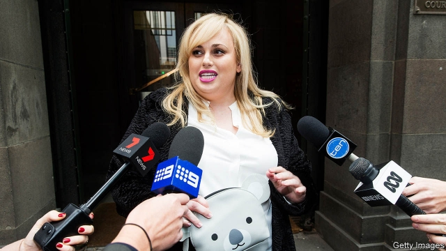

###### Publish and be slammed

# Australia’s government plans to water down ferocious libel laws 

 

> print-edition iconPrint edition | Asia | Dec 14th 2019 

IT WAS THE sort of story that was bound to cause a sensation. In 2017 the Daily Telegraph, one of Australia’s best-selling newspapers, reported that Geoffrey Rush, an Oscar-winning actor, had harassed a female co-star. Mr Rush sued the tabloid’s parent company, Nationwide News, saying it had painted him as a “pervert” and “a sexual predator”. The woman in question, Eryn Jean Norvill, testified that Mr Rush had made “groping” and “hour-glass” gestures at her, and claimed he deliberately touched her breast during a production of “King Lear”. Mr Rush denied the allegations and won the case. In May a judge ordered the company to pay him damages of A$2.9m ($2m). It has filed an appeal. 

Australia’s press is forced to pay eye-watering sums with surprising regularity. Last month a wealthy Queensland family, the Wagners, won A$3.6m from a commercial television channel, after it alleged that the collapse of a wall at a quarry which they own caused flooding which killed 12 people. The Wagners were awarded A$3.8m in a separate dispute with a radio station last year. In another case, Bauer Media, a magazine publisher, was told to pay A$4.7m to the actor Rebel Wilson, after a judge found she had lost work because a series of articles had portrayed her as a liar. The sum was later slashed by an appeals court. 

Lawyers note that workers who lose limbs on building sites are not compensated nearly as handsomely. Huge payouts tempt Aussies to sue when they are slighted, argues Matthew Collins, a barrister who represented Ms Wilson. The courts are packed with petty claims over insults posted on the internet. Sydney is the “defamation capital” of the world, says Mark Speakman, the attorney-general of New South Wales, the state of which Sydney is the capital. Relative to its population, its superior courts considered ten times more defamation lawsuits between 2014 and 2018 than those in London, says Mr Collins. 

Australia has no bill of rights nor any other constitutional protection for free speech. Media companies complain that this stacks the odds against them. Powerful people “use threats of legal action to shut down legitimate inquiry”, says Peter Greste, an Australian journalist who was imprisoned in Egypt. 

Even the government, which is not always seen as a friend to whistle-blowers or to investigative journalists, seems to agree. In late November all Australia’s states and territories agreed to approve draft amendments to the libel laws which are supposed to help the media do their job properly. The hope is to pass these amendments into law in 2020. 

The changes would provide several new protections for journalists. Reporters would be able to defend themselves on the ground of “responsible communication in the public interest”. Plaintiffs would have to prove that “serious harm” was caused in order to prevail in court. New caps would be imposed on exorbitant damages. The laws would also shrink the window during which a publisher can be sued for allegations made online. 

Some say the reforms need further clarification. The legislation leaves courts to decide what counts as “responsible journalism”, notes Arthur Moses, president of the Law Council of Australia. In the past they have disagreed with reporters on that definition. Australian law assumes that any disputed statements are false unless the publisher can prove otherwise. Showing beyond doubt that, say, a politician harassed his colleague can be hard. Critics argue that this has prevented victims of sexual assault from speaking out. 

America and many European countries, notes Mr Collins, put the burden of proof on plaintiffs, who must prove that allegations made about them are false. The same presumption should be introduced in Australia, he says. ■ 

