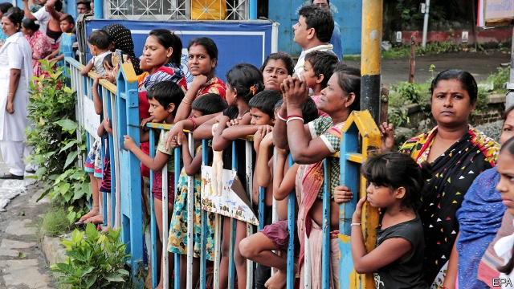

###### A recipe for unrest

# India’s new citizenship law outrages Muslims 

 

> print-edition iconPrint edition | Asia | Dec 12th 2019 

WHEN AMIT SHAH, India’s home minister, proposed his bill in parliament on December 9th, he framed it as an act of mercy. Henceforth, he promised, people who have fled persecution in neighbouring countries and taken refuge in India would be granted quicker access to citizenship. His Citizenship (Amendment) Bill would right the historic wrong of India’s Partition in 1947, when—as he disingenuously put it—the rival Congress party had agreed to split the country along religious lines. 

The bill passed handily in the Lok Sabha or lower house of parliament, where Mr Shah’s Bharatiya Janata Party (BJP) holds absolute sway. But India did not greet his tweaks to citizenship rules with joy. In the northeastern states of Assam and Tripura, violent protests prompted curfews, suspension of internet and train services and deployment of army units. Hundreds of prominent intellectuals signed an angry petition, while in parliament’s upper house speaker after speaker rose to lambast the bill, calling it an attack on India’s constitution, or on its national soul, that would make the country like Nazi Germany or, worse, Pakistan. When the bill did pass into law on December 11th, it was by only a 21-vote majority in the 245-seat house. 

For most of the participants, the cause of all this passion was not the few words that Mr Shah has added to India’s 1955 citizenship law. It was the ones he left out. The new law applies solely to immigrants from three countries, Afghanistan, Bangladesh and Pakistan. And while it specifically accepts adherents of six religions, it does not include Muslims. 

That is problematic for several reasons. By injecting religious credentials into considerations of citizenship, it subtly challenges the secularism enshrined in India’s constitution. Opponents of the BJP see this as a deliberate tactic towards the Hindu-nationalist goal of redefining India as a Hindu state, reducing the 200m-strong, 14-centuries-old Muslim community to a tenuous and dependent status. By rejecting proposed amendments that would have widened the bill’s scope to include people of all religions, from more neighbouring countries, Mr Shah made clear that the intention is indeed to make India a refuge principally for Hindus (the other religions mentioned in the law together make up just 5% of India’s population), even as it rejects Rohingyas from Myanmar, Uighurs from China or members of the Ahmadi sect that is branded heretical in Pakistan. 

In parliament, Mr Shah vigorously denied that his bill was discriminatory. On the campaign trail, however, he has sounded a different tune. Speaking this month in Jharkhand, a rural state where voting for the local assembly is under way, he ridiculed the concerns expressed by the Congress party’s leader, Rahul Gandhi. “Rahul baba says don’t expel them [Muslim migrants],” he sneered. “What are they, your chachere bhai, your cousins? I assure you that before the national election in 2024 I will throw them all out.” 

Like the changes to the citizenship law, this promise has formed part of the BJP’s election manifesto since Mr Shah’s boss, Narendra Modi, became India’s prime minister in 2014. Before illegal immigrants are expelled, however, they must first be identified. One Indian state, Assam, has over the past four years undertaken just such an exercise. Responding to decades of agitation by native Assamese, who fear being swamped by Bengali-speaking intruders, the state forced its 33m residents to produce documents establishing their long-term residency in India. 

Completed in August, this National Citizens Register excluded some 1.9m inhabitants as “non-Indians”, who must submit to special tribunals to appeal against their status. To the chagrin of Hindu chauvinists, it turned out that two-thirds of these ostensible illegals were in fact Hindus; the claim that millions of Bangladeshi Muslim migrants had “invaded” Assam proved to be a myth. 

Despite this shortcoming, and despite the fact that compiling Assam’s list proved costly and time-consuming for the government—not to mention a bureaucratic, legal and logistical nightmare for citizens—Mr Shah wants to extend the project nationwide. Assuming a cost proportional to what Assam has spent, this would require at least $7bn. That does not include the expense of building detention centres such as Assam’s growing archipelago of prison camps, to house thousands of people judged stateless and stripped of rights. 

The Citizenship (Amendment) Act may save some of this money. Since the new law fast-tracks the route to Indian citizenship for everyone else, it is primarily Muslims who are left to be sorted by the National Citizens Register. Word of this danger is already spreading. Mosque sermons are warning the faithful to gather as many official documents as they can to serve up to Mr Shah’s expected bloodhounds. 

If, that is, the count goes ahead. Constitutional lawyers believe that inserting a faith criterion for citizenship contradicts as many as three articles of the country’s eloquently secular constitution. The Indian Union Muslim League has already appealed against the law to the Supreme Court. Many lawyers also contend that forcing people to produce documentary evidence of their right to be called citizens tramples on the principle of presumption of innocence. 

It could be, too, that popular resistance fails to die down. Secular activists, as well as Muslims, talk of refusing en masse to comply with any demand to present citizenship documents. In Assam and other states of India’s remote, ethnically complex and historically violence-prone north-east, the citizenship rules are unpopular because native Assamese-speakers and numerous tribal groups harbour a deep fear of being outnumbered in their own state by other Indians of any religion. To assuage such worries, Mr Shah exempted much of the region from the new rules, even granting one state, Manipur, an archaic status, dating from the time of the Raj, that obliges visitors from other parts of India to obtain permits to visit. 

Ironically, this sort of exclusionary arrangement is precisely what Mr Modi proclaimed he was ending, when in August his government stripped India’s only Muslim-majority state, Jammu and Kashmir, of its semi-autonomous status. Four months later the restive Kashmir Valley, the most populous part of the erstwhile state, remains locked under an internet ban, with its political leaders under arrest. 

In parliament, Mr Shah described the situation in Kashmir in glowing terms as peaceful and normal. Perhaps he failed to notice that by turning citizenship into a matter of which religion you happen to be born into, his government has undermined India’s strongest claim to legitimate rule over the disputed territory: that at the time of Partition its people preferred India’s broad secular democracy to the constricting Muslim uniformity of Kashmir’s other claimant, Pakistan.■ 

