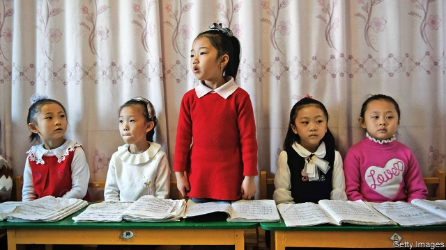

###### Hungry for knowledge

# Private tutors are illegal in North Korea, but thriving 

 

> print-edition iconPrint edition | Asia | Dec 14th 2019 

SOUTH KOREA’S overworked children are well-known for finishing the school day and heading straight to hagwon (cram-school) classes to become musical virtuosos or to gain an edge over their peers in mathematics or English. In North Korea, by contrast, school is typically followed by compulsory labour in the fields. 

In recent years, however, school days in the North have come to resemble those in the South—at least for a select few. Of 116 recent North Korean defectors interviewed by researchers at Seoul National University this year, a third said they had received some form of private education while in the North. Some had worked as private tutors themselves. Cho Jeong-ah of South Korea’s Institute of National Unification thinks the survey shows that views about education are changing among North Korean parents: it is increasingly seen as an investment they can make in their children’s future, rather than something to be accepted from their all-wise rulers. 

In theory, paying for education is illegal in North Korea. One of the main purposes of universal schooling is to batter into young minds the godlike virtues of the Kim dynasty and the infallibity of the communist regime. Only the state can be trusted to do this properly, of course. But in practice North Koreans have had to pay even for state-provided education since the famine of the 1990s, which devastated the provision of all sorts of public goods—not just food distribution but free textbooks, heated classrooms and wages for teachers. 

Accounts abound of pupils compelled to pay teachers to show up to work. If they could not pay, they were forced to help the teachers harvest crops or, in winter, bring firewood to class. The first private tutors were state-school teachers trying to make ends meet. Since then, tutoring seems to have evolved into a profession in the state’s grey economy, with an average monthly cost per subject of around 200 Chinese yuan (the most widely used currency, worth $30). The regime is apparently willing to turn a blind eye to the informal hagwon classes, so long as parents are not too ostentatious about using them. 

It probably helps that the biggest beneficiaries of private tutoring are the children of the elite. According to Thae Yong-ho, a former North Korean diplomat who defected to the South, parents in Pyongyang and provincial capitals use it to get their children into the best secondary schools. One of the perks of such schools is that pupils are exempt from compulsory labour, allowing them to study to get into universities. Music and foreign-language lessons are popular at the hagwon, because these might help children get jobs as diplomats or professional musicians, and therefore travel abroad. Chinese lessons are prized in areas near China because the language helps with cross-border business. 

The accounts of defectors are probably not representative. They are, after all, an unusual group and private tutoring may be much rarer than they suggest. Still, among some parents, educational competition may be nearly as all-consuming as it is in the capitalist South. One North Korean recently told a South Korean talk-show host that she had made her daughter study with a headlamp during power outages. Another said that she used to wake up her nephew at 4.30 every morning in order to memorise English words. ■ 

