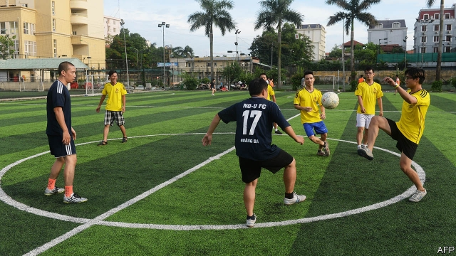

###### Red card

# The Vietnamese football club that defies China 

 

> print-edition iconPrint edition | Asia | Dec 14th 2019 

IT IS JUST a practice match, but the footballers are wearing their full kit anyway. As the shadows stretch across the pitch in inner-city Hanoi, the words emblazoned on their bright yellow jerseys catch the eye. “No-U FC” is not so much a name as a cri de coeur. U refers to the U-shaped “nine-dash line”, a curve on a map delimiting China’s sweeping claims to the South China Sea. These include a wide area that international law recognises as belonging to Vietnam. Depending on whom you ask, FC either stands for what you would expect or for “Fuck China”. This is not your average football club. 

Though all the players agree that the game is beautiful, it is China, not beauty, that has brought them together every Sunday for the past nine years. No-U FC was formed in 2011 to protest against Chinese incursions into what Vietnam calls the East Sea. China has occupied islands and atolls claimed by Vietnam and incorporated them into a new administrative district. Chinese vessels have attacked and killed Vietnamese fishermen plying the contested waters. 

The belief that China is encroaching on Vietnam’s maritime space has inspired a number of demonstrations by fledgling civil-society groups. In 2018 thousands protested against a law on special economic zones that was viewed “as selling out the country to the Chinese”, says Tuong Vu of the University of Oregon. Most demonstrations were swiftly shut down by nervous authorities. But one group of activists came up with a way to make their point without being arrested. “Vietnamese people are very fond of playing football,” Anh Chí, a member of the team, recalls thinking back in 2011. And so No-U FC was born. 

The police were not deceived for long. Officers have disrupted matches, instructed managers of pitches to bar the group from playing, and beaten and jailed members. After being branded an “enemy of the people”, Mr Anh claims he was hounded out of his job by his boss, at the behest of the police. Undaunted, the team continues to play every Sunday. 

The authorities’ harsh treatment of No-U FC is surprising, considering it was founded to express pro-Vietnamese sentiments. But there are two reasons for the reaction. First, the club may be too patriotic for the regime’s taste. Though the government objects to China’s claims and actions in the South China Sea, in practice its response has often been meek. Mr Tuong, the academic, argues that a conservative faction within the ruling Communist Party does not wish to offend its Chinese counterpart. 

Second, a connection is growing between the club and democratic activism. Because of the government’s caution in the contested waters, many activists think the party is feeble in defence of Vietnam’s sovereignty. Some have “concluded that, in order to save the Vietnamese nation, the political system must be replaced with a robust democracy,” writes Ben Kerkvliet in “Speaking Out in Vietnam”, a study of political activism. When he is not playing football, Mr Anh, now a democracy activist, produces a vlog in which he tells his followers that the people are the referees of the government—not the other way round. 

