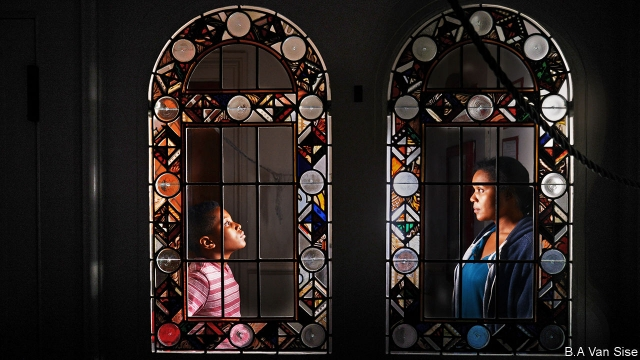

###### No crib for a bed

# An opera in a soup kitchen, featuring homeless singers 

 

> print-edition iconPrint edition | Books and arts | Dec 14th 2019 

LAURA O’DAY is not a professional singer. Nonetheless, last year she auditioned for On Site Opera’s seasonal production of “Amahl and the Night Visitors”, a Christmas staple by Gian Carlo Menotti, because she heard that chorus members would be paid and she needed the money. She used to bag groceries but now, at 58, is on medical leave because of severe arthritis, chronic pancreatitis, lymphoma, diabetes and various other maladies—“It’s easier to say what I don’t have,” she says with a grim laugh—which are a legacy of her years living rough and addicted to drugs. 

She heard about the auditions because she lives in The Times Square, a Manhattan building run by Breaking Ground, the city’s largest provider of permanent supportive housing for the homeless—and a collaborator on the production. Ms O’Day thought she would quit after a rehearsal or two, but found the experience so rewarding that she decided to join the acclaimed troupe for a second year, performing in a sold-out revival at the Holy Apostles Soup Kitchen that ended on December 8th. 

On Site Opera has been taking opera out of traditional venues since 2012. The aim, says Eric Einhorn, the company’s co-founder and artistic director, is to demystify an art form that struggles to attract younger audiences. By staging shows in unusual spaces, such as “The Barber of Seville” in an Upper East Side mansion and “Pygmalion” in Madame Tussauds, the company found it could both keep costs down (by avoiding rent and doing without built scenery) and create the kind of intimate theatrical experiences that patrons like. As his team went from staging one production a year to three, Mr Einhorn became more ambitious in other ways, too. Eager to produce an opera with a social impact, he contacted Breaking Ground. The result is a uniquely moving production of “Amahl”. 

The title character of Menotti’s opera, which had its premiere in a television broadcast on Christmas Eve 1951, is a poor, crippled shepherd boy who, with his widowed mother, unexpectedly hosts the three kings on their way to visit the Christ Child. In this modern staging, performed in the round in a vaulted Chelsea church that serves hot lunches to the hard-up, Amahl (Devin Zamir Coleman, pictured on previous page) and his mother (Aundi Marie Moore, a soprano) live in a homeless shelter. The kings arrive wearing ragged robes and makeshift crowns which imply that they, too, are on the streets. In a city where more than 60,000 people have no homes, these characters are distressingly familiar. They are backed by a chorus drawn mainly from Breaking Ground’s tenants, most of whom have—like Ms O’Day—experienced homelessness for themselves. 

“Amahl” has always been a story about grace amid misery: the mother steals the kings’ gold to feed her boy, but then gives away everything to honour a divine child who will one day build a kingdom “on love alone”. This version reminds viewers that such desperation remains shockingly common in one of the richest cities in the world. After it opened last year, many audience members were so moved by this “Amahl” that they asked for it to be an annual holiday event. Most of the original performers cleared their schedules to ensure they could take part again. “When you see people crying, not just one person but a lot of people, it’s clear it’s special,” says Musa Ngqungwana, a bass-baritone who reprised his role as one of the kings. 

Ms O’Day hopes audiences come away with a better sense of what it is like to be homeless. She notes that Amahl’s mother steals because she worries about her child going hungry. “That’s what homeless people think about,” she says. “Most people don’t know how hard it is not to have.” ■ 

