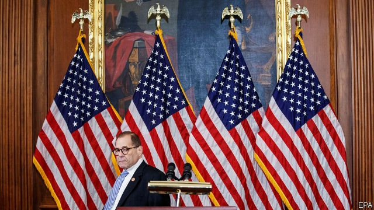
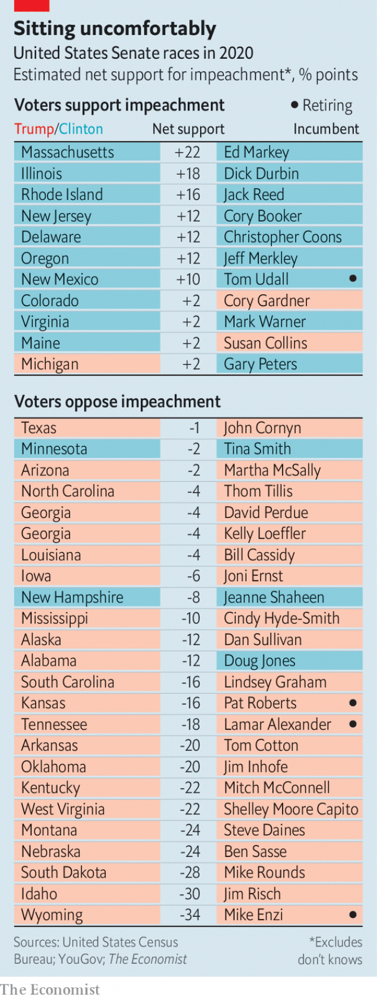

###### Headed for trial

# The politics and history behind Donald Trump’s impeachment 

 

> print-edition iconPrint edition | Briefing | Dec 12th 2019 

ON JULY 26TH, the day after President Donald Trump called the president of Ukraine to ask him for a favour, America’s ambassador to the EU, Gordon Sondland, went out to lunch in Kyiv. The ambassador, who secured his position after donating $1m to the Trump Presidential Inaugural Committee, placed a call to the White House while on the terrace outside a restaurant. He held the phone far enough away from his ear that David Holmes, a counsellor for political affairs at the embassy in Kyiv lunching with him, could overhear what was said. 

“I heard Ambassador Sondland greet the president and explain he was calling from Kyiv,” Mr Holmes testified to the House intelligence committee on November 15th. “I heard President Trump then clarify that Ambassador Sondland was in Ukraine. Ambassador Sondland replied yes, he was in Ukraine and went on to state that President [Volodymyr] Zelensky, quote, unquote, loves your ass. I then heard President Trump ask, quote, so he’s going to do the investigation? Ambassador Sondland replied that he’s going to do it, adding that President Zelensky will, quote, do anything you ask him to.” 

What Mr Trump had asked Mr Zelensky to do is not in dispute. On September 25th the White House released a memorandum of the conversation between the two presidents that had taken place the day before that lunchtime call. Mr Trump wanted Mr Zelensky to investigate the far-fetched idea that some faction in Ukraine might have worked to implicate Russia in meddling with America’s 2016 presidential election. He also wanted him to announce an investigation into corruption at Burisma, an act which might be expected to harm the reputation of Hunter Biden, an American lawyer who sat on the gas company’s board, and his father, Joe Biden, who is quite likely to be Mr Trump’s opponent in the 2020 presidential election. There is no evidence that Mr Trump had any interest in other investigations into corruption in Ukraine, of which there are plenty. 

The first of the two draft articles of impeachment against Mr Trump which Jerry Nadler (pictured above), the chair of the House Judiciary Committee, published on December 10th treats the request the president made of Mr Zelensky as an abuse of power made “for corrupt purposes in pursuit of personal political benefit.” 

Mr Zelensky, the House says, did not simply feel the level of pressure to be expected when a recently invaded supplicant is asked for a favour by the president of the largest military power in the world. The article charges Mr Trump with using both government channels and other means to tell Mr Zelensky’s team that two things which they wanted—a meeting at the White House and the release of military aid—were conditional on their granting Mr Trump the favour he had asked for. 

Mr Sondland testified that the announcement of investigations was indeed treated as “a quid pro quo for arranging a White House visit for President Zelensky”, and that this was on “the president’s orders”. American officials worked with Mr Zelensky to draft an acceptable announcement of the investigation. According to testimony from Kurt Volker, who was at the time America’s special representative to Ukraine, the president’s unofficial envoy, Rudy Giuliani, made clear that this statement had to include references both to Burisma and to the 2016 elections, rejecting a draft that did not. “Everyone was in the loop,” says Mr Sondland. 

Fiona Hill, until recently a Russia expert on the president’s National Security Council, testified to Congress that a week before the July 25th call NSC staff were told that the Office of Management and Budget had placed a hold on $391m of military aid for Ukraine that Congress had already appropriated. They were told that this had been done on the instructions of the president’s acting chief of staff, Mick Mulvaney; they were not given any reason for the delay. 

Neither Ms Hill, Mr Sondland nor any other witnesses who testified to the House could say from their own direct knowledge that the delay was designed to press the Ukrainian government to announce investigations. Mr Sondland was merely able to say that he could think of no other explanation for the hold-up. This lack of direct evidence is a point that Mr Trump’s defenders have made much of. 

But when asked at a press conference on October 17th whether the president’s desire for “an investigation into the Democrats” was part of the reason that the money had been held back, Mr Mulvaney replied that “The look back to what happened in 2016 certainly was part of the thing that he was worried about.” Making the disbursement of such aid conditional on a foreign government’s actions, Mr Mulvaney went on, was quite proper: “We do that all the time…Get over it.” 

Mr Mulvaney did not address the question of whether requiring the Ukrainian government to announce investigations of “the Democrats” was a defensible foreign-policy goal or an abuse of power undertaken “for corrupt purposes”. The House did not have the opportunity to push him on the question because, like eight other officials named in the second of the articles of impeachment, he failed to comply with its subpoena requiring him to testify. This is part of the second article’s claim that the president obstructed Congress. Mr Trump, it says, “directed the unprecedented, categorical and indiscriminate defiance of subpoenas issued by the House of Representatives pursuant to its [constitutional] ‘sole Power of Impeachment’.” 

The House seems very likely to vote in favour of these articles of impeachment within days. They will then form the basis of a trial in the Senate. 

A conviction requires two-thirds of the Senate—67 senators—to vote against the president. Given that the Republican Party currently holds 53 Senate seats, this would require 20 members of the president’s party to cross the floor. 

Some Republican senators dislike and disapprove of Mr Trump. Some may well believe him guilty of the charges brought against him. But it remains unlikely that many, or perhaps any, of them will vote to convict him. Their calculation will not be based on justice but on politics. As of the first few days of December a plurality of Americans supported impeachment, according to data from YouGov, a pollster. But this support, like support for the Democratic Party, is weighted towards populous states. In the Senate, all states are equal. 

A state-by-state analysis of YouGov’s data by The Economist finds the public opposed to impeachment in 29 of the 50 states. Of the 35 Senate seats in these states which will be contested in 2020, 23 have Republican incumbents, 20 of whom intend to run again (see table: the analysis is presented in fuller form on our Graphic detail page). Those senators know that, unless public opinion shifts dramatically, a vote against the president would invite a damaging primary challenge and slash their chances of re-election. By contrast, only two Republican senators are standing for re-election in states which support impeachment, and in neither of those states is support for impeachment genuinely strong: indeed, it does not rise above the margin of error. Senators not steadfastly loyal to the president who do not face re-election until 2022 or 2024 will be making similar calculations, if with less of a sense of urgency. 

 

Those stark electoral numbers are unique to this impeachment, and a level of partisanship as marked as today’s is historically unusual. But a Senate highly disposed to acquit a president the House has impeached is not. Twice in the 19th century the House considered impeachment, but held back because it knew the Senate would vote to acquit. Once it went through with the process, impeaching Andrew Johnson in 1868. Acquittal promptly followed. The only 20th-century impeachment, that of Bill Clinton over perjury related to his affair with Monica Lewinsky and related obstruction of justice, ended the same way. 

That impeachment should be hard, and conviction of an impeached president yet harder, seems to accord with the wishes of those who drafted the constitution. The impeachment clause was not put there to rid the country of a president who is simply bad at the job, or has made a disastrous mistake, or has fallen out with Congress, or even who has acted unconstitutionally (that is something for the Supreme Court to put right). It was put there to protect against a president who posed a threat to the republic. 

One such threat was that he might lose his “capacity” after his appointment. The 25th amendment, ratified in 1967, lessens such worries by providing a separate process for dealing with presidential illness or disability, whether temporary or permanent. The greater threat to the republic was that he might be corrupt. 

American statesmen of the late 18th century were obsessed with corruption. It was a term which described a much broader range of bad behaviour than simply taking bribes or receiving pay-offs; it covered all instances where a president might act in his own interests against those of the country. They likened such behaviour to a tumour that, left unchecked, would kill the body politic. 

One reason for having it dealt with through impeachment, rather than by trusting that the electorate would be able to discern its presence and act accordingly, was a sense that a corrupt president might be able to rig an election. That worry allows a direct line to be drawn between the favour which Mr Trump asked of Mr Zelensky, which was seen as offering Mr Trump an edge in the 2020 race, and the reason the impeachment process exists. 

The paucity of impeachments does not mean administrations have been generally well-behaved. In 1974 the counsel to the impeachment inquiry into Richard Nixon commissioned a study of presidential misconduct from George Washington onwards. The study eventually took the form of a collection of essays dealing with the issue administration by administration, and it contained plenty of dodginess. But in his editorial summary C. Vann Woodward, a Yale historian, wrote that “heretofore, no president has been proved to be the chief co-ordinator of the crime and misdemeanour charged against his own administration as a deliberate course of conduct or plan.” On top of that, the “malfeasance and misdemeanour” that had gone on “had no confessed ideological purpose, no constitutionally subversive ends”. 

Self-serving venality was hardly unknown. The administration of Ulysses S. Grant saw presidential confidants using their access to information in order to make bets on when the Treasury would intervene in the gold market. Warren Harding’s administration was rife with scams, some perpetrated by people close to the president, though there is little evidence Harding himself knew what was going on. 

Abuse of power also has a history. “Given everything I know about the individuals involved,” says David Garrow, a historian of the FBI, “I would assume that LBJ at a minimum read some juicy files on Barry Goldwater.” But if Lyndon Johnson did indeed have such insights into his opponent during the election campaign of 1964, there is no evidence that he made use of them. 

Nixon was not impeached, let alone convicted. He curtailed the process by resigning. But there is no doubt that the Watergate scandal was qualitatively different from the earlier presidential misdeeds which Woodward’s book surveyed. In 1972 an attempt to plant bugs in the offices of the Democratic National Committee for use during that year’s election campaign went awry. The subsequent cover-up of the White House’s involvement was called for and directed by the president himself. There was thus an indefensible political—rather than pecuniary—purpose, as well as direct presidential involvement in the obstruction of justice, a process which extended to doctoring and withholding evidence requested by Congress. The three articles of impeachment adopted by the House Judiciary Committee accused the president of obstruction of justice, abuse of power and contempt of Congress. 

 

At the same time as showing, almost 200 years on, that an impeachment process could actually bring about the result for which the founders designed it, the Watergate inquiry also made the case for future impeachments stronger. Lawyers for the Department of Justice determined that a president could not be prosecuted while in office by the bureaucracy that served under him. It does not take much Founding Fatherology to grasp that if such prosecutions are not possible, alternative ways of removing a president became more vital. 

These limits on the prosecution of presidents through any means other than impeachment played a crucial role in the inquiry into Mr Trump’s campaign led by Robert Mueller, a former head of the FBI. His report upheld earlier findings by the intelligence community that Russia did indeed help the campaign: the evidence of its hackers’ work was not planted nefariously through Ukraine, as Mr Trump would like people to believe. But it did not find evidence that links between Mr Trump’s campaign and the Russians had been used to co-ordinate the activity. And on the subsequent matter of Mr Trump’s attempts to derail the investigation, it stuck with the post-Watergate position which limits the prosecution of the president to just one body. “Congress may apply the obstruction laws to the president’s corrupt exercise of the powers of office”, it concluded, having provided ample evidence of such obstruction. The Department of Justice could not. 

The two most notable White House scandals post-Watergate but pre-Trump illustrate the ways in which its circumstances were special. In the Iran-Contra scandal, Ronald Reagan’s White House illegally sold arms to a regime with which America had no diplomatic ties in order covertly to fund a group of guerrilla fighters it was pretending not to help. At their subsequent trials some officials involved claimed that Reagan knew about the broad outline of the scheme, if not all its details, but at the time his involvement was entirely deniable. And the scam’s aim was geopolitical, not party political—a continuation of the cold war, not an attempt to do down Democrats. 

The impeachment of Bill Clinton differs from Watergate in other ways. Here the fact that the president had perjured himself was irrefutable. However he had not done so as part of a political scheme, but over embarrassing and inappropriate, though consensual, sexual activity. This was not a threat to the republic, any more than the pay-offs Mr Trump paid to porn stars during his election campaign were. For that reason alone those pay-offs did not rise to the level of the impeachable, even though they seem to have been in breach of campaign finance law. They would not have done so even had they taken place while Mr Trump was in office. 

The pressure put on Mr Zelensky, on the other hand, has risen to that level; Mr Trump’s main aim was to undermine a political rival. It is true that the aim was not achieved. Ukraine has announced no investigations, and the military aid that was withheld while those announcements were under discussion was in the end mostly released. In the absence of direct testimony as to the motives for the hold, conditionality might have been easier to prove if its release had followed the achievement of Mr Trump’s aims, rather than Congress and the public finding out what was going on. 

But just as the Watergate burglary was a crime despite the fact that the burglars did not accomplish their purpose, so an abuse of power in pursuit of personal political benefit is an abuse of power even if the benefit is not, in the end, forthcoming. The House investigation shows that Mr Trump bent American foreign policy to improve his electoral chances. And he has taken extreme measures to stop Congress from investigating how far the bending went, something which the constitution gives it every right to do. 

Impeachment will undoubtedly have negative effects, not all of which can be foreseen. But it is the only available check on dire presidential misconduct. To wait for the electorate to respond is to duck the role that Congress was given in the constitution and to risk the integrity of the next election. And future presidents tempted to use the power of their office to nobble a political opponent and nullify congressional oversight will take lessons from the case as to what they can get away with. 

If they look back at history, as C. Vann Woodward did, and conclude that whatever they do, a friendly Senate will see them right, America will be a lesser republic than the one its founders wanted. ■ 

