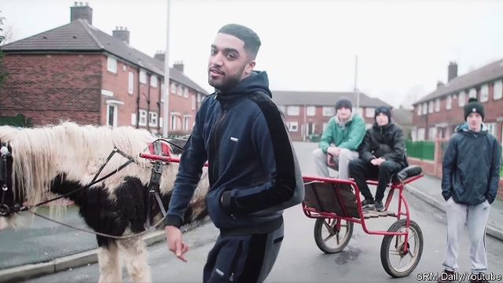

###### It’s grime, up north

# Grime music, Bradford-style 

 

> print-edition iconPrint edition | Britain | Dec 14th 2019 

“SO RIGHT NOW just let me talk / And tell you lot it’s grim up north,” raps Blazer Boccle in his thick Bradford burr. The window of his makeshift bedroom recording studio looks out over the Holme Wood estate. Horses—which belong to the “Charvas”, Bradford’s settled traveller community—roam the streets like dogs. “This is our culture. It’s like London rappers showing high-rise flats in their videos,” says Blazer. “We don’t have that. Round here it’s like kids driving around with shotguns on flippin’ horses.” 

Grime, a genre of hip-hop known for its rapid breakbeats, emerged in east London in the early 2000s. Its biggest stars, including Stormzy, still hail from the capital. Yet grime is now a national soundtrack. Online commenters poke fun at white youths in Blackpool or Wigan for appropriating the culture of black Londoners, but these rappers are a source of intense local pride. 

The scenes have much in common, sharing roots in deprivation. Since the decline of its woollen industry, Bradford has lacked jobs. West Yorkshire has the highest rate of violent crime in England. Grime is something to latch onto. Teenagers congregate in the city’s bus terminal, says Blazer. “Everybody sits at the back and spits bars and shares them on Bluetooth.” Without grime, “we have two options: break our backs for ever in a warehouse, or sell drugs and go to jail. We want to make music an option for other Bradford people, like it is in London.” 

As in London, critics argue that grime means crime. Grime lyrics, with their bleak social realism, sometimes spill into outright provocation. In September Asco, a rapper from Gillingham, was jailed for 12 years for drug-dealing. Other provincial rappers argue they are merely reflecting society back to itself. 

Yet northern grime is distinctively northern. One of Blazer’s tracks, “Local”, translates London slang into its northern equivalent. “Everybody says they trap, but here up north yeah we do rounds,” he raps, referring to drug-dealing. Many grime artists want to defend their home towns. “People just have a made-up image of Derby,” says MC Eyez. “They think it’s just farms and trees. I have to let the music speak, so they hear it and say, ‘Okay, there’s a lot of crime and multiculturalism up there’.” MCS see themselves as representatives. As Eyez raps: “Man know that I put Darbz on the atlas.” 

Others emphasise their city’s diversity, hoping to debunk stereotypes about the anti-immigrant attitudes of northern Brexiteers. “I want people to respect Leicester’s identity as an example of how multiculturalism can work,” says Kamakaze, a white rapper from one of Britain’s most diverse cities. “White man will never know what the underhand is / I mean look what our country was built on,” he raps. In Bradford, which experienced race riots in 2001, Blazer argues that grime is bringing people together. “What overrides race is the class system. We’re all lower class.” 

Many have ambitions that reach far beyond their bedroom recording studios. Stormzy’s vocal support for Jeremy Corbyn helped push young voters towards Labour in 2017. Some of his northern peers are just as political. “I’m not saying I’m going to be the MP for Leicester,” Kamakaze admits, “but politics is definitely a future for certain rappers.” Haze de Martian, another Bradford MC, laughs: “I don’t think Stormzy would do a bad job.” ■ 

