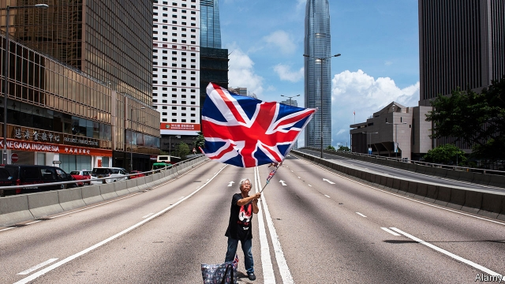

###### Out of sight, out of mind

# Hong Kongers with UK passports demand the right to live in Britain 

 

> print-edition iconPrint edition | Britain | Dec 14th 2019 

IN IMPERIAL TIMES Britain governed a quarter of the world’s population. Until the 1960s those people shared a common British nationality and, in theory at least, the right to move within the empire, regardless of where they were born. Later, to control immigration, the government in London limited colonial and Commonwealth subjects’ rights to live and work in the mother country. Now one far-flung group of British nationals, in Hong Kong, is asking that those rights be restored. 

Britain ruled Hong Kong from 1842 until 1997, when it passed the tiny territory, and its 6.5m inhabitants, to China. Before the handover Britain declined to turn all British nationals in Hong Kong into full British citizens, a legal distinction which would have given them more rights. Instead, after 1997 Hong Kongers of Chinese descent were offered Chinese citizenship and a new Hong Kong passport, while those who had been born in Hong Kong were also given the chance to apply for “British National (Overseas)” status. BNO passports, whose burgundy cover and golden coat of arms make them look like the ordinary British sort, give holders the right to British consular assistance abroad (though not in China), as well as the right to apply for certain restricted jobs in the British civil service and armed forces. But they provide no automatic right to live or work in Britain. 

After six months of increasingly violent anti-government protests, and amid fears of a crackdown by the Chinese authorities, many in Hong Kong are considering their escape routes. More people are renewing their BNO passports. The number of holders rose from about 180,000 in December 2018 to 250,000 the following October. Yet without the right of abode, the document gives less protection than would, say, an Australian or Canadian passport. 

BNO passport holders are therefore urging Britain to extend their rights. Craig Choy, a lawyer and campaigner on BNO matters, says that letting in these British nationals would be a good way for the country to demonstrate its vaunted global openness after Brexit. Yet the government insists that to offer the right of abode to BNOs would breach the Sino-British Joint Declaration, the treaty which outlines how Hong Kong should be run. (BNO campaigners retort that citizenship is mentioned only in a memorandum tacked on to the end, not in the main document.) 

Unsurprisingly, the issue did not feature much in Britain’s election—except in Esher and Walton, the foreign secretary’s constituency, where Hong Kong activists urged voters to back the Liberal Democrats, who promise more BNO rights. Polls suggest Britons would be open to the idea of admitting their fellow nationals. Yet for now, Hong Kongers joke that BNO really stands for “Britain says No”. ■ 

