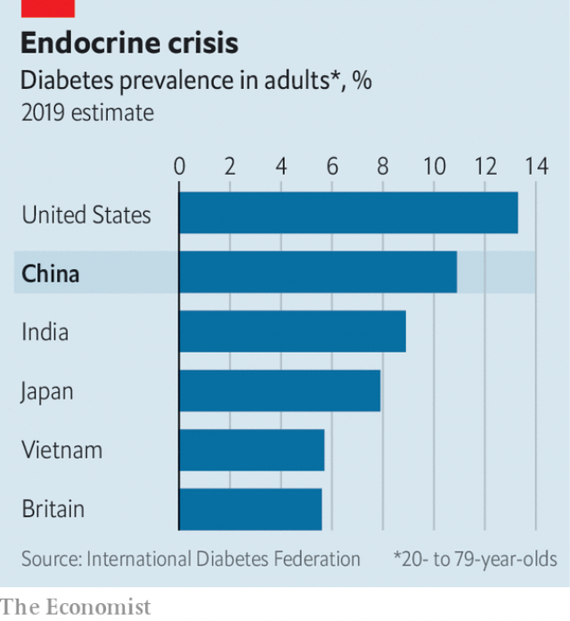

###### Sugar high

# As China puts on weight, type-2 diabetes is soaring 

 

> print-edition iconPrint edition | China | Dec 14th 2019 

MORE THAN 30 years ago, doctors in the northern city of Daqing began a pioneering long-term study into the prevention of type-2 diabetes, a disease which was then thought to affect about 1% of Chinese. When doctors, academics and officials convened there this autumn to discuss the conclusions and promote prevention work, they faced a very different reality. About 11% of Chinese adults now have the condition, nearly the proportion in America and twice the level in Britain. Type-2 diabetes is becoming more common globally, but in recent years its prevalence has been growing fastest in China. 

Diabetes is a dysfunction in the body’s regulation of blood-sugar levels. Type 1 is rare and usually shows up early in life, triggered by factors that are not yet well understood. It can kill swiftly unless managed with daily injections of insulin. Type 2 is far more common, accounting for more than 90% of cases worldwide. It tends to develop in adults, especially if they are overweight or do not exercise much. It can usually be controlled with pills and lifestyle changes, and can sometimes be reversed. Both types, if not well-treated, can cause complications such as organ damage, blindness, strokes and heart attacks. 

China has an estimated 116m diabetics, by far the highest number of any country. Twenty years ago it had fewer than 25m. The dramatic increase, almost entirely involving type 2s, worries the government. The study in Daqing showed how lifestyle changes can prevent type 2 among people with impaired glucose tolerance, which is sometimes a prelude to the condition. But the country’s health-care system is ill-equipped to ensure symptoms are detected, let alone help people with them. 

A big reason for the increase is that as people get richer they often consume more processed foods and sugary drinks. One in seven Chinese adults is obese, including a quarter of adults in Beijing, China’s fattest city. The urban share of the population has grown from less than 20% to about 60% since 1980. City dwellers tend to be less physically active than people in rural areas. 

 

There may a genetic link, too. Research finds that ethnic-Han Chinese are acquiring type 2 diabetes while younger and thinner than Caucasians. Smoking is another factor. China has one-fifth of the world’s population but consumes one-third of its cigarettes. About half the country’s men smoke daily. The speed of China’s recovery from Mao-era destitution may also be relevant. Chinese experts have found that people underfed as children are more likely to acquire diabetes in later life. 

China’s health system is not coping well. The most recent national survey, in 2013, found that nearly 65% of China’s diabetics were unaware of their condition (in America it is about 25%). Only about one-third were getting treatment. Among those receiving it, only about half were keeping their blood-sugar levels within a healthy range. Another study showed that the proportion of diabetics who were managing not only to control their blood sugar, but also their blood pressure and cholesterol—measures that also help avoid complications—was lower still. Some of them turn to quack remedies. 

Despite the prevalence of type 2, public understanding of the condition is woeful. There is little appreciation of how modern medicine can control it. Poorly educated people in remote communities sometimes worry that it is infectious, says Yang Lijun, the manager of a website for diabetics. Such views lead to discrimination. The civil service refuses to hire people with diabetes. Official guidelines allow universities to do so, too. This is more likely to affect type-1 diabetics, because their form of the condition is more common in the age group applying for university places or junior government jobs. But the rules make no distinction between the types. 

Managing patients with diabetes requires a health-care system that can help them understand their condition, adhere to prescribed treatments and encourage regular check-ups. This is costly. In recent years the number of people with state health-insurance has grown hugely. This has reduced out-of-pocket spending on health from 60% of the total in 2001 to around 30% today. It has made it more affordable for many diabetics to get the treatment they need. But the government’s insurance still does not cover some essentials, such as blood-sugar test strips and injection devices. 

In July the government published a list of priorities for health-care reform in the coming decade. They include a pledge to improve support for diabetics. The plan says officials must nudge Chinese into leading healthier lives. 

The single best medicine for type-2 diabetes would be more investment in primary health care. Many people do not have easy access to family doctors or specialist nurses, who are best able to provide the kind of regular advice and check-ups that type-2 patients need. Even if they do, Chinese patients often prefer to use big-city hospitals, believing that specialists there will do a better job because of their greater expertise. Such hospitals account for nearly 55% of health-care spending in China, compared with less than 40% in rich countries. But in China they are neither equipped nor inclined to co-ordinate the education, screening and monitoring required to deal with chronic conditions such as diabetes. Building a primary-care structure that patients trust will require enormous effort, including finding doctors willing to work as general practitioners (who have fewer money-making opportunities than hospital doctors) and devising better incentives for GPs to promote preventive measures, such as healthy diets and physical exercise. 

Without an overhaul, China’s health-care system will be crushed by the burden of coping with the chronic diseases that will burgeon as the population ages. In recent years annual increases in total health-care spending have been 5-10 percentage points higher than GDP growth. About 13% of China’s health spending goes toward treating diabetes, and perhaps four-fifths of that is spent treating complications that could be avoided. China has an opportunity to save both money and lives. ■ 

