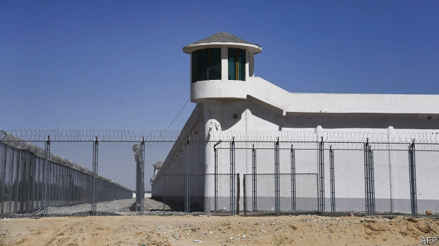

###### School’s out

# In Xinjiang, China applies repressive lessons learned in Tibet 

 

> print-edition iconPrint edition | China | Dec 14th 2019 

CHINA USUALLY marks the UN’s human-rights day on December 10th with angry rebuttals of foreign criticism rather than announcements of improvements in its record. So it was perhaps coincidental that an official this week updated the world on the most egregious of China’s current abuses: the incarceration of hundreds of thousands of Uighurs and other mostly Muslim minorities in the vast western region of Xinjiang. Shohrat Zakir, chairman of the regional government, told a press conference in Beijing that the “trainees” in detention had all “graduated”. Since then, he said, they “have achieved stable employment, improved their quality of life and have been living a happy life.” 

Mr Zakir said foreign reports that trainees numbered 1m-2m were groundless, but did not give his own total. China describes what outsiders see as vast prison camps (one is pictured, near the city of Hotan) as “vocational training” centres, teaching Chinese, occupational skills and “deradicalisation”. The camps were set up in response to sporadic outbreaks of Islamist and anti-Chinese violence. The mass detentions amount to a preventive internal-security operation of almost unimaginable—and unmeasurable—proportions. 

Divided families fear to speak about disappeared members. A Uighur activist based in Canada says his grandfather died this year soon after being freed from one of the camps, where his diabetes and heart condition had been untreated. The activist is loth to contact his family. A phone call to his bereaved grandmother prompted a warning text to her from the authorities. 

So the fate of the detainees remains unclear. Mr Zakir did not say they had been freed. The activist thinks a mass release “pretty unlikely”. But some observers think that China might be moving to a more subtle form of repression: in the community. They point to Tibet, a neighbouring region with its own history of protest, where a resentful local population has been subdued without mass incarceration (though plenty of malcontents remain locked up). The Communist Party chief in Xinjiang, Chen Quanguo, served in the same post in Tibet. His skills in containing unrest have been bolstered by extensive deployment of surveillance technology. 

For Tibetans, December 10th did mark an important and poignant anniversary: 30 years to the day since their exiled spiritual leader, the 14th Dalai Lama, was in Oslo to receive the Nobel peace prize. Tibetans enjoy no more freedom than they did then. But few mass protests have been reported since an outbreak of anti-Chinese violence in Lhasa and protests across the Tibetan plateau in 2008. 

The “Tibet model” of repression relies on four tactics. The first is to deflect any international pressure. In Tibet’s case this has meant curtailing the influence of the Dalai Lama. At 84, he is not the tireless globe-trotter he once was. And China is itself tireless in browbeating (and even imposing sanctions on) any country whose leaders dare to meet him. 

Second is to limit foreign contact. Tibet remains cut off. Individual foreign tourists—never mind journalists or human-rights investigators—are banned, and the stream of exiles escaping to India has been cut to a trickle. Third is to swamp the territory’s native majority by promoting economic development that encourages migration from elsewhere in China. Thanks to tourism and investment in infrastructure, Tibet’s economy last year grew by 9%, faster than all but one Chinese province. The growth brings both jobs and an influx of Han Chinese, whose presence sparked the resentment that exploded in 2008. 

Last, blanket the region with security mechanisms and personnel. This includes stationing “work teams” in villages and sensitive spots such as monasteries, and dividing cities into “grids” in which residents have to spy on each other. 

Tibet shows how effective and sustainable mass repression can be. But China still has to weather the eventual passing and reincarnation of the Dalai Lama, a powerful and moderate restraining figure. Where the Tibet model fails is in offering a future of reconciliation and harmony. ■ 

