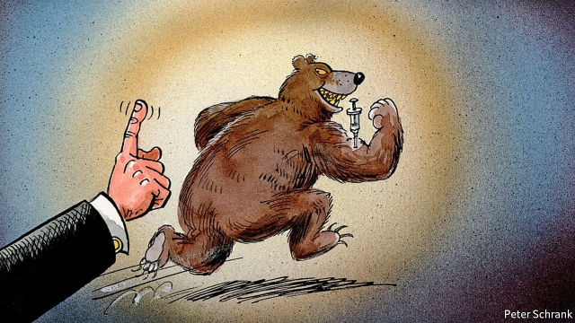

###### Cheat, cover up, repeat

# A four-year ban on Russian athletes is less than it seems 

 

> print-edition iconPrint edition | Europe | Dec 12th 2019 

ON DECEMBER 9TH the World Anti-Doping Agency (WADA) banned Russia from major sporting events for four years. The ban will apply to next year’s Olympics in Tokyo, the 2022 winter Olympics in Beijing and that year’s football World Cup, to be held in Qatar. It follows the discovery that Russian officials are still covering up widespread cheating. Russia handed over computer files in January that were supposed to be a full account of past doping, which WADA thinks involved more than 1,000 athletes and was directed by government ministers. But WADA found the files had been doctored. 

A four-year ban sounds like a stiff penalty. But it is full of loopholes. It applies only to “major” tournaments, which do not include such mega-events as next year’s European Championship in men’s football. 

Even at competitions that WADA classifies as “major”, such as the World Cup, the ban could allow Russians to compete under a neutral flag. The fine print of the agency’s ruling specifies that athletes may take part as long as they have neither been named in the documents that the Russian officials handed over nor failed any drug tests. FIFA will probably allow Russians to play their qualification matches for the 2022 competition in their national colours. Only at the finals in Qatar will the team have to give up its flag and anthem. 

This arrangement has already been used at the Olympics, and will probably continue at next year’s games in Tokyo. The International Olympic Committee (IOC) suspended Russia’s team from the winter games in Pyeongchang last year, but in name only. It still allowed 168 competitors to appear as “Olympic athletes from Russia”, collecting 17 medals in all. The men’s ice hockey squad won gold while wearing a distinctly familiar red kit (albeit without emblems or flags) and defiantly sang the national anthem at the medal ceremony, against official orders. Few spectators could have doubted who they were representing. 

The message to any such cheats is clear. If you get caught, you may lose some of the medals your country has won, and your teams will briefly compete without your flag. But many of your stars will slip through the net. Cheaters sometimes prosper, it seems. 

