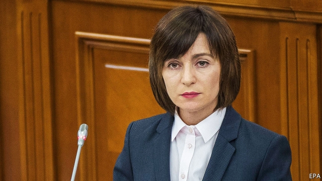

###### Rolled over

# A pro-Western government has been pushed out in Moldova 

 

> print-edition iconPrint edition | Europe | Dec 14th 2019 

HAS RUSSIA quietly taken back control of Moldova? Many observers reckon that is what, in effect, happened in the tiny former Soviet republic in November, when a pro-Western government abruptly collapsed, to be replaced by a new one that leans firmly towards Moscow. There is even a rumour running round Chisinau, Moldova’s sleepy capital, that Aureliu Ciocoi, the new foreign minister, is planning to remove all the European flags from his ministry. Mr Ciocoi looks shocked when asked. The flags are going nowhere, he says, and there is to be “no change at all” in Moldova’s relations with the EU. However, since 2013 Russia has embargoed almost all Moldova’s wine and agricultural produce, and so his country wants “pragmatic relations” with Moscow. 

Poverty makes it hard for Moldova to stand up for itself, and its economy has been looted for years, especially at times when governments claiming to be pro-European were in charge. Now, Mr Ciocoi says, Moldova’s problems are so dire that unless his government succeeds, in a decade the country could end up as a lot at Sotheby’s, a London auction house, “with a starting price of €1.” 

Mr Ciocoi is not wrong to paint his country’s problems as existential. Emigration is now at such high levels, thanks to endemic corruption, a miserable economy and the lure of better-paid jobs in the EU, that one study predicts that by 2035 there will be only 2.1m people left in a country which had 4.3m in 1989. 

Russian aspirations in this corner of Europe are nothing new. In 1918 the fledgling Moldovan Republic united with Romania for a brief interlude. In 1940 the Soviet Union reclaimed the former Russian imperial possession, and kept it until the Soviet Union disintegrated in 1990. Igor Dodon, Moldova’s pro-Russian president, uses pictures of himself with Vladimir Putin to win elections. In a leaked recording he talks of getting (illegal) party finance from Russia, though he says his words were taken out of context. Last June, though, Mr Dodon teamed up with a pro-European, Maia Sandu (pictured), to rid Moldova of Vlad Plahotniuc, an oligarch who had long dominated the country as chairman of the then ruling party. Mr Plahotniuc is now widely believed to have fled to Miami. 

In November the hopeful coalition collapsed. Ms Sandu claims that the new government, voted in by Mr Dodon’s Socialists and by MPs from Mr Plahotniuc’s old party, is pro-Russian, but that it will say whatever it needs to to keep Western countries happy, so that, while Russia calls the shots, the West keeps critical loans flowing. The government fell over a dispute about a new prosecutor-general. Ms Sandu says Mr Dodon told her that he did not want it to create an independent anti-corruption force which would arrest dirty politicians. 

Ms Sandu is down, but far from out. Vadim Pistrinciuc, an analyst and supporter, thinks she needs fewer “nice and smart” people around her and “more fighters”. Russia is flooding the country with fake news and money. Western governments run sessions on democracy and human rights. “It is like one side gives boxing classes while the other side does ballet ones,” he says. ■ 

