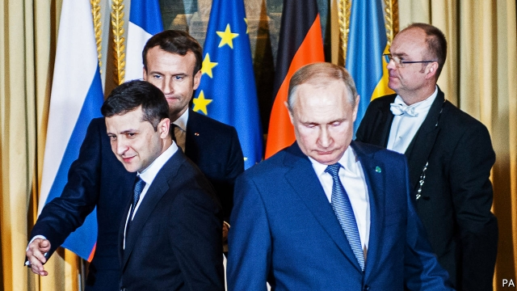

###### Vladimir v Volodymyr

# An awful week for Vladimir Putin 

 

> print-edition iconPrint edition | Europe | Dec 12th 2019 

THE OPENING ceremony of the Sochi Winter Olympics in 2014 was meant to be the defining moment of Vladimir Putin’s presidency, showing off a resurgent Russia to the world and turbocharging his popularity at home. With a price tag of $50bn, he left nothing to chance. Russia doped its athletes and trumpeted their gold medals as though they were the spoils of war. Whipped up by the state propaganda machine, the celebration morphed into anti-Western hysteria; and the Sochi Olympics gave way, within days, to the annexation of Crimea and the invasion of Donbas, in eastern Ukraine. 

Six years on, the after-effects are catching up with the Kremlin. On December 9th the World Anti-Doping Agency (WADA) banned Russia from major international sport events for four years (see article). In a country where symbols matter more than substance this ban, despite its loopholes, comes as a huge humiliation. It came on the day that Mr Putin sat down with Ukraine’s president Volodymyr Zelensky, and the leaders of France and Germany, to negotiate a settlement to the Russia-sponsored war in Donbas that has claimed 13,000 lives. 

The first “Normandy format” meeting for three years was shrouded in apprehension, partly caused by Emmanuel Macron’s new eagerness to build bridges with Russia. Would Mr Putin achieve his goal of pushing Donbas back into Ukraine without giving the government full sovereignty over it, seen as a ploy to destabilise the whole country? Would the French president put pressure on Ukraine for the sake of his own grand vision for a new European security architecture? And would the neophyte Ukrainian president cave in? These fears drove thousands of people onto the streets of the Ukrainian capital, Kyiv, urging Mr Zelensky not to give ground. 

The summit did not yield much, which was in a way a relief: an agreement to exchange all prisoners, to disengage in three additional areas along the conflict line, and to meet again in four months’ time. But Mr Zelensky also publicly drew some red lines. There must be no sacrifice of Ukraine’s territorial integrity, including Crimea, and crucially, there must be no local elections in Donbas until Ukraine has full access to the occupied territory and regains control over its border with Russia. That way, the election might be fair, which it certainly would not be if held now. 

The contrast between the presidents was striking. Mr Putin arrived in his monstrous armoured limousine, accompanied by a suite of security men, some in balaclavas. Mr Zelensky rode in a Renault minivan. At the late-night press conference, Mr Zelensky appeared young, nervous and sincere. Mr Putin looked like an ageing autocrat, vengeful, arrogant and bored. Having set out to normalise his relationship with Europe and isolate Ukraine, he achieved neither. On the very same day, EU foreign ministers agreed to start work on a European version of America’s Magnitsky Act—legislation that originally hit Russian violators of human rights with sanctions. 

In what was a terrible week for him, Mr Putin also encountered resistance from Belarus, a fellow Slavic country which is already part of an economic union with Russia. Tightening that union (and so, effectively, taking over Belarus) might allow Mr Putin to declare the creation of a new country that he could preside over after his presidential term—the last the Russian constitution permits him—expires in 2024. 

But talks at Mr Putin’s Sochi residence on December 7th produced nothing from the Belarusian leader, Alexander Lukashenko. “We never intended and never will become part of any other state—even the brotherly Russia,” he said, before they began. The five-hour conversation ended with nothing, other than an agreement to meet again in two weeks’ time. And as soon as Mr Lukashenko returned home, his army’s top brass said that Belarus is willing to take part in NATO war games—to be called “Defender Europe”—next year. That will not have filled Mr Putin with Christmas cheer. ■ 

