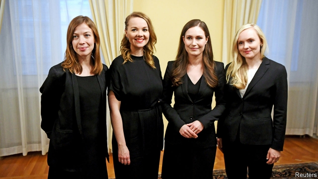

###### All change

# Finland’s new government 

 

> print-edition iconPrint edition | Europe | Dec 14th 2019 

FINLAND NOW has the world’s youngest serving prime minister. On December 10th Sanna Marin (pictured, second from right), who is 34, was sworn in at the head of a coalition whose four other component parties are also led by women. Three of them are also in their 30s. Strikes toppled the previous prime minister last week. 

