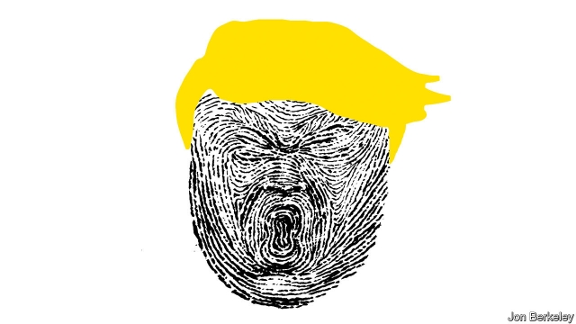

###### On trial

# Trump, impeachment and American democracy 

 

> print-edition iconPrint edition | Leaders | Dec 12th 2019 

ON DECEMBER 10TH the House Judiciary Committee formally accused President Donald Trump of abuse of power and obstruction of Congress. It was a solemn moment, and the prelude to Mr Trump becoming only the third president to be impeached. It was also entirely predictable. Mr Trump will now almost certainly be indicted by the House and cleared in a trial by the Senate. If a single legislator crosses party lines, it will be news. That enough to convict him will do so is inconceivable. 

Mr Trump’s behaviour forced on Congress an invidious choice. He deserves to be removed for attempting to tip the 2020 election. But the impeachment that has unfolded over the past three months will leave Republicans unswayed, voters divided and Mr Trump in office. That is bad for America. 

The main facts are not in dispute. Mr Trump ordered $391m of military aid to be temporarily withheld from Ukraine, which is fighting a Russian-backed uprising (see article). Using back channels, Mr Trump also promised Volodymyr Zelensky, Ukraine’s new president, a coveted meeting in the Oval Office if he announced investigations into Ukraine’s role in the 2016 American election and, more important, into whether Joe Biden, a potential rival to Mr Trump in the 2020 election, had corruptly protected his son, Hunter. Mr Trump’s claim was that Mr Biden, when he was vice-president, had prevented a Ukrainian prosecutor looking into a gas company that had Hunter on its board. 

The law is clear, too. Impeachment involves “high Crimes and Misdemeanours”, threats to the state and violations of public trust that need not be crimes in themselves (see Briefing). Mr Trump’s manipulation of a foreign government to smear his opponent is the sort of election-rigging that bothered the Framers. So much the worse that the president was also acting against the national interest by endangering an ally. 

Instead, the arguments have been about what Mr Trump intended. The president’s defenders insist that he was not smearing Mr Biden. He had a legitimate concern about corruption, and was conducting relations with the new government in Kyiv in his own way—as is his right. Ukraine’s president, they say, did not even know about the delay to the $391m, which in any case was mostly disbursed eventually. They note that Mr Zelensky denies that the aid depended on his investigations—and no wonder, because Mr Trump never intended such a quid pro quo. 

Intentions are hard to get at, especially with a man like Mr Trump who routinely contradicts himself. But this defence does not ring true. Ukrainian officials did in fact know about the delay, and Mr Trump released the money only after a whistleblower had complained about his behaviour. Mr Zelensky’s statement is open to doubt, as he has everything to lose from getting mixed up in an impeachment while Mr Trump remains in power. 

Moreover, Mr Trump did not take the Ukrainian allegations seriously. If he had wanted the Bidens investigated, the proper course would have been to refer the matter to the FBI, not to use a foreign government. Before charging ahead, Mr Trump could have asked whether the allegations were substantial. They were not. A Russia expert once on his own staff has warned that the story about Ukrainian meddling in 2016 was a Russian propaganda campaign. The Ukrainian prosecutor pushed out by Mr Biden was shielding corrupt firms: the father was not protecting his son, but exposing him to investigation by a new prosecutor. 

“Shall any man be above justice?” George Mason asked when drafting the impeachment clause. “Shall that man be above it, who can commit the most extensive injustice?” Mr Trump wanted to tilt the 2020 election in his favour by tainting Mr Biden. Given a free hand, his illegal efforts to cling to power might continue from the Oval Office. That is why Mr Trump should be removed. 

But he won’t be. To expel him, the Senate needs to vote against the president with a two-thirds majority. The Democrats, with 47 of 100 seats, would count it a victory to win a simple majority. Public support for impeachment jumped in September when it was announced, to a little under 50%, but all the investigations and hearings since then have not shifted it. Only 21 states have a majority in favour of impeachment (see our Graphic detail page). 

Democrats argue that this is because the White House has refused to let staff testify, or to release documents to Congress, the basis for that charge of obstruction of Congress. Republicans, they say, abetted by Fox News and others, have thrown sand in voters’ eyes by mounting shifting and inconsistent defences. 

The Democrats are right. The Republican refusal to take any allegations against Mr Trump seriously has been contemptible. In private, many Republican senators abhor Mr Trump and his methods. But they will not risk their careers by breaking with him in the national interest. 

The key to shifting them is public opinion—and it still has the potential to move against Mr Trump. Pollsters report that a third of independent voters are undecided; some of those opposed to impeachment appear willing to reconsider. But the White House will not let the public hear from the witnesses closest to Mr Trump, such as John Bolton, a former national security adviser, and Mick Mulvaney, his acting chief of staff. Sworn testimony from the inner circle could have contained facts and insights with a unique power to change minds. 

Democrats could have asked the courts to compel them to testify and turn over documents. If Mr Trump defied the judges, Republican senators would be under severe pressure to break with him. However, rather than submit to the grinding wheels of the law, the Democrats have settled for a vote simply to get it out of the way. They argue that they have already accomplished a lot. They have shown that the president did wrong, they say. Because the House has sole power over impeachment, they do not need the courts to prove obstruction. Even if they fail to remove Mr Trump, impeachment is deterrent enough. 

That is a counsel of despair. Nobody can say how long the courts would take. Democratic leaders cite the months needed to force witnesses to testify in other cases but, mindful of the electoral timetable, the judges could just as well choose to proceed swiftly. While they deliberate, the impeachment inquiry will hang over Mr Trump. That will do more to restrain him from further abuse than a rushed process that is done and dusted early next year. Even if time ran out, the impeachment lapsed and Mr Trump was re-elected, the case might be revived and he might be removed from office. Democrats, however, are focused on the risk that their party will suffer in next year’s elections. 

They are entitled to put their own electoral calculations first. The Republicans certainly have. But the Democrats should be clear that, even if their party benefits, America will bear the cost. 

Mr Trump is getting off lightly. When the Senate absolves him next year he will claim to have been vindicated. On the evidence, he is guilty of abusing his office. Instead, he will stay—possibly for another term. There is little doubt that his sense of impunity will be further redoubled. 

Impeachment was designed to be a last solemn resort, not another partisan tool. Settling for today’s doomed indictment ushers in tomorrow’s. Impeachment’s deterrent effect will erode, because it will be seen as a political gesture. The barrier to removal will rise because breaking with your party will be harder. Oversight will be weaker; the presidency more imperial. As the Senate trial draws near, America has nothing to celebrate. ■ 

