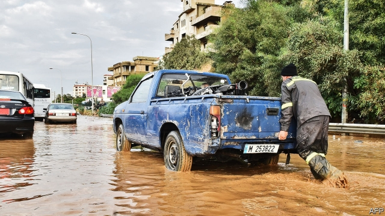
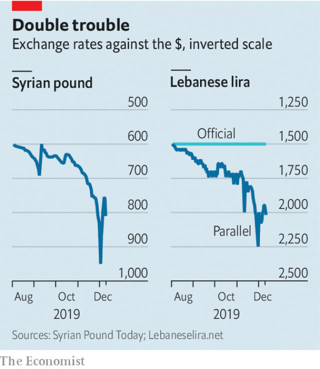

###### Reverse contagion

# As Lebanon’s economy drowns in debt, Syria’s begins to sink as well 

 

> print-edition iconPrint edition | Middle East and Africa | Dec 14th 2019 

OVER THE past two months everyone in Lebanon has become an economist. Walk down the street and you will probably hear snippets of conversation about dollars and exchange rates—and vitriol aimed at bankers. The country is in the third month of a political and economic crisis caused by a drop in remittances and bank deposits that has left everyone short of hard currency. Customers queue in banks for hours only to face arbitrary limits on dollar withdrawals. Credit has dried up, leaving firms unable to finance imports. Though the Lebanese pound is still officially pegged at 1,500 to the dollar, in practice the peg no longer exists: traders charge 2,000 pounds or more. 

Now Lebanon’s crisis is rippling across the border into Syria. Their economies have long been linked. Syrian labourers rebuilt Lebanon after its civil war, which ended in 1990. Banks in Beirut were a safe place for wealthy Syrians to park their cash. Since the Syrian conflict began in 2011, businessmen have used Lebanon to skirt sanctions and do deals abroad. But Lebanon is no use as a financial hub if its financial sector is frozen. With dollars scarce, the Syrian pound has followed its Lebanese counterpart and crashed to record lows, from 500 to the dollar at the beginning of 2019 to 950 in early December (see chart). Though it has stabilised a bit, Syrians expect it to fall further in 2020. 

 

As winter sets in, Syrians worry about how they will afford fuel, often sourced through Lebanese ports. Shortages of cooking and heating gas last winter, caused by a mix of international sanctions and corruption, led to widespread anger. The queues and scarcity will probably be worse this winter. Petrol stations in Lebanon are already struggling to keep the pumps filled; they briefly shut down last month to protest at the shortage of dollars at the official exchange rate. 

The Syrian government is trying to reduce imports, but the country’s shattered factories cannot provide basic goods. Many firms rely on raw materials from abroad, bought with dollars, then sell their finished goods on an impoverished domestic market. In some industries prices are fixed by the government: drug firms, for example, find it all but impossible to break even. Last month Bashar al-Assad, Syria’s dictator, decreed a pay rise of 20,000 pounds ($24) for civil servants. That is a 50% increase for many—but it is barely enough to allow them to pay for a winter coat. 

Lebanon is Syria’s biggest foreign market: it bought $132m of Syrian goods in 2017, 21% of total exports. A drop in purchasing power may hurt trade. It will also dent the value of remittances. Though many of the 1.5m Syrians in Lebanon are refugees barred from formal employment, aid groups estimate that their remittances still account for perhaps one-sixth of the total sent back to Syria from abroad. A pro-government newspaper in Syria has suggested that Mr Assad tax the diaspora. That might be tricky. It was his brutality that sent millions into exile in the first place. 

Mr Assad has shrugged off concerns about the economy. “Syrians have a lot of money,” he says. Meanwhile, Lebanon’s leaders are fighting over berths on a sinking ship. The prime minister, Saad Hariri, resigned on October 29th after weeks of protests. In November politicians seemed to agree on Samir Khatib, a businessman, as his replacement. But on December 8th Mr Khatib abruptly withdrew from consideration. Talks about a new cabinet were again postponed. His nomination seems to have been a stunt intended to make Mr Hariri look like the only viable option. “It’s a game. He still wants the job,” says an aide. 

Lebanese protesters want a cabinet stocked with technocrats to rescue the economy. Mr Hariri and his allies also back this arrangement, not least because the government must make painful choices about whether to restructure debt and devalue the currency. Few politicians want to be blamed for such decisions. But Hizbullah, the Shia militia-cum-political party, and its partners are reluctant to give up their foothold in the cabinet. 

While its leaders squabble, Lebanon is literally and figuratively underwater. Winter storms flooded parts of the country this month, a reminder of how the government has squandered money meant for infrastructure. One-third of Lebanese are poor, according to the World Bank, a figure that could rise to 50% as the crisis worsens. 

In April 2018 donors pledged $11bn to help Lebanon; it has yet to make needed reforms to unlock that money. Before a follow-up meeting on December 11th the French foreign minister, Jean-Yves Le Drian, said he hoped to “encourage the Lebanese authorities to realise the seriousness of the situation”. It may take much more than a reminder to convince them to act. ■ 

