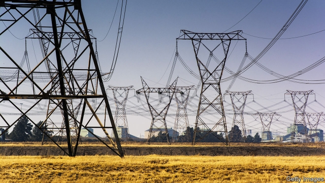

###### A failure of power

# Eskom is turning out the lights in South Africa 

 

> print-edition iconPrint edition | Middle East and Africa | Dec 14th 2019 

IN RECENT DAYS the only thing darker than South Africans’ homes has been their humour. On December 9th Eskom, the state-owned power utility, announced its biggest-ever blackouts, turning off the lights across Africa’s most industrialised country. Some wags used the remaining battery on their phones to vent on social media. “The E in South Africa stands for electricity,” read one post. Another suggested that “Eskom’s been bad all year…in the hope they’ll get coal for Christmas.” 

Many South Africans have stopped seeing the funny side. The failure of Eskom’s coal-fired power stations meant the loss of almost a third of its 44,000MW capacity (14,000MW, roughly the potential output of Denmark). The blackouts may tip the country into recession for the second time in two years. 

Eskom was quick to blame inclement weather. It has indeed been very rainy. But the root causes are gross mismanagement and rampant corruption. Two huge new power stations—Medupi and Kusile—are years behind schedule and billions of dollars over budget. Under Jacob Zuma, South Africa’s former president, Eskom was systematically looted. Today it is broke, with debts of 450bn rand ($30bn) that are crippling the public finances (see Buttonwood). 

Cyril Ramaphosa, Mr Zuma’s successor, has promised better management and the “unbundling” of Eskom’s three main parts: generation, transmission and distribution. Yet there has been little urgency. Andre de Ruyter, the incoming chief executive, does not start until January. Worse still, Mr Ramaphosa seems not to grasp the scale of the crisis. On the day the huge blackouts were announced he described Medupi as “a fitting symbol of the importance of our state-owned enterprises”. 

The tragedy is that the crisis is avoidable. Unbundling could be accelerated and assets could be sold to more efficient operators. The government could allow cities and companies to buy their own power and expand its auction scheme that allows private renewable-energy providers to sell to the grid. Mr Ramaphosa may fear the political consequences of such steps, if his party and its allies in the trade unions complain. But the alternative is surely worse. South African voters are already tiring of a well-meaning president who cannot keep the lights on. 

