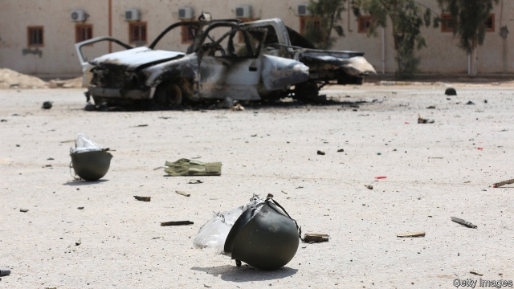
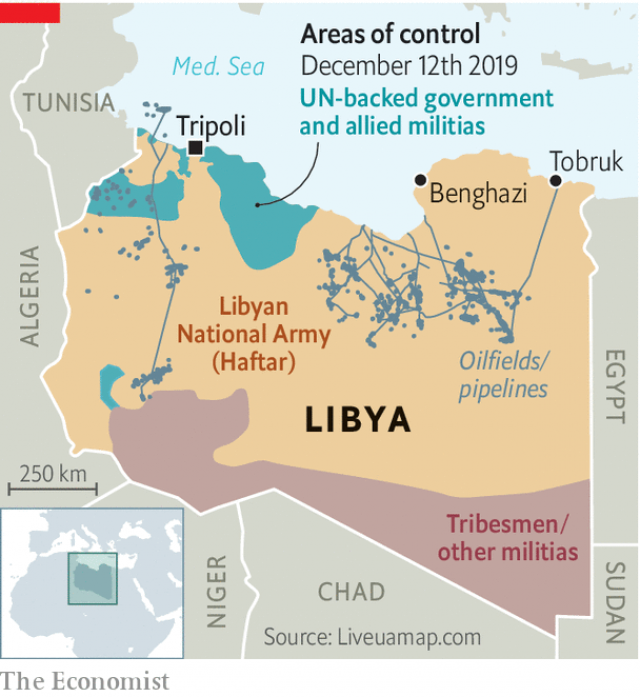

###### Magnet for mayhem

# Foreign powers are piling into Libya 

 

> print-edition iconPrint edition | Middle East and Africa | Dec 14th 2019 

THE WOUNDS of Libyan militiamen defending the UN-backed “government of national accord” (GNA) in Tripoli are changing, along with the battle they are fighting. Shrapnel used to be the cause of most of the casualties around the Libyan capital. But lately the fallen have been shot through the head, says a foreign diplomat. On the other side of the fight, Russian snipers have teamed up with the self-styled Libyan National Army led by General Khalifa Haftar, who laid siege to Tripoli in April hoping to dislodge the government. The front lines are moving for the first time in months. 

Countries such as Egypt and the United Arab Emirates have long supported Mr Haftar with guns and money. But Russia’s backing is a game-changer, say Western diplomats. It has helped Mr Haftar consolidate his hold on the east and south, home to most of the country’s oilfields (see map), and may tip the balance in Tripoli. But Russia’s presence may also be drawing in other foreign powers. America accused Russia or its local allies of shooting down one of its drones last month. President Recep Tayyip Erdogan of Turkey says he might send troops to defend the GNA, if invited. 

 

Russia’s intervention has come in the form of mercenaries from the Wagner Group, a private security firm with connections to the Kremlin. Officials in Moscow deny any involvement in Libya, but Western officials say the Wagner Group has been flying arms, tanks and drones into Libya for almost a year. There are thought to be 1,400 Russian mercenaries in the country. “It’s like a world-class coach taking over a B team,” says a diplomat in Tripoli, who considers the firm an unofficial arm of the Russian government. 

President Vladimir Putin is trying to build on his success in Syria, where he rescued the regime of Bashar al-Assad and won a foothold in the eastern Mediterranean. Libya’s coastline runs for 1,770km and sits directly across from Europe. The Wagner Group already protects most of the oil installations under Mr Haftar’s control. That gives it leverage over Europe, which guzzles Libyan crude oil. 

Turkey has commercial ties to the GNA and is opposed to the anti-Islamist agenda of Mr Haftar and his foreign backers. But its interest in Libya also stems from concerns over energy. Last month it signed a contentious deal with the GNA that demarcated the maritime boundaries between the countries’ exclusive economic zones. Greece, Cyprus and Egypt see the move as an attempt by Turkey to gain control of contested gas-rich waters. The energy agreement was accompanied by one aimed at strengthening the defences of the GNA, which Turkey has already armed. 

Mr Haftar’s foreign allies say they will boost their support for him if Turkey gets more involved. In an effort to lower tensions, Mr Erdogan said he wants to speak to Mr Putin before the Russian president visits Turkey early next month. “On the Haftar issue, I don’t want it to give birth to a new Syria in relations with Russia. I believe Russia will also review its existing stance over Haftar,” said Mr Erdogan. “He is an outlaw, and by that same token, any support he’s given is rendered illegally.” 

The foreign meddling makes a mockery of the arms embargo imposed by the UN in 2011, as well as its efforts to broker a peace deal. Plans for an international conference in Berlin have been postponed time and again. The GNA is increasingly seen as a hostage to its allied militias. The central bank in Tripoli maintains control over Libya’s oil revenues. But Mr Haftar could renew his bid for international recognition and start selling oil himself. 

Observers do not believe Tripoli’s fall is imminent. In a recent offensive Mr Haftar’s forces advanced about a kilometre, then ground to a halt. Still, the city’s defenders would welcome Turkish troops and air power (Mr Haftar currently controls the skies). “A lot of people on the front are getting tired,” says a militiaman in Tripoli. “It’s been eight months of fighting and they want to go home.” 

Meanwhile, residents of the capital feel the noose tightening around them. Civilian deaths because of the war, which had averaged less than 50 a month, are climbing. The streets have become crowded with people fleeing the fighting. Mr Haftar, who controls the city’s supply of power and water, could make matters worse. Whether he does or not may depend on the calculations of his foreign backers. ■ 

