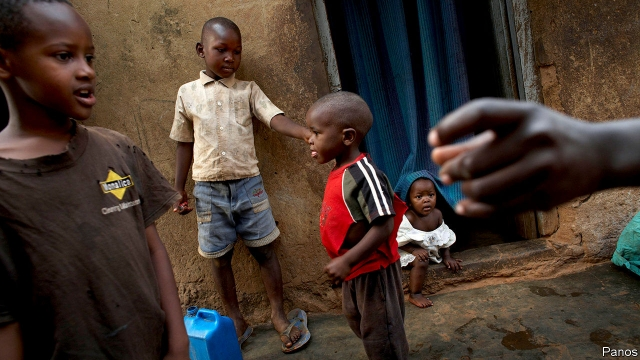

###### Africa’s affection economy

# In much of Africa the family is bank, business and welfare state 

 

> print-edition iconPrint edition | Middle East and Africa | Dec 14th 2019 

A GAGGLE OF children play outside Dorothy Nabitaka’s front door on the outskirts of Kampala, the Ugandan capital. She shares her home with 17 people: her mother, child, sisters, nephews, nieces, cousins, and several children she has taken in simply because they had nowhere else to stay. She helps others pay school fees with the money she earns selling animal feed. In all she gives away around four-fifths of her income, she reckons, though she is not really counting. “I don’t like seeing people suffering,” she explains. 

Sharing within social networks is central to economic life in much of Africa. Although kinship systems vary, obligations typically extend beyond the nuclear family to include the children of siblings as well as cousins, or sometimes larger units such as clans. People turn to friends and relations for help with school fees, hospital bills, or for a place to stay. Where formal institutions are weak, the family is bank, business partner and welfare state. 

At times the pressure to share can be stifling. “People make you feel guilty when they see you with a house, car or even a good dress,” says one Ugandan journalist. Black South Africans talk about paying a “black tax” to support a web of dependents. In Ethiopia, Pentecostal Christianity has taken off, in part because it offers an escape from traditional kinship obligations. 

One way to keep hold of your money is to hide it. Zainab Lamin, a housekeeper in Sierra Leone, tells her sisters she is unemployed. “If they know I have a job,” she says, “they will be sending their children to me—to pay for school fees” In experiments, recipients of a cash windfall, such as a raffle prize, will often take less to keep their winnings under wraps. In Cameroon people take out loans they do not need so that relatives think they are hard-up. 

Kinship networks can grease the wheels of commerce with loans or by creating trust when contracts are hard to enforce. But they also come with an “extra bill” that can “slow down the growth of a business”, says Ronald Mukasa, who trains Ugandan entrepreneurs. Cash flows are diverted into weddings and funerals. Managers hire relatives, who are not always up to the job. 

Yet family life is far more than an accounting exercise. In South Africa under apartheid, racist residence restrictions forced black workers to leave children in the care of others while they migrated to towns for work. Habits of sharing are now a bulwark against inequality. The term “black tax” is a misnomer, says Niq Mhlongo, the editor of a new book on the subject. He grew up in Soweto, a township, sharing a room with seven others. After the death of his father, his brother’s salary put him through school. As an adult, it was his turn to pay university fees for the same brother’s son. “It means that I had to postpone marriage,” he says, just as his brother had once done for him. “But is that a tax? No, it’s a family responsibility.” 

Mutual help acts as insurance against sudden shocks, such as illness or the loss of a job. One study in Kenya found that contributions from friends and family made up a quarter of income for poor rural households, mitigating swings in other earnings. 

Kinship cannot replace the welfare state. Sharing breaks down in the face of big shocks, such as drought, which hit everybody at once. And the neediest people often have the weakest networks. But informal groups, such as savings circles, can connect to larger institutions. 

As horizons expand, social networks do too. Nigerians encourage their relatives to go abroad to support the family, says Olayinka Akanle of the University of Ibadan. Emigrants sometimes invest in schools or businesses back home, and ask kin to oversee them in their absence. Remittances to Nigeria now exceed oil revenues: last year they brought in about $24bn, 11 times more than all foreign direct investment. 

Urbanisation, consumerism and rising inequality may strain kinship ties, but they have not yet broken them. In a trendy café in Kampala, two sisters discuss the middle-class dilemma. “How do you save up when your salary doesn’t just look after you?” asks one. She cannot afford to go travelling as much as she would like. Yet sharing is her culture, and she would have it no other way. “Your savings are in people,” her sister elaborates. “So when I have a bad day I cannot starve.” ■ 

