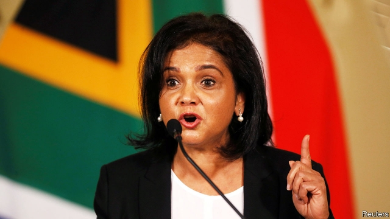

###### Batohi’s battle

# The wheels of justice are finally turning in South Africa 

 

> print-edition iconPrint edition | Middle East and Africa | Dec 14th 2019 

SO BAD WAS corruption under Jacob Zuma, South Africa’s president from 2009 to 2018, that people referred to it as “state capture”. Cyril Ramaphosa, Mr Zuma’s successor, thinks it cost the country 1trn rand ($95bn) in looted funds and lost GDP. And that is just the tangible expense. State capture also deepened a pervasive sense that, 25 years after apartheid, South Africans are dangerously short of trust in each other and hope for the future. 

The person charged with restoring some of both is Shamila Batohi, who left the International Criminal Court to take charge of South Africa’s National Prosecuting Authority (NPA) in February. Her appointment is central to Mr Ramaphosa’s efforts to clean house. “Everyone says there is a lot on my shoulders,” says Ms Batohi. “The people of South Africa are impatient, understandably so.” 

Few doubt her ability, but her success is far from assured. Christopher Stone, an expert in criminal justice at Oxford University, says she labours under a “triple burden”. The first is that the NPA, like other anti-crime institutions, was eviscerated during Mr Zuma’s time in office. The crooks did not simply loot state-owned companies but “systematically dismantled” the organisations meant to fight crime, says Anton du Plessis of the Institute for Security Studies, a think-tank. Heads of the NPA under Mr Zuma face serious questions about their integrity. Mokotedi Mpshe, the acting director when the former president took office, dropped corruption charges against Mr Zuma (which have since been reinstated ahead of a trial due next year). Mr Mpshe’s successor, Menzi Simelane, was found unfit for the job by the country’s highest court, which said his appointment was “irrational” and “unconstitutional”. 

Then came Nomgcobo Jiba, whose husband’s criminal record had been expunged by Mr Zuma. An official inquiry found in April that Ms Jiba had lied under oath, failed to follow court orders and compromised the independence of the NPA. The verdict cited, for example, how she dropped charges against Richard Mdluli, a Zuma ally and intelligence official who has since been convicted of kidnapping and assaulting a former lover’s husband. 

Ms Jiba’s successor, Mxolisi Nxasana, proved less convenient for Mr Zuma, and left after a golden handshake. In 2018 the highest court found that President Zuma “was bent on getting rid of Mr Nxasana by whatever means he could muster”, and declared the move “constitutionally invalid”. 

Such shenanigans led to an exodus of honest lawyers. From 2015 to 2018 more than 700 prosecutors left and were not replaced. Ms Batohi estimates that the NPA is functioning at 70% capacity. She has wrangled a bigger budget to recruit good people, and in February Mr Ramaphosa announced a dedicated unit to investigate serious cases of state capture. 

This has exacerbated the second burden on Ms Batohi. “Expectations are far greater than what any prosecution service can reasonably deliver,” notes Mr Stone. There are potentially hundreds of cases related to state capture, many of them fiendishly complex. Ms Batohi is fond of telling allies: “when you shoot at the king, make sure you don’t miss.” In other words, she wants to ensure cases are solid before making arrests. However, she sounds confident that arrests are coming. “If there are no [state capture] prosecutions next year then—my word—I should retire or resign.” 

There are signs of progress. On November 21st investigators arrested Bongani Bongo, a security minister under Mr Zuma. He was charged with attempting to bribe an official to obstruct investigations into the looting of Eskom, a state-owned electricity provider. Mr Bongo, who remains an MP (chair of the home-affairs committee, no less), is the first politician to be arrested in relation to state capture. A few days later the NPA won another victory when a court froze the assets of Regiments Capital, a company accused of orchestrating corrupt deals linked to the Gupta brothers, businessmen with close links to Mr Zuma. 

Yet even as cases are built, Ms Batohi believes that the NPA is serving as a deterrent to graft. Previously there was little chance that corruption would be investigated, “so it was a risk worth taking”, she says. “Those days are gone.” 

The third challenge facing the NPA, though, is that reclaiming a captured state means more than putting crooks in jail. It will require Mr Ramaphosa to make good on his promises to reform failing state-owned companies such as Eskom (see article). It also requires him to ensure that prosecutions are not seen as political. 

Under Thabo Mbeki (president from 1999 to 2008) and Mr Zuma the NPA was used as a political tool. By contrast, Mr Ramaphosa appointed Ms Batohi after a meritocratic, transparent process. The president “unwaveringly gave me his word that there will be absolutely no interference” in the work of the NPA, says Ms Batohi. “Since my appointment, that has been absolutely the case.” 

Yet opponents of Mr Ramaphosa—many of whom want him out so they can keep stealing and stay out of jail—will almost certainly cry foul if senior figures in the ruling African National Congress are prosecuted. For now, all the NPA head can do is get on with her job. Success will not be clear-cut, but if she can help convict the crooks it will inspire not just South Africans but reformers in other venal regimes, such as Angola, Pakistan and Ukraine. “It’s not going to be easy. It’s not gonna be quick,” she says. But, adds Ms Batohi, “failure is not an option.” ■ 

