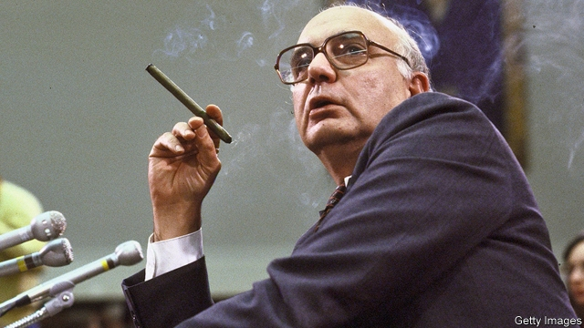

###### Through a cloud, brightly

# Obituary: Paul Volcker died on December 8th 

 

> print-edition iconPrint edition | Obituary | Dec 14th 2019 

IN HIS SPELLS of leisure time, when he had any, Paul Volcker liked to go fishing. Towering above a river in his jerkin and waders, fly cast, cigar firmly in mouth, was a good way to ruminate on big decisions. And he believed in rumination. “Procrastinate and flourish” was a favourite motto. Another, from George Washington, which his father had kept above his desk when he was city manager of Teaneck, New Jersey, was: “Do not suffer your good nature…to say yes when you ought to say no.” So when he was asked in 1974 to be president of the New York Fed, he went off on a fishing trip to chew it over. And in meetings and congressional-committee hearings later, as chairman of the Federal Reserve from 1979 to 1987, he hid his bald head in smoke-clouds, as if he was slowly weighing up what answers he could possibly give. 

His salvo against America’s inflation in 1979, which slew the dragon for decades, therefore seemed unusually abrupt. The times certainly required it, with annual inflation then at 12%. And his measures, announced at an extraordinary press conference in the boardroom of the Federal Reserve building in Washington, were drastic. From then on the Fed would control not the price of money, by adjusting the interest rate, but its supply, leaving interest rates to be set by the market. He would force America into recession to cure people of their expectations that since prices would keep on rising, they must keep on spending. The downturn that followed—double-dip, because he briefly took his foot off the brake—brought soaring unemployment, reaching 10.8% in 1982, and a federal funds rate of over 20%, the highest in history, before both rates and prices eased. By 1983 inflation was less than 4%. 

Yet he had been ruminating about the beast, and how to subdue it, since his Princeton student days. He was struck by Friedrich Hayek’s observation that the only way inflation cured unemployment was by disguising cuts in real wages. This linked inflation and deception indelibly in his head. Price instability destroyed trust, not only in the dollar but in government; and trust that officials would work for the common good, as his father had selflessly worked in Teaneck, was basic to the social contract. These feelings, more than any strong commitment to monetarism, convinced him that gentle rate-raising would not be enough. And with inflation running at well over 5% for most of the 1970s, he arrived at the Fed ready to tighten until interest rates went through the roof. 

This caused fury and despair. As consumers stopped spending, home-building tanked and businesses closed down. Angry crowds and farmers on tractors besieged the Fed; the keys to cars that dealers could not sell were sent to him in the mail. Though he had doubts, and wore out his office carpet with anxious pacing, he kept at it: not just because expectations would leap back up if he relented, but because persistence was a virtue in itself. And he stayed on guard, so much so that during Ronald Reagan’s 1984 campaign he was ordered by Reagan himself not to dare raise interest rates before the election, even though, by then, he was not intending to. 

Reagan’s men thought he wanted to hold the economy back, and tried to dislodge him. He opposed the president’s tax cut in 1981 unless it was matched by cuts in spending, but this was not political; deficits led to inflation. Besides, to a man who believed in frugality and discipline, they were also offensive. He was happy, even at the Fed, to wear crumpled suits, live in a students’ apartment block and fly coach back to New York and the family at weekends. (His salary had fallen by half when he went from the New York Fed to Washington, and even when he returned to Wall Street in 1987, making $1m a year, he kept his old pinchpenny ways.) As for discipline, he smoked AC Grenadier cigars not only because they were cheap, at a quarter each, but also because he had trained himself to like only what he could afford. 

Discipline was something he wanted banks to show, too. He battled to get them better regulated, though the weight of lobbying from the Washington swamp and, under Reagan, the pressure of the president’s advisers, made this hard. He mightily defended the Glass-Steagall Act which, since the 1930s, had prevented banks from trading in securities, but lost. His failure to clamp down on reckless lending, either at home or to foreign countries, showed up in a string of debt crises during and after his tenure, culminating in the Great Recession of 2008-09. At that low point he was called in again, the ever-reliable disciplinarian, to chair Barack Obama’s Economic Recovery Advisory Board. Although he much disliked having his name on things, it was pinned to the Volcker Rule of 2010, which barred banks from playing fast and loose with customer deposits just to boost their bottom lines. 

Behind almost everything he did lay concern about trust in the dollar, which also meant trust in America as the leader of the free world. In his time as a Treasury official in the 1960s he had laboured to maintain the Bretton Woods agreement of 1944, which had built an international monetary system round pegging the dollar to gold at $35 an ounce. When this began to founder he went along with a temporary suspension and then, in 1973, with decisive decoupling, but longed for some system of fixed exchange rates. Instead, the dollar was allowed to float. To him floating exchange rates were fundamentally dangerous, an open invitation to countries to manipulate their currencies—and so inherently unstable that they undermined the stability of governments, too. 

It was probably his wartime adolescence that made him yearn for such a rules-based world. But in so far as he managed to impose rules himself, they were a success. After 1983 the economy mostly grew without inflation and political leaders, by and large, learned to defer to the central bank on monetary policy. What worried him more as the years passed was a growing lack of trust in and respect for institutions in general, from the Supreme Court to Congress to the presidency. America sometimes seemed to be in a mess in every direction. Every direction, that was, except the coast of Florida, where he might get a big plump tarpon on his line, or the sparkling, ever-beckoning salmon rivers of Maine. ■ 

