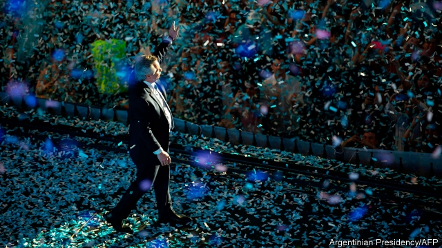
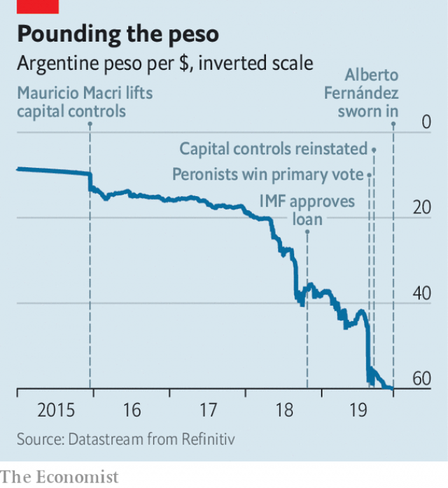

###### The Peronist predicament

# How Alberto Fernández plans to cope with Argentina’s economic crisis 

 

> print-edition iconPrint edition | The Americas | Dec 14th 2019 

ALBERTO FERNÁNDEZ drove himself and his girlfriend, Fabiola Yáñez, to congress for his inauguration as Argentina’s president in their Toyota. That gesture, as much as anything he said in his hour-long speech, signalled that he intends to swiftly help ordinary Argentines who are suffering from recession, high inflation and rising poverty. But some wondered, as the Peronist accepted the presidential sash and baton from Mauricio Macri, his centre-right predecessor, whether he would drive the country forwards or backwards. 

The question was provoked in part by the presence of Cristina Fernández de Kirchner, the new vice-president, who preceded Mr Macri as president. Ms Fernández, a populist who governed from 2007 to 2015, created the economic mess whose clean-up Mr Macri botched. She has been indicted in nine separate court cases for acts of corruption and other misdeeds. In the new administration she has already amassed unprecedented influence for a vice-president. The new president (no relation to Ms Fernández) wants to be a crowd-pleaser as she was, at least for poor Argentines, but without repeating her mistakes. That will be tricky. 

The “social catastrophe” that Mr Fernández promises to end is real. Two-fifths of Argentina’s citizens cannot afford a monthly basket of staple goods. The year-on-year inflation rate exceeds 50%. Argentina’s $57bn bail-out from the IMF is the largest in the fund’s history. Mr Fernández promises to put the economy “back on its feet”. But an adviser to the new president admits: “There are no easy answers on the economy, and no good options.” 

 

Mr Macri’s bet was that he could restore the confidence that Ms Fernández had battered, which would lead to growth. On taking office in 2015 he lifted exchange controls brought in by Ms Fernández, reached an agreement with foreign creditors (with whom she had fought) and lowered her punishing taxes on exporters. That approach failed, largely because Mr Macri did not cut the budget deficit fast enough to keep investors calm when global interest rates rose. The peso slumped and inflation soared (see chart). The IMF agreement in 2018 was a second stab at reviving confidence. But the austerity it demanded hit just as Argentina’s political season was getting under way, weakening the economy and driving voters to Mr Fernández. That knocked the peso again.  

The new president’s big idea is to reverse Mr Macri’s sequence: growth will lead to a revival of confidence rather than the other way round, he argues. To boost growth, he intends to bring back tools employed by Ms Fernández’s administration—but to wield them more deftly. 

The centrepiece of the economic programme is likely to be a restructuring of Argentina’s $105bn debt to foreign bondholders (which does not include debt to the IMF). This is to be carried out by the new economy minister, Martín Guzmán, an academic with little political experience who specialises in debt negotiation. He has proposed that Argentina defer payment of both interest and principal for the next two years. Analysts assume he will end up demanding bigger concessions from creditors. Bond prices suggest the markets are expecting an implicit haircut—a discount on the bonds’ face value—of nearly 50%. “Every dollar we don’t use for debt will go to consumer-led recovery at home,” Mr Guzmán has told his new colleagues. 

The idea of paying foreign creditors less than they are owed is bound to be popular. So, too, will be Mr Fernández’s plans to boost wages for public-sector and low-paid workers and raise pensions. 

Ideas for reining in inflation are unorthodox. The new government may keep a cap on utility prices that was due to expire at the end of 2019. It is expected to keep capital controls introduced by Mr Macri as an emergency measure to curb the depreciation of the peso, and to reach a pact with employers and trade unions to hold down prices and wages. (This may mean that salaries will rise by less than Mr Fernández has implied.) 

The big question is whether such a package can exclude the growth-clobbering stuff that the Peronists campaigned against. That is unlikely. The new government does not want to draw down the remaining $11bn of its IMF loan, but will still have to deal with the fund. The IMF is likely to welcome a cut in the private-sector debt burden (making it easier for Argentina to repay the fund). Both sorts of creditor are likely to insist on a primary fiscal surplus, ie, before interest payments, which means more austerity than Mr Fernández has in mind. There is worried speculation that the central bank will pay for promises such as higher pensions by printing money, even though its new president, Miguel Pesce, is thought to be a safe choice. If either fiscal or monetary policy is too loose, that will push up inflation in spite of the bodges being planned to contain it. 

Although Mr Fernández is bringing back into use some of the techniques used by his Peronist predecessor, he is keen to signal that he will not repeat her excesses. “This is Alberto’s economic team, and he will be in charge on this front,” says an adviser. Yet the new president has not laid to rest fears that Ms Fernández will have undue influence. Mr Guzmán got the economy ministry after she vetoed two other candidates, says the presidential adviser. 

She had a hand in the choice of the ministers of interior, defence and security. Her supporters will be in charge of the agencies that handle taxation, pensions and care of old people, which have big budgets and jobs to offer political allies. Her clout in these areas suggests that reforming the state will not be a priority. As vice-president, Ms Fernández is the senate’s leader and commands the Peronist bloc in the chamber, where it has a majority. Her son, Máximo, leads the Peronists in the lower house of congress. 

Ms Fernández also helped arrange the appointment of Carlos Zannini, one of her closest associates, as attorney-general. Mr Zannini was held in preventive detention for his alleged role in covering up a deal that Ms Fernández had made with Iran to absolve it of blame for the bombing of a Jewish centre in Buenos Aires in 1994 in which 86 people, including the bomber, died. His trial has been delayed indefinitely. Alberto Nisman, a prosecutor who was murdered in 2015, had indicted Mr Zannini. As attorney-general Mr Zannini, who was released from jail in 2018 and denies all charges, will lead the government’s anti-corruption unit and its team of lawyers.  

Mr Fernández has already made clear that he is not concerned about the alleged misdeeds of his senior officials. He contends that Ms Fernández and jailed members of her government are victims of “political persecution”. He has pronounced Mr Zannini innocent. “We vindicate you,” he told the new attorney-general.  

Mr Fernández will revive aspects of his Peronist predecessor’s foreign policy. The incoming foreign minister, Felipe Solá, has signalled “re-engagement” with Nicolás Maduro, Venezuela’s leftist dictator, who will now be less of a regional pariah. Argentina’s new government will not accept in its current form a trade deal negotiated by Mercosur, a four-country trade bloc, with the European Union. This will dampen Argentina’s growth prospects in the long run and increase tension with Brazil, the bloc’s biggest member. Mr Fernández and Jair Bolsonaro, Brazil’s populist president, speak of having “pragmatic relations”. But there is no hiding the frostiness. Mr Bolsonaro did not attend Mr Fernández’s inauguration, sending his vice-president instead. 

The Macri government is proud of having ended the economic isolation that Ms Fernández imposed on Argentina. “We’ve spent four years taking Argentina out of the deep freeze,” says Jorge Faurie, the outgoing foreign minister. “The fear is we’re going back.” Optimists think that the leftward shift in diplomacy will make it easier for Mr Fernández to adopt a moderate economic policy. Argentines must hope so.■ 

