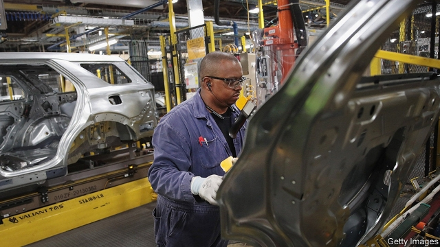
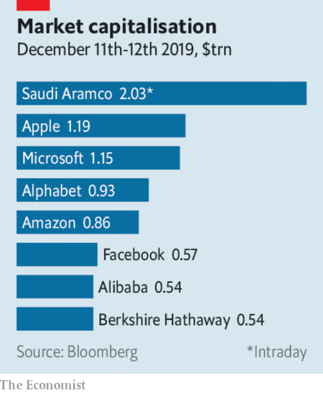

###### Boris bounds back

# Business this week 

 

> Dec 14th 2019 

The prospect of Congress approving the United States-Mexico-Canada Agreement improved, after Democrats reached a deal with the White House to revise the trade deal. The reworked USMCA weakens intellectual-property protections for the drugs industry, which Democrats insist will lead to lower health-care costs, and beefs up workers’ rights, putting more onus on employers to enforce labour standards. The USMCA will eventually replace NAFTA. See article. 

Still licking its wounds from its disastrous investment in WeWork, SoftBank was reportedly selling its 50% stake in Wag, a service that connects dog owners with people who will walk their pooch for them. Wag has struggled to compete against Rover, a rival. It has also been hounded by bad publicity about lost or dead dogs under its care. 

A judge on the New York state Supreme Court cleared Exxon Mobil of fraud related to its accounting for climate-change regulations. New York’s attorney-general had sought to show that the oil company committed fraud by using two methods to estimate costs posed by possible climate policies. The ruling lowers the likelihood of similar litigation in other states. 

Chevron said it would record impairments of more than $10bn in its fourth quarter. More than half of the write-down comes from shale assets in the Appalachian region. An abundance of shale gas has depressed prices, which are at their lowest in 20 years. 

America’s boundless production in shale energy has also kept down oil prices. In an agreement by which they hope to shore up prices, OPEC and Russia agreed to cut output by another 500,000 barrels a day, extending a strategy started in 2016. Saudi Arabia wanted deeper reductions, which were resisted by Russia. 

 

Saudi Aramco’s share price surged when it began trading on the Riyadh stock exchange. Although just 1.5% of the state-controlled oil company’s shares were sold, it raised $25.6bn in its IPO, the most ever. Aramco is now the world’s most valuable publicly listed company, hitting $2trn on December 12th. That is the value that Muhammad bin Salman, Saudi Arabia’s de facto leader, has decreed Aramco is worth, despite scepticism from global investors. Tranches of the shares are held by the Saudi elite, who have reportedly been pressed to trade the stock in order to reach the target. 

Problems at an oilfield off the coast of Ghana were one factor that caused Tullow Oil to drastically reduce its production forecasts for the next few years. Its share price tanked by 70%, one of the worst falls on the FTSE 250 this decade. 

Pacific Gas & Electric reached a $13.5bn settlement with the victims of wildfires that were sparked by its faulty equipment. That brings the total charges incurred by California’s biggest utility to $25.5bn. The settlement with victims could hasten PG&E’s exit from bankruptcy protection, though the deal must first be signed off by California’s governor. 

German industrial production fell by 1.7% in October compared with September, renewing concerns that the dip in German manufacturing may be deeper than had been thought. Compared with October 2018 output was down by 5.3%, the biggest drop by that measure in a decade. 

The Federal Reserve left its benchmark interest rate on hold, and suggested it would stay on hold throughout next year. The central bank cut the rate three times this year, but now believes the risks to the economy have moderated. 

Brazil’s central bank lowered its main interest rate for a fourth consecutive time, to a record low of 4.5%. That may spur a further decline in the real, which could be an issue for Donald Trump; he has accused Brazil of manipulating its currency to favour exports. 

Tributes were paid to Paul Volcker, who died at the age of 92. Mr Volcker influenced monetary policy for decades, waging a war on inflation as chairman of the Federal Reserve. He also proposed what became known as the “Volcker rule”, which bankers hate because it limits their trading. Asked how bad America’s economy was when he took charge at the Fed in 1979, Mr Volcker replied, “by Latin American standards, it wasn’t so bad”. See article. 

JD Wetherspoon, a pub chain in Britain, announced that it is pumping £200m ($264m) into its business over the next four years, creating 10,000 jobs. The ailing sector has been anything but stout over the past two decades, seeing around 12,000 pubs and bars close down. However, recent statistics have given the industry something to toast: there was a net increase of some 300 boozers in the latest year. That may be small beer for now, but Wetherspoon, at least, expects hoppy times ahead. 

