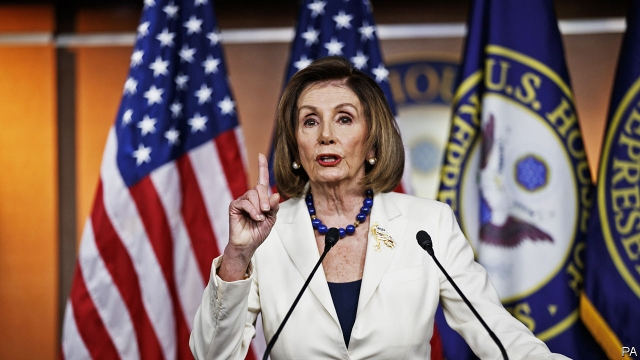
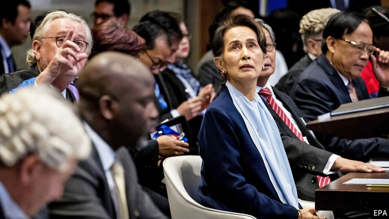

###### Boris bounds back

# Politics this week 

 

> Dec 14th 2019 

The House of Representatives presented two articles of impeachment against Donald Trump: that the president abused his power by pressing Ukraine to dig up dirt on Joe Biden, and that he obstructed Congress by insisting that key witnesses cannot testify. The votes on those charges are expected to be swift and along party lines in the House. Mr Trump could be impeached before Christmas, setting up a trial early next year in the Senate, which will in all likelihood acquit him. See article. 

Officials in Jersey City, which lies across the Hudson river from Manhattan, said three people murdered in a kosher market may have been targeted for anti-Semitic reasons. The two shooters, linked to a black hate group that considers itself the true Israelites, also killed a policeman before entering the store. The suspects were killed during an hours-long gun battle with police. 

A trainee in the Saudi air force murdered three sailors at a navy training base in Pensacola, Florida, before being shot dead by police. The motive was unclear but terrorism is one line of inquiry. See article. 

Alberto Fernández, a Peronist, took office as Argentina’s president. The economy he inherits from his centre-right predecessor, Mauricio Macri, is in recession and has an inflation rate of more than 50%. In his inauguration address Mr Fernández promised to end the “social catastrophe” of hunger and said Argentina could not pay its foreign creditors unless its economy grows. See article. 

Genaro García Luna, who was Mexico’s secretary of public security during the presidency of Felipe Calderón, was arrested in Texas. Prosecutors say he took millions of dollars in cash from the Sinaloa drug gang in exchange for protecting its activities and providing intelligence to it. Mr Calderón, who was president from 2006 to 2012, waged a bloody war against Mexico’s drug gangs. 

Honduras’s congress voted to recommend that the president not renew the mandate of MACCIH, a corruption-fighting mission backed by the Organisation of American States. Lawmakers complained that it disclosed names of people under investigation, but most Hondurans back MACCIH, which helped to jail a former first lady. 

None of Israel’s political parties was able to form a government before the December 12th deadline, so the country will hold another election, its third in less than a year, on March 2nd. Polls show little change in voter preferences. 

America and Iran exchanged prisoners in a rare bit of diplomacy between the two countries. The swap involved a Chinese-American researcher who had been convicted of spying in Iran, and an Iranian stem-cell scientist who was held by America for trying to export biological material. 

Opposition activists claimed that up to 1m people took to the streets in Conakry, the capital of Guinea, to protest against the rule of President Alpha Condé. Mr Condé is meant to step down at the end of his second term next year, but he may try to change the constitution so that he can run for a third term. 

Militants killed 73 soldiers in an army base in western Niger. The attack, the deadliest in years, highlights the rapidly deteriorating security situation across the Sahel. 

Security forces in Nigeria seized Omoyele Sowore, a journalist and activist, while he was appearing in court the day after judges had forced the state to release him. Mr Sowore, who had been held since August, has been charged with treason after criticising President Muhammadu Buhari and calling for civil unrest. 

India’s parliament passed a law offering a fast track to citizenship to minorities who face persecution in Afghanistan, Bangladesh and Pakistan, as long as they aren’t Muslim. The new law applies to Hindus, Sikhs, Buddhists, Christians and others. Muslims condemned it as an attempt by India’s Hindu-nationalist government to marginalise them. The law has been appealed to the Supreme Court. See article 

 

Aung San Suu Kyi defended Myanmar against charges of genocide at the International Court of Justice in The Hague. The Nobel peace-prize winner described the Myanmarese army’s bloody crackdown on Rohingya Muslims in 2017, in which thousands were killed or raped and 700,000 fled to Bangladesh, as an internal conflict started by Rohingya militants. See article. 

Police in Malaysia said they would interview Anwar Ibrahim, the country’s prime-minister-in-waiting, about an allegation that he sexually assaulted a male aide. As leader of the opposition in 1999 Mr Anwar was imprisoned on trumped-up charges of sodomy, which is illegal in Malaysia. He dismissed the allegation as political. 

Voters in Bougainville, an autonomous region of Papua New Guinea, voted by 98% to 2% for independence. Bougainville has long had a distinct identity; 15,000-20,000 people were killed in a civil war that was fuelled by separatist grievances and ended in 1998. The referendum, however, is non-binding. 

Hundreds of thousands of people marched through Hong Kong in the city’s first authorised protest since August and the largest in weeks. The demonstration, organised to mark the UN’s human-rights day, was mostly peaceful. Afterwards, however, some protesters threw firebombs at official buildings. 

A Chinese official, Shohrat Zakir, said everyone had “graduated” from “vocational education and training” camps in Xinjiang. An estimated 1m people, most of them ethnic-Uighurs, have been detained in what are in fact prison camps, often just for being devout Muslims. Mr Zakir said training would continue at the camps, with “the freedom to come and go”. Independent witnesses were not allowed in to verify his claims. See article. 

France’s prime minister unveiled details of the government’s plan for pension reforms, which put some of the toughest changes off into the future. But this may not be enough to halt a wave of strikes that have shut down most of the rail network, many schools and the Paris Métro. See article. 

A new government was sworn in in Finland. All five of the parties in the new ruling coalition are led by women. See article. 

Russia was banned from major sporting competitions for a period of four years, which will cover next year’s Olympics, after revelations that it had hacked and faked medical records dealing with doping. The ban contains significant loopholes, however. See article. 

