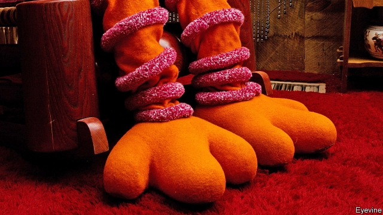

###### Farewell feathered friend

# Big Bird flies away 

 

> print-edition iconPrint edition | United States | Dec 14th 2019 

WHEN “SESAME STREET” first aired on November 10th, 1969, the first indication that this was no ordinary neighbourhood was when the eight-foot-two-inch yellow-feathered Big Bird appeared. At first he was depicted as a country yokel, but by the end of that first season the puppet’s operator, Carroll Spinney, had changed tack. Mr Spinney, who was Big Bird for five decades, played him as a six-year-old child, with all the wonder and sweetness that entails. (He once told the New York Times that he never got over being a child.) Big Bird would become, if not always the star, the soul of the Street. 

“Sesame Street” uses skits and songs to introduce little ones to letters and numbers, and well as to concepts like co-operation—and even death. A 2015 study showed that children who watched the show were better prepared for school and less likely to fall behind once there. Big Bird was a large part of that hidden curriculum. When he lost “my home, my nest, my everything” in a hurricane, for example, he learned to be optimistic. 

Kermit the Frog often sang that “It’s not easy being green”, but it wasn’t easy being yellow, either. Big Bird’s suit, with its 5,961 feathers, was burdensome. Mr Spinney opened and shut Big Bird’s eyelids by moving a 5lb (2.3kg) lever with his little finger. His right arm was fully extended to operate the heavy head and neck. Since he could not see out of the suit, a tiny monitor helped him manoeuvre. His understudy took over as Big Bird’s puppeteer in 2015, but Mr Spinney continued to be his voice until last year. 

A puppeteer since childhood, he also operated Oscar the Grouch, the sour to Big Bird’s sweet. Oscar, who hoarded junk and lived in a rubbish bin, gave children permission to be cranky once in a while. Mr Spinney’s own childhood was tough. His father was exceedingly frugal and sometimes violent. His mother encouraged his love of puppets and art. He spent a decade working in children’s television, but wanted to do something “more important”. A chance meeting with Jim Henson, the Muppets’ creator, gave him that opportunity. 

Big Bird became ubiquitous, the man inside remained unknown. In his memoirs Mr Spinney wrote that it was only the bird that was famous. But ensouling him was instructive. Among the chapter headings were “Find your inner bird”, and “Don’t let your feathers get ruffled”. 

