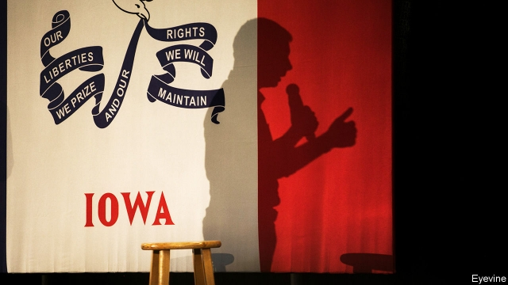

###### Mayor Pete’s edge

# How to win in Iowa 

 

> print-edition iconPrint edition | United States | Dec 14th 2019 

“IT’S A KINDA strange thing to do to your life. I’m trying to pace myself,” says Pete Buttigieg, the mayor of South Bend, Indiana. He has spent much of the past year criss-crossing Iowa, eating his body-weight in corn, shaking hands in coffee shops, spelling out his centre-left ideas. 

His bet is that getting a victory in the opening contest of the Democratic primary would propel him to be the party front-runner nationally. Over the past month polls in the state have shown he has emerged as the front-runner there with 25% support, nudging past Elizabeth Warren, although in national polls Joe Biden remains the most popular. That is what underpins the current Buttigieg bounce in political punditry. Of the 17 contested caucuses (in both parties) since Iowa set up its current system in 1976, victors on ten occasions went on to become their party nominee. For Democratic candidates recent odds are even more alluring: not since Bill Clinton, in 1992, has anyone become the nominee without coming first in Iowa. 

On February 3rd Democratic caucus-goers will congregate in 1,681 schoolhouses, barns and other forums, one for each precinct in the state. Candidates who receive fewer than 15% of the votes in each caucus will be knocked out and their support redistributed. Caucus-goers are older, whiter and more rural than the electorate as a whole. This tends to work against non-white candidates—with Barack Obama, who won Iowa, the only exception to this pattern. In some ways, then, the system seems rather retrograde. Yet the way votes from less popular candidates are redistributed is similar to a voting system that electoral reformers favour as a way to encourage moderation and compromise, making the caucuses rather forward-thinking. The other paradox of Iowa is that though the caucuses are supposedly all about folksy interactions with voters, all that meeting and greeting costs a lot of money. 

Cash and caucuses go together better than they may seem to. Steve Forbes, a tycoon, showed in 2000 that by spending $2m on a lavish campaign in Iowa he could draw plenty of attention and support. He came second to George W. Bush in the Republican caucus that year, a decent result for a political outsider. The cash buys local television ads. An estimate by FiveThirtyEight, a data-journalism site, suggests Mr Buttigieg has already spent $2.9m on television ads in Iowa, more than anyone else (and far more than he has spent anywhere else). Bernie Sanders is only slightly less lavish a spender. The likes of Mr Biden, Ms Warren and Amy Klobuchar are, for now, far behind on ad buys. 

This blitz has helped make Mr Buttigieg famous in Iowa. On a recent wintry weekday night he addressed 2,000 cheering people in a school auditorium in Council Bluffs. On the same night, in more-populous Des Moines, Ms Warren drew barely 700. A day later, in northern Iowa, Amy Klobuchar braved a blizzard to address a couple of dozen in a supporter’s living room. At recent events in western Iowa, a more conservative part of the state, Mr Buttigieg spoke frequently of his faith, marriage (to a man, though few seemed to care), military service and his wish to appeal to “future former Republicans” as well as Democrats. He emphasises unity and says America needs a return to civility in public life. Several who attended his events said they liked that, along with his caution on expanding Medicare. He proposes government health insurance for all who want to buy it, but not to ban the private sort. 

Local journalists and authors serve up supposed rules for caucus success. One holds that victors should avoid getting “hot” before November. Late surges often win out, implying that Iowans wait until late in the race to make up their minds. Ms Warren led in September, but has since drifted. Mr Obama came to lead the polls in Iowa only two months before caucus night in 2008. Ted Cruz did something similar, rising in the last months from third place to win the Republican caucus in 2016. 

Other rules mostly come down to a simple point: the winning candidates are usually those who spent plenty of time on the ground, building a strong organisation. At this point Iowa political junkies mention Jimmy Carter in 1976, who spent 17 days in Iowa (considered an eternity then), chatting to hog and corn farmers and leaving handwritten greeting notes on voters’ doors. Higher-flying candidates ignored the state as too small to matter, but Mr Carter’s victory won him such a rush of attention that the momentum carried him through the national race. 

Candidates must win as many precincts as possible, not just rack up votes in populated places like Des Moines, so organisers, staff and volunteers must be deployed all around the state. Building such a team takes time. Mr Buttigieg raised more money than other candidates for much of the past year and spent little early on, leaving him with $23m on hand in November (against Joe Biden’s $9m, for example). Like the former McKinsey consultant he is, he rather wisely spent on infrastructure. The fact that he has no onerous Senate commitments, unlike some other candidates, and comes from a nearby state also helps. 

In September his team said it was opening over 20 field offices (it now claims 30) and employing 100 staff, all in Iowa. Team Buttigieg has also done well at recruiting volunteers (some are excited by the idea of electing the first openly gay president) who pack events, dish out yard signs and bumper-stickers or nag friends to sign a pledge to caucus. The most committed are people like Kevin Halligan, who walked away from his job and left his wife behind in New York to spend five hours a day driving a pale-blue, slogan-covered former food truck—the “Petemobile”—across the state. He sells campaign merchandise to youthful Iowans queuing for photos beside a cartoon image of Mr Buttigieg. 

None of this means that Mr Buttigieg is a dead cert on February 3rd. There are signs in the polls that his bounce has peaked. It may be that Mr Biden, who was on a bus tour for eight days in Iowa, can recover from his fourth place in statewide polls. He or someone else could enjoy the late surge that the caucus is known for. It is possible that Mr Biden or Ms Warren could hoover up the second preferences of caucus-goers, allowing them to leapfrog Mayor Pete. 

For Mr Buttigieg also has to reckon with the final rule of success in Iowa. John Skipper, the author of a history of the caucuses, argues that what really counts is to come near the top while beating expectations. Managing those expectations when you are already the front-runner in the state is hard. Mr Buttigieg looks strong today. That means anything less than outright victory on February 3rd could cut short his moment in the limelight.■ 

