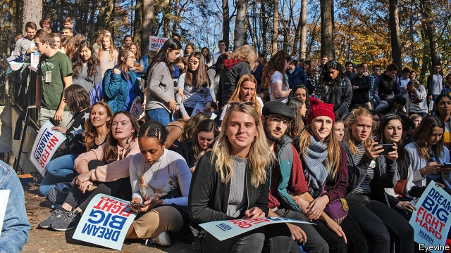
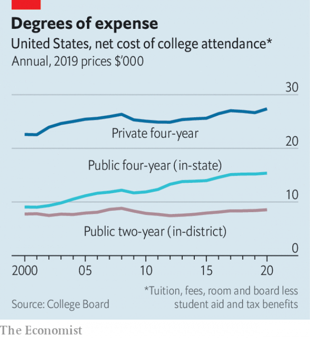

###### College free-for-all

# Should the federal government subsidise students, or make college free? 

 

> print-edition iconPrint edition | United States | Dec 14th 2019 

A CURIOUS THING seems to be eternally recurring in the Democratic presidential primary. Polices that not long ago looked like far-reaching progressivism are now deemed moderate milquetoastery by the party’s left flank. A public option for health insurance bores when compared with Medicare for All, a proposed single-payer set-up. Comprehensive immigration reform is deeply unfashionable next to decriminalisation of illegal immigration and the abolition of the nation’s immigration-enforcement agency. 

The same has happened with the debate over higher-education costs. Pete Buttigieg, the moderate mayor of South Bend, Indiana, newly rising in the polls, would like to expand subsidies significantly for public institutions. But he proposes to extend free tuition only to families making less than $100,000 a year (70% of all households), not to all students. For this, Alexandria Ocasio-Cortez, a popular lefty congresswoman, has accused him of parroting “a GOP talking point used to dismantle public systems”. “Just like rich kids can attend public school, they should be able to attend tuition-free public college,” she added. 

Ms Ocasio-Cortez’s preferred candidate, Bernie Sanders, is offering a maximalist solution to the problem. Not only would all tuition fees at public institutions be eliminated, but all $1.6trn of existing student-loan debt, from both public and private universities, would be cancelled. Elizabeth Warren, another leading progressive candidate, has a similar plan, though with a few more conditions on debt forgiveness. She reckons her plan would cost $1.25trn over a decade, paid for by her (at this point somewhat overextended) wealth tax, whereas Mr Sanders thinks his would cost $2.2trn, which he would pay for by hitting “Wall Street speculators” with a 0.5% tax on all trades of stock. 

Arrayed against this sort of solution are the ideas of ideologically moderate contenders like Michael Bennet, Joe Biden, Mr Buttigieg and Amy Klobuchar, who would like to subsidise higher education more without making it entirely free. Unlike the debates over Medicare for All and immigration, the agitation of the progressive wing over free college probably does not run the same risk of electoral backlash; few Americans are committed to the current system of university financing. Finding the optimal solution, however, requires a clear understanding of two matters: the scope of the current problem and the best way to target the benefits of enlarged subsidies. 

 

The stereotypical embodiment of America’s high university costs, much loved by journalists, is the part-time barista with a liberal-arts degree and a six-digit debt. Such luckless espresso-pullers undoubtedly exist, but they are far from typical. The average recipient of a bachelor’s degree in America graduated with $16,800 in outstanding debt. Though this is 24% higher than it was in 2003, it seems unlikely to trigger the kind of indentured servitude so often imagined. 

One reason that public perception and reality are so misaligned is the preoccupation with the costs of elite private colleges (which have indeed rocketed). In 2000 tuition at Harvard cost $31,400 per year without financial aid in current dollars. Today it costs $46,300. In part because America devotes considerable public dollars to higher education—spending twice as much as a share of GDP than Britain, for example—costs are lower than imagined. After aid and tax benefits are taken into account, private colleges charge an average of $27,400 each year in tuition and fees. In-state public college costs much less—about $15,400 on average—whereas local two-year colleges cost just $8,600. 

A universal college benefit would disproportionately help families that are already comfortable. Even among young Americans (those between the ages of 25 and 29), only 37% have a bachelor’s degree or a more advanced one. They are disproportionately white and wealthy. There are clear public benefits from higher education, but also considerable private benefits, given the large wage premium college graduates enjoy over less-educated workers. Nor would free college do much to advance racial minorities. Racial inequalities in educational attainment, which persist in the present cohort of young Americans, probably owe more to the quality of earlier schooling than the anticipated cost of college. For that reason, universal pre-kindergarten may be a more effective use of resources than universal free college. 

Few countries in the world guarantee free college, but in most countries college is cheaper than in America. One outlier is Denmark, where colleges are not only free, but international students also receive a monthly stipend of 6,166 kroner ($914). That could make for a nice Democratic presidential platform in 2024. ■ 

