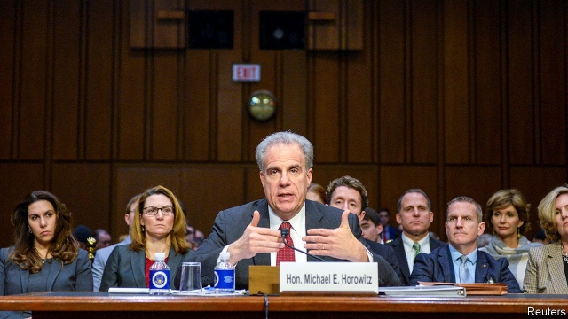

###### National inquirers

# The investigation into the investigation 

 

> print-edition iconPrint edition | United States | Dec 14th 2019 

FOR THREE years, Donald Trump and his supporters have insisted that the FBI’s investigation into links between his campaign and Russia was dishonestly predicated, and rooted in “deep state” contempt and political bias. William Barr, Mr Trump’s attorney-general, even condemned the FBI for “spying” on Mr Trump’s campaign. They hoped that a report from Michael Horowitz, the Justice Department’s inspector-general, would bolster those claims. Released on December 9th, Mr Horowitz’s thorough 476-page report showed serious problems with the investigation, particularly regarding the surveillance of Carter Page, an erratic member of Mr Trump’s campaign, but no conspiracy and no evidence of systemic bias. 

Its most fundamental finding was unequivocal: Crossfire Hurricane, as the investigation was called, was amply justified. It did not begin, as Mr Trump and his defenders claimed, with a dossier created by Christopher Steele, a former British spy. The Crossfire Hurricane team did not even see his work until two months after opening their investigation, on July 31st 2016. 

That was three days after the FBI received a tip from “a friendly foreign government” (Australia, though the report does not name it) that George Papadopoulos, a campaign foreign-policy adviser, “suggested the Trump team had received some kind of suggestion from Russia that it could assist.” That was the only trigger, Mr Horowitz’s report found, and it was both legitimate and carefully considered. 

Among Mr Trump’s accusations was that Peter Strzok and Lisa Page—respectively an FBI agent and lawyer who were having an affair during the election—were central to the “witch-hunt” against him. The report found that Ms Page played no role, and Mr Strzok just a minor one, in the decision to open the investigation. 

More broadly, it found no evidence that “political bias or improper motivation influenced the decisions” to investigate Mr Papadopoulos or the three other campaign members with links to Russia: Mr Page; Michael Flynn, briefly Mr Trump’s national-security adviser; and Paul Manafort, Mr Trump’s former campaign chairman, now imprisoned for a variety of financial crimes. Crossfire Hurricane might more accurately be considered an investigation of these four men, each of whom had dealings with Russia’s government, than of Mr Trump’s campaign more generally. 

The report did find multiple “significant errors or omissions” in the FBI’s applications to wiretap Mr Page, however. These errors “made it appear that the information supporting probable cause was stronger than was actually the case.” The fact that there was no evidence of “intentional misconduct” provides little comfort. If the process for watching an American citizen was so lax and error-ridden in such a politically sensitive investigation, it may be worse in less prominent cases. The investigators “did not receive satisfactory explanations for the errors or problems we identified.” They also referred Bruce Ohr, a Justice Department official whose wife worked for the firm that contracted Mr Steele, to the Office of Professional Responsibility for “errors in judgment”. 

This verdict will not end the partisan bickering over the Russia investigation’s origins. After the report’s release, Mr Barr dismissed its findings, arguing that the FBI may have acted in “bad faith”, and based its investigation on “the thinnest of suspicions”. John Durham, a prosecutor whom Mr Barr has assigned to undertake yet another investigation of the Russia probe’s origins, also disagreed with “some of the report’s conclusions as to predication.” Steve Scalise, one of Mr Trump’s staunchest defenders in Congress, said the report “proves Obama officials abused their... power to trigger an investigation,” when it reaches the opposite conclusion. ■ 

