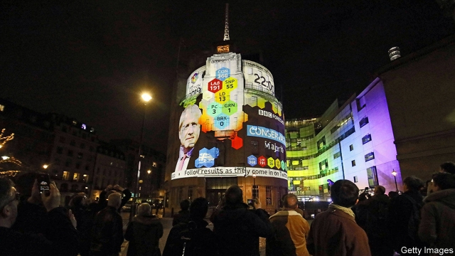

###### Agony Auntie

# Britain’s election fallout spells danger for the BBC 

 

> print-edition iconPrint edition | Britain | Dec 21st 2019 

PUBLIC-SERVICE broadcasters always come under fire during and after election campaigns, and the BBC more than any. On the campaign trail Boris Johnson threatened the licence fee, the charge on viewers from which it gets most of its funding. Labour is now accusing it of bias against its leader, Jeremy Corbyn. The BBC’s defenders argue attacks from both sides mean it must be getting things about right. In normal times, tempers calm and the corporation sails on to its next generous licence-fee settlement. 

But things look dangerous for the BBC this time. The Tories’ anger is deep. Their ire stems not only from their view of it as the Brexit Bashing Corporation (as Mr Johnson calls it) but their leader’s treatment by Andrew Neil. A week before the election, in a to-camera monologue that was widely shared, the BBC’s most feared political interviewer goaded and chastised the prime minister for avoiding a grilling. 

That has put the corporation in the sights of Dominic Cummings, Mr Johnson’s revolutionary strategy chief. His plans to shake up the civil service are well known. The BBC has apparently become another target. In November Mr Cummings had a meeting with the BBC's director-general, Lord Hall, according to people close to the broadcaster. Mr Johnson has reportedly banned cabinet ministers from appearing on the flagship “Today” radio programme. This week the government ordered a review of whether non-payment of the licence fee (currently set at an annual £154.50, or $203) should cease to be a criminal offence. Decriminalisation would cost the BBC £200m a year, it says. It would also signal that the government sympathises with those who have long attacked the licence fee as an unfair, anachronistic tax. 

Another unwelcome change from the Conservatives, decided in 2015 in order to achieve Treasury budget cuts, is about to hit. In a few weeks’ time, well over 1m grannies and grandads will be hearing from Auntie. A letter will spell out that for the first time in nearly two decades, over-75s must cough up for the licence fee (people with incomes of less than £167.25 a week will be exempt). 

In deciding which over-75s get free licences and enforcing the system, the BBC is in effect being obliged to take on the job of the Department for Work and Pensions. “There will be confrontations with millions of people and that will deeply hurt the BBC’s brand,” says Claire Enders of Enders Analysis, a media-research firm. The government could decide to keep free licences for the over-75s and make the BBC pay for them. That would mean a big cut—hundreds of millions—to its licence-fee income of £3.8bn, in addition to the cost of decriminalisation of non-payment. 

“The risk is that the walls close in on the BBC,” says Ed Williams, a former director of communications for the broadcaster who runs Edelman, a public-relations firm, in Europe. A mix of a big shift in politics, ageing audiences, the rise of video-streaming services like Netflix and the threat of public indifference is putting huge pressure on the corporation, he says. Persuading young people to watch and listen to the BBC has long been a problem. The average age of a BBC1 viewer is now 61. The most recent annual review from Ofcom, the media regulator, found that for the first time, fewer than half (49%) of people aged 16 to 24 tuned in to BBC TV channels every week. 

As for the broader public, the BBC commands wide support. Three-quarters of adults told Ofcom that the corporation’s public-service broadcasting purposes are important to society. Yet Netflix, the American entertainment behemoth, is now almost as trusted a brand in Britain as the BBC, research from Edelman shows. And a Brexit-dominated election has dented the BBC’s standing. A YouGov poll this month showed that people trusted its journalists significantly less than they did in October. 

Those who argue that the Beeb’s troubles will blow over point out that its licence fee is protected by royal charter until 2027. But it will need to reach another fee settlement in 2022. Mr Cummings and the prime minister were willing to prorogue Parliament; they might well countenance legislation to change the BBC’s funding. Changing the BBC’s leadership could be another approach. In the past the corporation could count on allies on both sides of politics. Just now it is looking rather friendless.■ 

Clarification (December 19th 2019): this article was updated to make clear that the meeting between Lord Hall and Dominic Cummings took place before the election, not after it. 

