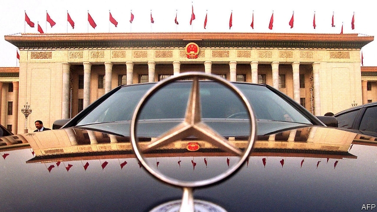

###### Two is traffic

# Chinese carmakers may soon own a fifth of Daimler 

 

> print-edition iconPrint edition | Business | Dec 18th 2019 

AT DAIMLER’S ANNUAL meeting in May, one shareholder captured the mood. “Don’t replace the Mercedes star with a Chinese dragon,” implored Deka Investment, a big asset manager, referring to the purchase in 2018 by Geely, a Chinese firm which also owns Sweden’s Volvo, of a 9.7% stake in the German car giant. Daimler now faces the rise of a second dragon. Beijing Automotive Group (BAIC) is reportedly poised to double its holding in Daimler to almost 10%. This would put it ahead of Geely as the firm’s biggest shareholder. 

If Geely’s manoeuvre was a surprise, BAIC’s is not. In July the state-owned company grabbed 5% of Daimler. Though the dragon is not yet on the bonnet, it has long been under it: engines, powertrains and other parts that go into Daimler’s Mercedes-Benz cars sold in China are made under two joint ventures with BAIC set up since 2005. With Chinese car sales down in 2018 and 2019 after years of steady increases, domestic manufacturers are banking on premium cars for growth. So is Daimler, whose financial performance has been less inspiring than that of its cars. Its share price has nearly halved since 2015. 

For BAIC, the relationship with Daimler is “of existential importance”, says Robin Zhu of Bernstein, a research firm. In 2018 sales from Beijing Benz, one of its ventures, grew by 16% year on year and accounted for 90% of BAIC’s total revenue. Mr Zhu notes that BAIC has long sunks profits from Beijing Benz—a tidy 10bn yuan ($1.5bn) in 2018—into “the bottomless pit” of BAIC’s domestic brands, which lost 6.5bn yuan. 

 

A bigger stake in Daimler may be an attempt to restore the perception that BAIC, not Geely, is the Germans’ main partner. A spokesman for Daimler says it welcomes long-term investors, especially those it knows well. The German firm owns 9.6% of BAIC Motor, the Chinese company’s Hong Kong-listed subsidiary, and 3% of BluePark, another BAIC affiliate that makes electric cars and batteries. 

Many Germans nevertheless worry. With another 5% or so the Chinese duo could block some strategic decisions, says Marc Tüngler of DSW, an organisation which represents the interests of German private investors. The pair could easily join forces. Geely may be privately owned but, Mr Zhu says bluntly, “both ultimately represent the Chinese state.” 

Geely and BAIC may shun separate holdings above 10% to avoid triggering a review by BaFin, Germany’s financial regulator. But Daimler is apparently already worried that an enlarged Chinese stake may invite scrutiny from an American government body which vets foreign deals, including those between foreign firms with American subsidiaries. Another of Daimler’s Chinese joint ventures, with BYD, a maker of electric cars, may come under strain as Congress tries to bar federal money from paying for Chinese buses, which BYD sells to America. On December 15th China’s ambassador to Germany threatened to retaliate against its car industry if the country bowed to American demands to bar Huawei, a telecoms-equipment giant, from its networks. For Daimler, this requires some deft handling.■ 

