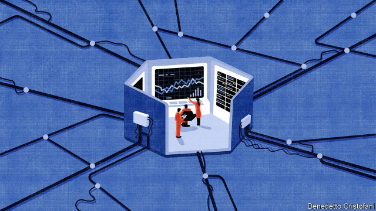
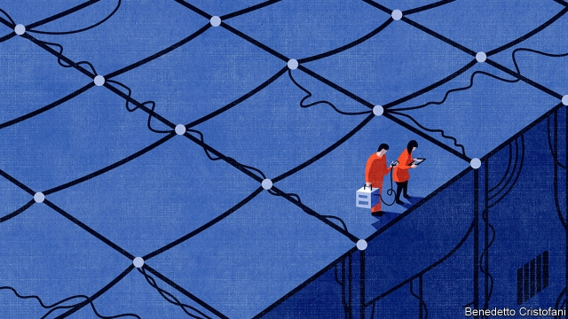

###### Essay

# Can technology plan economies and destroy democracy? 

 

> print-edition iconPrint edition | Christmas Specials | Dec 18th 2019 

ABOUT A CENTURY ago, engineers created a new sort of space: the control room. Before then, things that needed control were controlled by people on the spot. But as district heating systems, railway networks, electric grids and the like grew more complex, it began to make sense to put the controls all in one place. Dials and light bulbs brought the way the world was working into the room. Levers, stopcocks, switches and buttons sent decisions back out. 

By the 1960s control rooms had become a powerful icon of the modern. At Mission Control in Houston, young men in horn rimmed glasses and crewcuts sent commands to spacecraft heading for the Moon. In the space seen through television sets, travellers exploring strange new worlds did so within an iconic control room of their own: the bridge of Star Trek’s  USS Enterprise. 

A hexagonal room built in Santiago de Chile a decade later fitted right into the same philosophy—and aesthetic. It had an array of screens full of numbers and arrows. It was linked to a powerful computer. It had futuristic swivel chairs, complete with geometric buttons in the armrests to control the displays. Unlike the Johnson Space Centre and the Enterprise, it even had a small bar where occupants could serve themselves drinks after a hard day’s controlling. 

The operations room of “Project Cybersyn” (short for “cybernetics synergy”) was created by Chile’s president Salvador Allende in the early 1970s as a place from which the country’s newly nationalised and socialised economy could be directed. To build it, Allende had hired Stafford Beer, a British consultant, who requisitioned a mainframe computer and connected it to telex machines in factories. Industrial managers would input data which would then be centrally analysed; instructions for any necessary changes would be sent back. 

Ironically, the socialist system’s most notable success was in outmanoeuvring lorry drivers whose strike threatened to bring down Allende’s government in 1972. After Chile’s generals stormed the presidential palace on September 11th 1973 and Allende killed himself, Cybersyn was destroyed: a soldier is said to have stabbed all the screens in the operations room with a knife. 

It was a bloody reprisal of a then half-century-old debate about how best to run an economy. Allende had thought that, with state-of-the-art 1970s communications and computers, it would be possible for government to optimise an industrial economy. The Chicago-school economists advising Pinochet in Chile thought that the far greater information-processing capacity of the market would do better. In Chile their opinion was imposed by force. 

The success of market- and semi-market-based economies since then has made the notion of a planned economy seem like a thing of the past. But were a latter-day Allende to build a Cybersyn 2.0 it could now gather data via billions of sensors rather than a few telex machines, and crunch them in data centres packed with tens of thousands of servers. Given enough power, might it not replace the autonomous choices on which the market is based? 

Already a sense of technological control is spreading through society. The control room has given way to the cloud as the site where decisions are made. There is no central headquarters at Uber sending out drivers, no Borgesian library at Google where things are looked up. Just algorithms that seem to manage more and more of the world’s work, and make more and more decisions. Sometimes they run the software of the market, as when serving ads on your screen to the bidder who most wants your attention. But they could also run the software of the polis or the state. 

As Jack Ma, until recently the executive chairman of Alibaba, a Chinese online conglomerate, put it at a conference in 2017: “Over the past 100 years, we have come to believe that the market economy is the best system.” But in the next three decades, “because of access to all kinds of data, we may be able to find the invisible hand of the market.” Find it and help it? Anticipate it? Disable it? That was not clear. 

And if technology can outperform the invisible hand in the economy, might it be able to do the same at the ballot box when it comes to politics? If computer systems can divine what voters want and help those in power deliver it, the mandate they have for that power may come to matter less. 

One of the great arguments for democracy is what Fritz Schapf, a German scholar of politics, calls “input legitimacy”. Even if a system does not give people what they want, the fact that those running it reflect a democratic choice is legitimising. Undemocratic governments have to develop some mixture of “output legitimacy”—giving the people what they want—and frank repression. Today’s information technology can help with both. It can provide not just data on what people want and will tolerate, but also the means to manipulate those desires. When such means are available to actors within or outside a state the struggle to gain, or for that matter retain, a democracy which reflects a genuine popular will might become even harder than it is. 

If technology can outperform the invisible hand in the economy, might it be able to do the same at the ballot box? 

This is the sort of idea that leads thinkers like Yuval Harari, an Israeli historian, to suggest that ever more capable information technology means that not just free-market economics but also liberal democracy might “become obsolete” over the coming century. He argues this is particularly likely if information technology is partnered with biotechnology, allowing its algorithms to access and act on human thought. This does not necessarily have to entail tyranny. It might mean something even stranger. 

On some of their adventures Star Trek’s various starships encounter the Borg, a more-than-species which uses nanotechnology and computers to assimilate all those whom it encounters into its own collective. Its members all hear what each hears, all see what each sees, all will what each wills: there are no individuals; there are no aims but those of the collective. The demands of television drama mean that the Borg’s shared will may be represented by a leader—a queen for the spacefaring ant hill. The logic of the idea says otherwise, suggesting a truly equal, truly efficient hive that might persist with neither central control nor overt oppression, optimised only for assimilation. 

The Borg are a fantasy of totalitarianism, not a technological prediction. But as data processing pervades more and more of human life, displacing and recasting all sorts of processes, experiences and relationships, is it really inconceivable that they might begin to impinge on the processes of choice central both to market economies and liberal democracy? All-pervading information technology of the sort the world is embracing does not have to lead to strict economic and political control. But the possibility needs to be examined to be avoided. 

2. Costs and calculations 

The industrial states which fought the first world war brought their economies under centralised control to a degree Europe had never seen before. And many observers thought it had worked rather well. In 1919 Otto Neurath, an Austrian-born economist who in his youth had studied the pre-monetary economy of ancient Egypt, argued that there were lessons from this success. If the state was able to calculate how many uniforms and munitions were needed in wartime—which he knew it could, because he had been in charge of efforts to that end—it could surely do so for other goods in peacetime. 

Thus began what became known as the “socialist calculation debate”, a now obscure episode which changed the way people thought about the economy. The thinkers who went on to shape the new market liberalism of the second half of the century were on the side of the debate which held that control by planners could not work. In making this case, they introduced the idea of the economy as an information-processing system. And it is precisely that idea which opens the possibility that Mr Ma of Alibaba invokes. If markets are a success because of the way they process information, the fact that the other ways of processing information developed over recent decades are now so incredibly powerful must surely have implications for their role in the future. 

The calculation debate was not a matter of dry academic tit-for-tat. Soviet Marxism-Leninism was dedicated to the idea that an economy could be planned, and Russian industrialisation of a basically agrarian state seemed to many socialists in the West to bear the idea out. The Soviet Union made at least one theoretical contribution, too. In the 1930s Leonid Kantorovich, a Russian economist, saw how to manipulate a mathematical model of the economy so as to optimise its outputs through a technique called “linear programming”. The idea earned him the only Nobel prize for economics ever won by a Soviet citizen. In 1937 Oskar Lange, a Polish economist who later taught at the University of Chicago, but also served communist Poland at the United Nations and on the council of state, proposed a mathematical way of importing some of the virtues of markets into such planned economies by using “shadow prices” for basic inputs to calculate the optimal allocation of resources. 

In their responses to Neurath and Lange, respectively, Ludwig von Mises and Friedrich von Hayek, two Austrian economists, argued that using machinery for such calculations would never be able to beat the results achieved by markets, because markets were also machines—and vastly better ones. They ceaselessly crunched through all the data an economy had to offer in order to calculate what was available and what was wanted; the output of their calculations was what things cost. The processing power they embodied was of a different order from that available through calculations or the rules planners used to control things. 

 

When Glen Weyl, an economist who works for Microsoft, characterises the calculation debate as “basically an argument about computational complexity before Alan Turing formalised the concept 20 years later” he is hardly being anachronistic. By the time Hayek wrote his seminal essay, “The Use of Knowledge in Society”, in 1945, he was able to write about the market in terms that directly evoke information technology: it was a “machinery for registering change…a system of telecommunications which enables individual producers to watch merely the movement of a few pointers, as an engineer might watch the hands of a few dials.” 

But this machine, Hayek went on, did not just register change. It generated new information—information which made the world intelligible, and thus informed the activity within it. What would happen was not merely unknown before the market got to work: it was unknowable. And an economy which cannot be predicted cannot be controlled. 

There was another key difference between the market’s calculation-in-the-world and the planners’ calculation-in-the-calculator. The engineer looking at the screens in Hayek’s analogy is not a member of the technocratic elite locked up in a control room. It is anyone with access to price data. As a calculator, the market is essentially decentralised and accessible to all: that is why, in the view of Hayek and his followers, it fits so well with liberal democracy. Everyone is free to make their own decisions. 

For a period of time planning still seemed to work. During the post-Stalin “thaw” of the 1950s America saw its nuclear arsenal matched and was beaten into orbit, prompting real questions about which system worked better. Though the Soviet economy was never as strong as it hoped to look, that was a time when new ideas and the first computers allowed Kantorovich and his disciples to believe they might truly be able to turn the Soviet economy into “its own self-victualling tablecloth”. Francis Spufford’s book “Red Plenty” (2010), a blend of history, economics, science and fiction, reimagines that optimism—and shows how it fell apart in the complexity, criminality and unintended consequences of Soviet life. Democratic and market processes act to even out human fallibility and explore all sorts of possibilities. Planned dictatorships narrow choices and amplify error. 

The Soviet Union collapsed in 1991, and China’s subsequent decision to diminish the role of planning and embrace markets in much of its economy saw an unprecedented global boom. The market side of the debate seemed conclusively proved right. Some saw the Soviet collapse as making an allied point about politics; that decentralised freedom worked better. In 2012 Henry Farrell and Cosma Shazili, of George Washington University and Carnegie Mellon University, respectively, put this argument in a way that made it formally similar to the calculation debate. Democracy, they argued, has a “capacity unmatched…in solving complex problems”. 

To understand why this may be, consider the informational challenges faced by centralised or authoritarian regimes. They lack what Mr Shazili calls a “feedback channel”. Just as markets generate information about what people want, so does open discussion. In autocracies, citizens have no interest in openly discussing problems or experimenting with solutions, lest they end up in jail or worse. As a result, an unelected government has a limited capacity to understand what is going on in its polity—and thus tends to make bad decisions. Dictators maintain extensive security apparatuses not just to repress the people but to understand them; they serve as the feedback channel through which dictators get the information which they need to govern. 

Such measures are not just an affront to human rights. They are politically destabilising. The head of an effective security service can easily become either a rival for the top spot or a self-censoring information block, neither of which bodes well for the boss. And for the dictatorships of the early- and mid-20th century, snooping was expensive. In 1989, the last year East Germany functioned as a state, more than 260,000 people worked full- or part-time for the Stasi, its security service. That was nearly 2% of the population. 

3. The intoxications of technology 

Despite its advantages, both in terms of economic growth and problem solving, 21st-century free-market liberal democracy has not enjoyed quite the apotheosis that some expected at the beginning of the 1990s. The setbacks to democratic norms at the level of the state have been well documented. The persistence of planning goes unnoticed because it is so familiar: it is the way that companies are run. 

Around the time the cold war ended Herbert Simon, another Nobel-prize-winning economist and a pioneer in the field of artificial intelligence (AI), argued that talking about economies purely in terms of market transactions left a huge amount of what actually goes on in the world unexamined. To make his point he offered up a thought experiment. Suppose an alien intelligence—or, for that matter, the USS Enterprise, going into orbit, as is its wont, around an M-class planet—were to study a strange world with “a telescope which reveals social structures”. Pointed at the Earth, Simon argued, that telescope would show lots of solid green areas with faint interior contours linked by a network of thin red lines. Both colours would be dynamic; new red links would form and old ones perish; some green blobs would grow, others shrivel. Now or then one blob might engulf another. 

The green blobs in Simon’s vision were firms and other organisations in which people work; the red lines, market transactions. And if asked what the long-range scanner revealed, the observer would reply “large green areas interconnected by red lines” not “a network of red lines connecting green spots”. By concentrating only on the red lines representing market transactions, Simon said, classical economics misses out a great deal of what happens in the world. And in that missing part of the world, decisions are routinely subject to a great deal of planning, the information processing for which takes place in management hierarchies. Simon would not have been at all surprised to find that, 30 years on, those hierarchies were increasingly enabled by, and dependent on, computers processing reams of data. 

Let a thousand satellites bloom, a trillion sensors sense 

“Internally, firms are planned economies no different to the Soviet Union: hierarchical, undemocratic planned economies,” write Leigh Phillips and Michal Rozworski, two leftist activists, in “The People’s Republic of Walmart” (2019), a highly readable romp through the history and possible futures of planning. The management, marketing, logistics and manufacturing functions of big companies all exhibit huge amounts of planning (some of which, in areas like the layout of factory floors or the design of supply chains, may well use linear programming and related techniques). Amazon and Walmart display levels of planning that Gosplan, the Soviet Union’s central planning agency, could never have hoped to match. 

Today, applied within firms, such planning is used to maximise profit—and the tendency of such centralisation to produce corruption and other adverse effects is kept at bay through all manner of law and corporate-governance mechanisms. Messrs Phillips and Rozworski argue that if similar tools were applied more widely in an economy under democratic control other goals could also be taken into account and optimised: health; the environment; leisure time. It is a message that resonates with at least some on the left who are embracing anew the idea of a post-scarcity “Fully Automated Luxury Communism”, to borrow the title of a book by Aaron Bastani, a left-wing media entrepreneur. 

Actual existing communism, such as it is, is neither fully automated nor, for most people, luxurious. It is also little interested in putting the power to plan under democratic control. Indeed in pursuing its goal of actively managing a “harmonious” society, the Chinese Communist Party shows every sign of wanting more or less the reverse: not the democratisation of planning, but the sort of planning that permits democracy to be minimised. As Rogier Creemers of Leiden University explains it, the party (which, it should be noted, includes many engineers in its high ranks) thinks that, like the natural world, social reality is underpinned by objective laws. If a government understands these laws, it can predict how society will work, which will allow society to be controlled. “It’s a pure rejection of Hayek,” says Mr Creemers. 

With the tools at their disposal today, planners and controllers would seem to have no hope of competing with organically grown information-processing systems such as markets and democracy. But the power and reach of the tools available grows all the time. More than half the people on Earth already carry a hand-held sensor-packed computer. Many millions can make things happen just by speaking into thin air, thanks to the fact that computers are always listening for their command—and thus for anything else which may be going on. Few doubt that, barring some derailing catastrophe, the amount and variety of data gathered, processed and transmitted around the world will continue to grow. Let a thousand satellites bloom, a trillion sensors sense. There are already a thousand times as many transistors etched on to silicon every year than there are grains of rice and wheat grown in fields. Why should that multiplier not be a million? 

It is not only the quantity of data that has changed since the days of Soviet planning and Stasi snooping. There have been huge qualitative changes, too. Gosplan had to make do mostly with production data, which were often wrong because factory managers had many reasons to over- or under-report. 

Today’s digital information comes in real-time streams, not static statistics, taken directly not just from machines but from people, for instance by tracking subconscious eye movements. And the programming techniques—including self-programming techniques—now bundled up under the catch-all term AI can derive all sorts of meaning from them. Such systems embody that with which Kantorovich and his planners could not cope: effects related to their causes in complex, non-linear ways. 

Yet none of this means either efficient or effective planning is possible in the near term, or perhaps ever. For a start, a wider qualitative range of data does not equate to higher quality data; each new way of looking at the world through machinery is likely to bring its own biases, and in a data deluge these could become harder to spot. 

It is also worth keeping in mind that, though Messrs Phillips and Rozworski are correct that companies do a lot of planning, they do it suboptimally; indeed, many of them do it so badly they go out of business. Competition assures you that when this happens other companies will keep going. But that redundancy would be hard to come by if planning took on more and more of the economy. 

And economic planning really is hard. Inspired by Mr Spufford’s “Red Plenty”, in 2012 Mr Shazili published a fascinating mathematical exegesis of Soviet planning online. If Gosplan had been given a good modern computer and today’s snazziest linear-programming software it would have taken a few minutes to solve the equations needed to optimally allocate resources over the 12m products the Soviet Union was making in 1983. But factor in a range of further relevant variables—quality, technical specifications, delivery locations and the like—for each product and the calculations get much much harder. If there are a thousand variables associated with every product, the computing power needed goes up by a factor of 30bn. 

Suresh Naidu of Columbia University thinks such calculations may, from a planner’s point of view, be overly pessimistic. You do not need to model the whole economy. Some entities—industrial sectors, labour markets—could be optimised separately, allowing separate planning problems to be solved in parallel. “We’re never going to plan the economy like the Soviets, with a giant matrix with every good in it,” explains Mr Naidu, “but we could get it right on average.” 

 

But could you plan a moving target? If the role of AI within the economy increases, so will the economy’s complexity. As Alex Tabarrok, an economist at George Mason University, puts it: “The problem of perfectly organising an economy does not become easier with greater computing power precisely because greater computing power also makes the economy more complex.” 

And there is the problem of Goodhart’s Law, named for Charles Goodhart, an economist: data known to be used for planning purposes cease to be good measures of the way the world is. Yu Yong-ding, a Chinese economist, saw this in action during the Great Leap Forward. Chairman Mao decreed that China should produce more steel: as a result, much of the country’s existing stocks of the metal were melted down in backyard furnaces which produced poor quality pig iron. Mr Yu is now an adviser to China’s National Development and Reform Commission, which is in charge of developing the country’s five-year plans, a reasonably broad-brush endeavour he supports. He is utterly sceptical about microeconomic planning. “If you are not God, you cannot foresee everything,” he says with a smile. Hayek could not have put it better. 

4. A screen pressed up against a human face forever 

China’s leadership may be as convinced as Mr Yu that fine-grained economic prediction, and thus control, remain impossible. But when it comes to using computers for social and political control it seems, predictably, much more keen. 

A lot of this is relatively straightforward repression, seen in its most extreme form in Xinjiang, a region in western China where most of the citizens are Uighurs, a Muslim minority. In cities, cameras are everywhere, as are checkpoints where residents must show ID cards and allow their faces to be scanned. They are also required to install a smartphone app that allows police to track them and access their data. This is not an alternative to the internment camps in which hundreds of thousands of Uighurs are confined. It is an extension of them. 

There also are softer, but perhaps more far reaching, applications of information technology. To police public conversation, as China’s censors are tasked to do all across the country, means listening to it. What people talk about on social media shows what they care about. It thus describes what the state needs to do to achieve “output legitimacy”. Active manipulation of the public conversation provides another avenue for control. So does the “social credit system”, which is meant to use a range of data to give citizens a trustworthiness score, though it is still a fragmentary work in progress, at best. 

For a catastrophising imagination, it may seem only a few steps from here to the Borg. Add a few biological implants, AI which hears everything and draws conclusions about potential instabilities and an ability to provide for the basic needs of all, and you have your cybernetic ants’ nest. But that is quite a stretch. Ultra-wired dictators would run into similar problems as economic planners. Even in relatively small countries it is exceedingly difficult, not least because of social media, to predict what will drive change where. Hong Kong is an excellent worked example. And social engineering via AI risks going badly wrong, as Mr Shazili’s sometime co-author Mr Farrell points out in a recent blog post. AI systems make mistakes and develop biases. If the people the AI is being used on suffer as a result, that is bad for them; but it might be even worse for a government relying on the AI’s insights for control. “Machine learning ... may turn out to be a disaster for authoritarianism”, writes Mr Farrell. 

When it comes to eroding an existing democracy, rather than shoring up a dictatorship, there are somewhat similar technologies on offer. Some are destructive. Social media, driven as its commercial interests are by the desire to “go viral”, offers ways to inject the equivalent of computer viruses into the public’s political information processing, degrading and distorting its output through misinformation, emotional incontinence and cognitive sabotage. 

Some are less obviously abhorrent. Neither scoring for some sort of social credit nor sophisticated surveillance tools are the sole preserve of authoritarian states. Online, people happily allow firms to follow their every move—where they are, what they buy, what they like and even what they think—and build up profiles of them scored for any number of characteristics. State surveillance can gel with the self-administered form. More than 400 American police departments have agreements with Amazon that allow them to access the cameras associated with the company’s video-doorbell service, Ring. The “surveillance-based economic order”, as Shoshana Zuboff of Harvard Business School calls it, is not identical to what is growing in China. But the two systems have clear similarities. 

A visit to the heart of one of Earth’s greatest green splodges reinforces a sense of what is afoot. In many ways, Apple is on the side of the angels when it comes to surveillance; no other big tech company takes privacy so seriously. Employees are no longer as afraid of error as they were when the late Steve Jobs still ran the place. Even senior executives sport a relaxed untucked look, a faint echo of Apple’s countercultural origins. 

The great glass torus which houses the company’s headquarters is bright, clean and beautiful, its processes hyper-efficient and environmentally friendly. But from within it feels more than slightly sect-like. The transparency is amazing—the floors curve away into the distance, workers on the other side of the building can be seen across the central garden. But transparency does not mean openness. Doors let you through when you swipe the right badge. Cameras are everywhere, albeit well hidden. In 2017 an employee was fired after his young daughter took a video of him in the Apple cafeteria using an iPhone that had not been released and posted it online. 

Designed by Norman Foster, an architect besotted with flight, the building is often likened to a spaceship—an impression reinforced by the fact that its foundations are decoupled from Earth’s crust by a system of 700 steel disks which allows it to move back and forth during an earthquake. But is it a flying saucer readying itself for launch? Or has it just touched down, the beachhead of a courteous, almost welcome invasion from the fully networked, algorithmically optimised and increasingly well controlled future? 

5. Welcome to Planet Platform 

One of the interesting things about the socialist calculation debate was the degree to which the two sides agreed. They shared the desideratum of machine-like efficiency; they differed about how to get it. It is harder to see the common ground between outrages such as the suppression of Xinjiang and busy people surrendering data and decisions to Alexa and Siri. But the desire for control and predictability in your own life shares some characteristics with the notion of controlling others. Thoughtlessly pursued it may open up similar possibilities. And thoughtlessness is the whole point of automation. 

The idea is that, as a healthy federation of platforms emerges, it will give rise to new ways to make decisions 

If you care about values, though, you can design systems with room for thoughtfulness—systems which provide room for discussing the whys and to-what-ends that the how-wells of efficiency tend to silence. Consider again Chile’s Project Cybersyn. Yes, its operations room was a place for control. But it was also a place for debate. As Eden Medina of MIT explains in “Cybernetic Revolutionaries” (2011) it was designed to bring humans and machines together in a way that promoted the discussion of ends, means and values. It was a platform for economic democracy that its creators wanted to replicate across the country, providing workers, managers and officials with the opportunity to understand their situation and decide what to do. Hence its use of big geometric buttons instead of traditional keyboards: working men with fat fingers would be able to use them as well as managers whose secretaries normally did the typing. 

The concept of providing a platform for choice and for discussion is a crucial one, not least because carving up the world into platforms on the one hand and the things which run on them on the other is a near ubiquitous feature of tech-talk. The platform in question may vary—it may be an operating system, an online marketplace, a social network. But it is always something on which other stuff sits, and which determines what that other stuff can do. 

If planners—or regulators, for that matter—want to intervene in something, it is with the platform that they are best advised to start. It is the place where code becomes law, where the mechanisms by which a market works are specified. The canonical example is the early web. No startup had to ask if it could put up a website. But if it did not follow certain technical standards its offering simply would not work. 

This way of thinking of things allows a new insight into the calculation debate. In treating both the planning system and the market as what might now be called computer programs it made them comparable. Take the next step of seeing the type of program in question as a platform, though, and they become very different. The market is a platform that can run lots of very different processes; the planned approach is much stricter. 

Platforms are already a source of huge and increasing power, commercial and otherwise. Politics needs to catch up with this, not just in terms of regulating commerce—where the issue is already a hot one—but also by opening up discussion of the values that platforms embody and encourage. In a recent paper entitled “Digital Socialism?” Evgeny Morozov, an American writer and researcher, calls on the left to push governments to take back control of the “feedback infrastructure” of the platform economy; Trebor Scholz, a researcher at the New School in New York, wants a lot more platforms run by co-operatives. Some will see problems with both approaches. But expecting a market that lacks both foresight and oversight to produce platforms fit for civic purpose on their own would be very optimistic. 

Like most things, the platform world should be pluralistic. Some basic platforms, such as digital identity and digital currency, perhaps, should probably be owned by governments, or at the very least open to policing by them. Other platforms need to allow oversight by their users and civil society to ensure an absence of bias (the besetting sin of AI) and privacy infringements. A further set, such as the internet, Linux, an open-source operating system, and Wikipedia are best looked after by standards bodies or groups of volunteer developers. And many should be allowed essentially to own themselves, perhaps encoding what they are there for and how they are to be used in blockchains like those used by cryptocurrencies. 

Mr Weyl, the economist at Microsoft, thinks a healthy federation of platforms will provide new ways to make decisions. That might allow new ways of planning; but it might do so on platforms that require democratic consent (Mr Weyl has a geeky new voting system he is itching to try out in such a world). 

To see everything in terms of platforms is not a necessarily sunny outlook. An all-encompassing platform which required applications to embody a single set of values would be headed in a decidedly Borgish direction. Mr Weyl’s healthy federation of platforms, like the mostly amiable and high minded United Federation of Planets which is responsible for the USS Enterprise, is a hope, not a certainty—one that needs an engaged political process to bring it into being if it is to set off in search of new life, and new civilisation. ■ 

