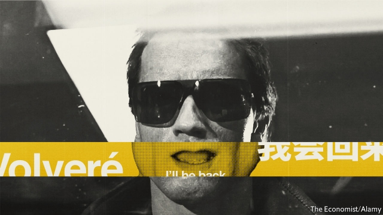

###### Dubbing

# Dubbing is coming to a small screen near you 

 

> print-edition iconPrint edition | Christmas Specials | Dec 18th 2019 

YOUR CORRESPONDENT is ready for his close-up, of sorts. In a Los Angeles sound studio, a television monitor is showing a scene from a new Brazilian thriller series in which a headmaster is chasing away a loitering ne’er-do-well. Words stream across a purple band running below the action: “Get out of here! You graduated two years ago!” Reading them out at the precise moment they arrive at the centre of the frame, at just the right speed, takes several takes. Getting the emotion and voice right—the director wants something hard-boiled and urban—takes a couple more. Finally, no doubt keen to flatter a visitor, he pronounces it a triumph.  

The show is “Spectros”. Made by Netflix, a video-streaming company, it was conceived by an American showrunner and filmed in the Japanese-Brazilian São Paulo neighbourhood of Liberdade by a Brazilian director. Its potential audience, though, is spread all around the world. And very little of it speaks Portuguese. 

Netflix has moved heavily into “international originals”: programmes shot in languages other than in English. It is a strategy that has various attractions. Producing locally set shows no one has seen before helps the company conquer new territories. Film-making in much of the world is considerably cheaper than it is in America. Talent is widespread. And a lot of people are culturally curious, intrigued by stories from elsewhere. 

But it also has an obvious disadvantage. That rich pool of talent telling new stories does so in a wide range of languages. If those stories are to be spread around the world then they have to be intelligible to all. Netflix has decided that means dubbing them with translated speech. Competitors such as Amazon, now producing video of its own as well as distributing the video of others, are pushing into the field. 

In its infancy, cinema was international—a silent film made in Moscow could be watched in Manchester quite easily, its intertitles translated if need be. But then cinema learned to talk, and all was Babel. 

In English-speaking countries, the problem of watching a film made in a foreign country was mostly solved either with subtitles or by not bothering to do so. With the world’s largest film industry in America, an English-speaking audience wanting to be entertained rarely troubled itself with foreign languages. 

In countries where productions in the mother tongue were not so copious, various other approaches were tried. In Poland and Russia, the preference is for lectoring, an unsettling experience (for those unused to it) in which the original voices are audible but low and a single voice emotionlessly speaks a translation. Some small Kenyan cinemas employ a live version of the same idea: a “DJ” who vividly interprets and even explains the film as it plays. 

Another approach is to make the film twice; first do the original version of a scene, then do a re-take in translation. Hollywood used to do this for some films. Bilingual actors could make this easy: Marlene Dietrich was a natural. Sometimes a new actor would be brought in to perform the role in the desired language. Some film buffs consider “Drácula”, the Spanish-language version of Tod Browning’s “Dracula” in which Carlos Villarías replaces Bela Lugosi, better than the original. 

This is still done here and there. A recent Indian blockbuster, “Baahubali” (2015), was made simultaneously in Telugu and Tamil, two related southern languages, with a cast bilingual in the two. It was the highest-grossing film of all time in both languages. “Baahubali” was also a huge hit in northern India, where it was dubbed into Hindi. But with many films from southern India Bollywood does not bother with dubbing; it just buys the rights and remakes them from scratch. America does this, too, and very occasionally it works. Martin Scorsese won an Oscar for “The Departed” (2006), a remake of “Mou Gaan Dou” (Infernal Affairs), a Hong Kong thriller made by Andrew Lau and Alan Mak in 2002. 

But the heart of Europe, film-making’s home, belongs to dubbing. Cheaper than employing bilingual casts or remaking from scratch, more accessible to mass audiences than subtitling, the technique had in the early days of the talkies an extra bonus: censorship. Don’t like the opinions voiced in a film? De-voice them. While that is no longer an issue, the desire to see American and British films while hearing your own language remains. 

There is also a desire for known quantities. In dubbing-dominated markets, voice artists stay with the same actor, often across decades. This makes stars out of those who voice the stars, or at least provides them with steady work. Take the recently retired Thomas Danneberg. Germany dubs more films than any other country, and over his career Mr Danneberg worked on some 1,500 of them. He played funny men, such as John Cleese and Dan Akroyd, and tough ones, such as Nick Nolte and Sylvester Stallone. One of his mainstays was Arnold Schwarzenegger, whom he voiced from “The Villain” (1979) to “Aftermath” (2017). 

This might seem strange. If Marlene Dietrich could play herself in German, surely the Austrian-born Mr Schwarzenegger could, too. But German dubbing has a reputation for consistency over artistry—or authenticity. Mr Schwarzenegger’s Austrian accent would have been far too distracting to audiences accustomed to a high German accent. (In his first film, “Hercules in New York” (1969), the then-bodybuilder had the distinction of being dubbed in both his native and his acting language, with an American actor re-recording his English-language dialogue.) 

Voicing a range of actors has an obvious drawback; sometimes they may appear in the same film. When Mr Schwarzenegger and Mr Stallone bantered with each other in “The Expendables” (2010) Mr Danneberg rose to the challenge by subtly changing his voice as he switched between them. Now he has retired, though, the roles have been reassigned; in the German-language version of “Terminator: Dark Fate” Mr Schwarzenegger was voiced by Bernd Egger. 

There are other reasons for foreign-language voices to change. In the third of the eight “Harry Potter” films the voice of the actor playing the hero, Daniel Radcliffe, had begun to break; that of his first German to dub the role, Tim Schwarzmaier, had not. Mr Schwarzmaier was replaced by Nico Sablik, two years older, who finished out the series. It was a good break. Mr Sablik, at 31, now has 738 credits to his name. 

Part of the scorn with which dubbing is treated in the Anglophone world is down to the fact that dubbing into English has rarely been done well. In countries more invested in the art, it is done with care and skill. 

Dubbing Brothers in Saint-Denis, just outside Paris, is a large and well-appointed complex with 14 studios which are typically all in use. French catchphrases from English-language films adorn its walls (“Cours, Forrest, cours!”). In the dub for “The Knight Before Christmas”, a straight-to-streaming Netflix production made in English, the actors work in pairs, reading from a “rhythmoband” which carries the dialogue across the bottom of the monitor. The rhythmoband’s cursive font stretches words out when actors should slow, compresses them when they should move quickly. Now digital, it used to be a transparent layer of celluloid on which the dubbed lines were written by hand. 

If the rhythmoband is computerised, though, the words on it are most definitely not. Computer translation is not yet anywhere near good enough for such applications. When two Argentinian films were released on Amazon Prime’s video service in France with computer-translated French dialogue performed by auto-generated voices that made Siri and Alexa sound like Helen Mirren and Meryl Streep, they were greeted with derision and ridicule. Amazon explained embarrassedly that it was not responsible for the productions; the films have now been geoblocked and can no longer be watched in France. 

In Saint-Denis the director adjusts lines on the fly. At one point, a mother calls out to her daughter and a friend playing outside not to go “far away, please”. The line is translated literally in the French on the rhythmoband, but feels wrong. A French mother should not wheedle her children. The “s’il vous plaît” is cut. From the mouth of the middle-aged actor playing one of the children comes a surprisingly high-pitched voice entirely appropriate to little Lily. Between takes it becomes clear that that is simply her normal voice. She is a specialist in dubbing children.  

Adapting the script for a new language offers both technical and aesthetic challenges. A crucial first step is to annotate the film in terms of the mouth movements, so the new voices look as though they come from the existing faces. It is not just the number of mouth-movements—Joe Lynch, director of the “Spectros” dub, calls them “flaps”—which matters. So does their type. A b-sound, with the lips together, in the original should ideally correspond to a similar-looking sound (which might be p or m) in the dub. 

On top of this, information may have to be added or lost. Languages convey roughly the same amount of information per period of time, but some (like Mandarin or English) do so with a small number of complex syllables, and others (like Japanese) do so with a rapid flow of simpler ones. Synchronising mouth and meaning is hard to do at the same time between any two languages; dubbing between languages at opposite ends of this spectrum poses an extra challenge. 

Then there is the matter of altering foreign films to local tastes. Irene Ranzato of Sapienza University in Rome describes a particularly elaborate example. In “Sleeper” (1973), Woody Allen’s character fantasises that he is Blanche DuBois in the film of “A Streetcar Named Desire” (1951); Diane Keaton’s character becomes Marlon Brando’s Stanley Kowalski. “Streetcar��� was not well known in Italy, though, so the dubbed version transposes the dream sequence to Bernardo Bertolucci’s “Last Tango in Paris” (1972), which was just out in Italy. Diane Keaton is still in a Marlon Brando role, but now his middle-aged character from “Last Tango”. Mr Allen becomes Maria Schneider’s character, complete with a French accent. The scene even works in a crack about censorship, not present in the original, referring to judicial bans on “Last Tango” in Italy. 

Such creative solutions have led dubbing to be treated as more than a craft in the countries where it is common. Italy even has an Oscar-style awards ceremony, the Gran Premio Internazionale del Doppiaggio, for dubbing (the statuettes look like microphones). Well done, the faceless art might yet catch on in the Anglophone world. Indeed, to some extent, it already has. 

Netflix’s in-house data show that, in America, 36% of viewers watched its most popular non-English show, “Money Heist” from Spain, with dubbing only, and 48% with a mixture of dubbing and subtitles. This probably has something to do with setting. Those who have paid to go to an art-house cinema for the latest French arrival might not mind reading subtitles; indeed, it may be part of the experience that they cherish. But it is harder to “Netflix and chill”, in any sense of the phrase, if you have to keep your eye on the screen to know what is going on. 

 

If it is what more than a third of the American market wants, dubbing makes a lot of sense. A third of the American market is worth more than most other markets in their entirety. Netflix dubs from many languages and into many languages—it is working with 165 dubbing studios globally—but dubbing into English probably matters most to it. 

At the Los Angeles studio where “Spectros” is being dubbed, the actors do not have the luxury of working in pairs or groups, as they do in Saint-Denis. Efficiency demands that they come in, do the job and get out. Mr Lynch tries to have the best actor record first, to coax better work out of the others. The French rhythmoband is replaced with VoiceQ, a software Netflix credits with making sprawling international productions easier, faster and cheaper. It includes a lot of “inhale” and “exhale” and “mouth smack”; in the recording booth Ren Holly Liu, playing the lead character, deftly does what they say.  

Mr Lynch and Ms Liu both describe the job the same way: like making their own film without the camera. Ms Liu says she would enthusiastically recommend the work, and not just because the pay is surprisingly generous. Netflix has signed an umbrella deal with America’s Screen Actors’ Guild (SAG), the biggest actors’ union, guaranteeing pay and other conditions for work on its dubbing projects. (The deal required that your correspondent be paid $200; the money was donated.) Netflix hopes that the SAG partnership will make dubbing jobs seem not like drudgery that actors do to pay the bills, but a challenging acting role in its own right. 

Despite all this care, some Netflix shows never quite manage to shed the obviousness of having been re-recorded. It may be that more technology will help: syncing flaps and sound is an obvious application of the nascent technology that produces “deep fakes”, in which still pictures of a face are used to create nearly-real-looking computer-generated video. Synthesia, a company that specialises in just that, released a video this year in which David Beckham, a footballer, seems to deliver an anti-malaria message in nine languages. Victor Riparbelli Rasmussen, the company’s CEO, confidently predicts that “photo-realistic” lip-syncing is just two years away. 

Another use for AI might be heard, not seen: in making the dubbing actors sound more like the actors in the original language. Mr Lynch says he sometimes has to choose between a talented dubbing actor with a voice which does not fit the face and a lesser talent with a better voice. “Voice-cloning” could obviate that problem, giving a German dubbing artist’s recording and the timbre of, say, Sylvester Stallone—potentially making it harder for an actor like Mr Danneberg to lock up a star’s voice for decades. 

For now, though, it is actors who take on the biggest role in making dubbing seem authentic. Ms Liu, asked what surprised her about voice-over work, describes “vomiting”, heaving in sync with her character on the screen, and screaming, which must be kept until the end of her sessions, in order to preserve her voice. She talks about the possibility of “kissing” her “Spectros” co-star (she has never met the actor who does his English voice), and laughs at the possibility of making out with her hand to get the required sounds.  

Mostly, she says, it is fun. She too hopes a new wave of artistry will remove the “cringey” reputation clinging to dubbing. Watching the poor-quality products she grew up with, Ms Liu, 24, says she would think, “Who is doing this? I could do a better job.” “And now,” she adds, “I am.” ■ 

