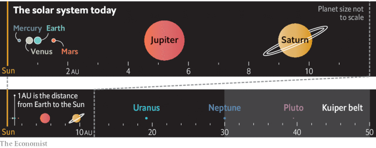

###### The solar system

# How the planets got their spots 

 

> print-edition iconPrint edition | Christmas Specials | Dec 18th 2019 

IT IS HARDLY surprising that in the 17th and 18th centuries scientists likened the movements of the solar system to the ticking of well regulated machinery. The clockwork of orreries, mechanical models of the solar system, neatly encapsulated the apparently clockwork nature of the heavens, each planet following its designated course just as it always had, world without end. 

The beginning, though, was much less orderly. Wind the clock back far enough and the clockwork goes awry. When the solar system was in its infancy, it now seems, planets changed their orbits with feckless abandon, swinging in towards the sun and out again, sometimes swapping places, possibly leaving the solar system altogether. These peregrinations seem to explain long-standing mysteries about why the solar system is the way it is. 

The solar system formed from a cloud of gas and dust which collapsed into the Sun and a disc of dust and gas from which the planets grew through accretion and collision, with smaller things merging into bigger ones until there were no mergers left to be had. The end result was a neat arrangement of four inner planets—Mercury, Venus, Earth and Mars—and four outer ones—Jupiter, Saturn, Uranus and Neptune—all in nearly circular but in fact elliptical orbits that kept them strictly separated. The inner ones were made mostly of rock and relatively small: the Earth is the largest. The outer ones were bigger and made mostly of gas. Disc material that did not get swept up into planets formed a belt of asteroids between the inner and outer quartets and a belt of small, icy bodies beyond them. 

In the absence of other planetary systems to study, this orderly arrangement was considered likely to be typical. Its division was taken to be the result of a “snowline” in the original disk. Sunwards of this snowline it was too hot for volatile compounds like water, methane, carbon dioxide and ammonia to condense, and so the planets were mostly bare rock and iron, with some atmosphere added later on. Beyond the snowline, these volatiles condensed into giant gas-balls. 

In the mid-1990s, though, astronomers started to discover planets around other stars—and they were arranged very differently. The most easily detected were “hot Jupiters”, gas giants circling their stars in orbits much tighter than that of Mercury, the nearest planet to the Sun, and thus far inside any conceivable snowline. Other systems featured giant planets in curious, elongated orbits inexplicable in terms of a coagulating disk. Either that model of how the planets formed was particular to the solar system—unlikely—or planets could change their orbits. 

The idea that planets might migrate was not entirely new. In 1984 Julio Fernández and Wing-Huen Ip, then working at the Max Planck Institute for Solar System Research in Germany, used a computer to study the interactions between the outer planets and smaller leftover bodies, known as planetesimals, which took place in the solar system’s early days. When a planetesimal passes close to a planet it gets flung into a new orbit. On average the three outer giants flung planetesimals inwards, towards the sun. Jupiter, though, threw its prey outwards. These encounters changed the orbits of the planets, too—infinitesimally, case by case, but cumulatively quite a lot. As Jupiter flung things out, it moved in towards the sun. As the others flung things in, they moved out. 

In 1993 Renu Malhotra, now at the University of Arizona, suggested that this idea might explain the orbit of Pluto, a dwarf planet. Pluto has a high eccentricity (it is considerably farther from the sun at some times than at others) and a high inclination (the plain of its orbit sits at a marked angle to the disk in which the other planets travel). On top of that, Pluto makes exactly two orbits of the Sun for every three orbits made by Neptune, an arrangement called a resonance; such resonances make it easy for momentum to move from one body to another, giving bigger planets a lot of influence over the orbits of smaller ones. Dr Malhotra proposed that Neptune had pushed Pluto into its odd orbit as it migrated outwards from the Sun, and speculated that it might have done the same to other bodies it came across as it migrated. Within a few years a number of other “trans-Neptunian objects” (TNOs) in 2:3 resonant orbits obligingly got themselves discovered. 

But it was the weird exoplanets that started people thinking that the solar system might not be what it used to be. “Something big had happened in those systems, and that made it easier to think about the possibility that something like that might happen in our system,” says Bill Bottke of the Southwest Research Institute (SwRI) in Boulder, Colorado. 

To observe these possible pasts needed something beyond telescopes: computer simulations. In the late 1990s Dr Bottke’s colleague Hal Levison wrote a program called SWIFT which could follow the orbits of bodies interacting with each other over billions of years. Together with his colleagues Kleomenis Tsiganis, Rodney Gomes and Alessandro Morbidelli at the University of Côte d’Azur in Nice, Dr Levison used this software to model the evolution of the planets’ early orbits. 

Their results, published in 2005, dramatically illustrated a point made by Dr Malhotra: interactions between the migrating planets might matter a lot. As Jupiter moved inwards and Saturn was pushed out, they passed through a 1:2 orbital resonance which kicked off all manner of mayhem. Uranus and Neptune were suddenly flung outwards into far more distant orbits like baubles in a storm; in about 50% of the program’s runs they swapped places, too. 

 

The Nice model, as it became known, explained the outer planets’ final distances from the sun, the eccentricities of their orbits and their inclinations. The effects of the migrating giants on the planetesimals in the disk at the time also explained why TNOs have the orbits they do, and why the orbits of the Trojan asteroids associated with Jupiter are highly inclined. “The Trojans, I think, were the smoking gun,” says Dr Bottke. Before, no-one had an account of why they were as they were; after the Nice model, they did. 

Nice as it was, the Nice model left something to be desired. The starting position of the planets was highly specified, and did not look like the arrangements seen in planetary systems observed in the act of formation around other stars. “So we decided to redo everything,” says Dr Morbidelli. Nice II was published in 2011, and was yet more dramatic. It showed Jupiter throwing one of the other giant planets out of the solar system entirely, which seemed like a problem. But David Nesvorny, one of the authors, suggested that it might not be. 

Dr Nesvorny found that a five-planet version of Nice II reproduced various characteristics of the modern solar system ten times more often than a four-planet version of the model did. And the idea that Jupiter might have thrown a smaller sibling into outer darkness was not unprecedented; models of the more dramatic migrations needed to produce hot Jupiters showed exoplanets being flung from their stars with reckless abandon. The galaxy may contain more such nomads than it does stars. 

Some wondered, though, if the prodigal had stuck around, like a banished dog that stays in sight of the campfire. In 2016 Michael Brown and Konstantin Batygin, at the California Institute of Technology, proposed that the orbits of some very oddly behaved TNOs might be explained by a ninth planet a bit smaller than Neptune that had been flung between 10 and 40 times farther from the sun. Dr Morbidelli is having none of it. But if Dr Brown is right and such a planet does exist, it will have to have come from somewhere. 

There is another problem that the migrants might explain. Venus is 90% as big as Earth; Mars only 10%. But models of the way that rocky planets form from a disk of dust which successfully produce a couple the size of Earth and Venus have a strong tendency to produce a third big planet farther out, rather than a runt. 

One possibility is that, beyond the Earth, there was a dearth of raw material. In 2011 Kevin Walsh of SwRI, with Dr Morbidelli and others, proposed that giant-planet migration was again to blame. They suggested that very early on in the history of the solar system, before the orbital ballet of the Nice models, interactions between Jupiter and the Sun-centred disk in which it was embedded drove the giant planet towards the Sun. This is the same process thought to be responsible for pushing the hot Jupiters in other systems so close to their stars. 

In this system, though, around the time when Jupiter got to where Mars orbits today, it changed its mind and headed back out—a manoeuvre the scientists dubbed the “Grand Tack”. They think it came about because Saturn was following Jupiter inwards. Inward-moving planets create gaps in the disk of dust through which they travel. When the gap created by Saturn reached Jupiter, it changed the way the planet interacted with the disk, leading Jupiter to swing back outwards—and take Saturn with it. 

This was a lucky escape for the inner solar system; had Jupiter plunged through it, Earth and Venus might never have formed. But by getting as close as it did, Jupiter cleared out the disk around the orbit of Mars—thus stunting its development. Had it never strayed sunwards, the inner solar system might boast another planet as large as the Earth—one which might have done a better job of holding on to an atmosphere and even an ocean than cold little Mars did. The Grand Tack may have spared the Earth; but it may also have cost it a habitable, perhaps even inhabited, neighbour. 

Fanciful, perhaps. But as Dr Morbidelli says, “It’s clear that the history of planetary systems is very dynamic.” And where there is dynamism, there is luck and chance. Before there was a celestial clockwork, there was, it seems, a celestial roulette wheel. ■ 

