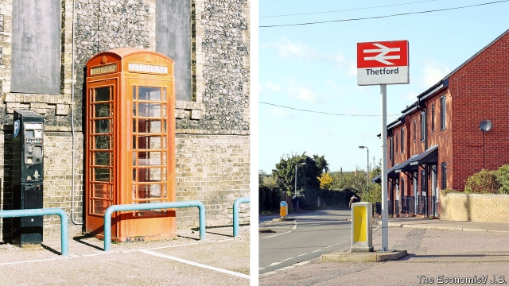

###### Deepest England

# The Cockneys of Thetford 

 

> print-edition iconPrint edition | Christmas Specials | Dec 18th 2019 

MANY OF THE headstones in Thetford’s cemetery are modest. “Dearly beloved” or “In loving memory” they begin, before stating the bare facts: name, spouse, birth, death. Such stones tend to mark the graves of people born in or around this small Norfolk town, roughly halfway between Cambridge and Norwich in eastern England. A quiet, understated sort, buried in simple coffins. “They pass without much fuss,” says Lydia Turner, who runs a funeral parlour nearby. 

There is another kind of headstone in Thetford’s cemetery, which is beginning to outnumber the modest variety. This is made of shiny black granite. It contains so many effusive, gold-lettered words that they sometimes spill onto the back of the stone. Mum (seldom “mother”) was always there when you needed her; Dad was a king; Nan will be missed for ever. The headstones have lots of images—not just angels but dartboards, fancy cars and the logos of Chelsea and Tottenham Hotspur football clubs. Underground, the coffins have brass handles. Many arrived at the cemetery in carriages filled with flowers, pulled by beautiful horses. These are the graves of working-class Cockneys who left London half a century ago and made new homes in a town in the middle of nowhere. 

As they die and are buried, so their descendants live. Although Thetford is 110km (70 miles) from St Mary-le-Bow in London—the centre of the Cockney heartland, according to Cockneys—many of its 25,000 inhabitants belong fully to that flashy, gravel-accented tribe. In many ways Thetford resembles a 50-year-old East End transported to the flat rural landscape of East Anglia. Frozen in time and overlooked by outsiders, it is a bit like the mythical Scottish village of Brigadoon. This makes it an excellent place to go if you want to understand a crucial figure in modern society and politics: the white, southern, working-class Brexiteer. 

The seat of the bishops of East Anglia in the Middle Ages, by the early 20th century Thetford was in a sorry state. It had hitched its fortunes to a single company, Charles Burrell & Sons, which made steam-powered traction engines. The rise of the internal-combustion engine killed it. Thetford was barely able to keep its population from falling below 5,000. 

In 1957 the town’s leaders decided to do something drastic. The British government was trying to push factories and workers out of London; Thetford offered to take so many that its population would at least triple. Using money from London County Council, it began to build social housing for people known then (and now) as “overspill”. Factories rose on industrial estates, separated from the houses by strips of woodland. 

The Londoners loved their new homes, which were larger than their digs in the capital and had private indoor toilets. And some of the locals were pleased to see them. “There was a bit more talent,” remembers Teresa Mead, who married a Londoner. Unfortunately, the work was a let-down. Jobs were easy enough to find: in 1964 there were said to be just 20 unemployed people in the whole town. The problem was the pay, especially for men. In 1971 Malcolm Moseley, a social scientist, conducted hundreds of interviews in Thetford. Although 57% of the people he spoke to described their houses as very good, just 4% said the same of men’s wages. The migrants had chosen quality of life and made themselves poorer. 

And there was no getting away from it—the new settlers were a loud, lairy bunch. Danny Jeffrey, who moved from east London to work at Jeyes, a maker of cleaning products, eventually stopped drinking in the Londoners’ pubs because of all the fights. Stuart Wright, a councillor from a Norfolk family, says that some of the new arrivals dug up his grandfather’s potatoes. When challenged, they were affronted. Spuds just grow naturally, don’t they? 

At first, the new settlers went back to London by coach every month or so to visit their relatives. As they settled down, the trips became less frequent. But they did not really blend in to the quiet Norfolk life. After six decades, they still have not. Instead they boiled down the working-class London culture they had brought with them into a concentrated broth. Whether they came from east, south, west or north London, they adopted the East End funeral. Many still shun Norwich City, the local Premier League team, in favour of London clubs—some of which, like Queens Park Rangers, are no better than Norwich. 

Above all, you can hear old London in their voices. Young working-class Londoners of all races now speak a dialect known as Multicultural London English, or MLE, which mixes Cockney words and sounds with Caribbean and South Asian ones, stirring in a few inventions of its own. Popular culture helps it spread: grime stars such as Dizzee Rascal and Stormzy rap in, and speak, MLE. But on the council estates that ring Thetford, you hear one of MLE’s ingredients in its pure form. The town’s name begins with an F sound and has a glottal-stop in the middle. A Thetford poet could rhyme “arrow” with “Mo Farah”. “Oi oi” is fine as a greeting; to tell someone off you “give them grief”. People in other parts of south-east England, such as Essex, speak similarly. But there is something peculiarly urban and old-fashioned about Thetford Cockney. Your correspondent grew up in north London in the 1970s. No current accent reminds him so strongly of his childhood as the Thetford one. 

Susan Fox, who studies English speech at the University of Bern in Switzerland, suggests that the authentic Cockney voice may have endured in Thetford because Londoners overwhelmed the locals, then remained dominant. In Milton Keynes, a new town established not much later, you hear nothing of the kind—but in Milton Keynes, Londoners were only one incoming group among many. 

Another possibility is that speech reflects aspiration as well as history and geography, and Thetford has remained intensely working-class. In 2011 when the last census was conducted, manufacturing was by far the largest industry, employing 24% of the town’s workers, compared with 8% in Britain as a whole. Many of those factory jobs are unskilled or semi-skilled. One Thetford firm that employs skilled engineers is Warren Services, which makes things like props for pop concerts. Richard Bridgman, the founder, spends half an hour walking the factory floor trying to find a worker who moved from London or is descended from someone who did. He fails. His engineers all seem to come from Norfolk families, or from somewhere other than the capital. 

Something else arrived with the Londoners—an attitude to family and labour that seemed exotic in mid-20th century Norfolk. In April 1959 the Thetford and Watton Times reported that 40 or so “housewives” from London had travelled to Thetford to see their almost-finished homes and examine “the factory in which the husbands will soon be working”. When the factories opened, though, London women rushed in. 

 

It was part of their culture. As early as 1961, 37% of workers in London were female. They did not just work in offices, hospitals and shops; a quarter of metal-manufacturing jobs in the capital were taken by women. The married couples who moved to Thetford often both worked, alternating shifts so that one partner could watch the children. 

Occasionally it was the wives who took jobs in Thetford factories and their husbands who came along. That was true for Brenda Canham, now Thetford’s mayor, who moved from east London to work in a factory that made insulated Thermos flasks. “I got married at 16 and I’ve always worked,” she says. 

Just as London’s accent has changed, leaving the Cockney Thetfordians with an antique, so has London’s work culture. Since the 1970s the capital has gone from having the highest rate of female employment in Britain to the lowest rate. Two sorts of British women are less likely to do paid work: immigrants from countries where it is frowned upon, and the wives of extremely wealthy men. London now has lots of both. 

Thetford also resembles 1970s London in a less fortunate way. State schools in London used to be terrible. A government survey in 1978-79 found that 24% of London children left school with no qualifications, not even a Certificate of Secondary Education. The national figure was 14%. The situation had become so dismal that some universities required lower exam marks from applicants who attended inner-London state schools. 

London’s state schools now post better exam results than schools in any other region of England and Wales (those immigrants again)—but Thetford’s state schools look like those of the capital half a century ago. In 2019 the average 16-year-old in every one of London’s 32 boroughs got better exam results than the average pupil at Thetford’s only state secondary school. There could be many reasons: there is a private school in the town and higher-achieving state schools nearby, all of which may cream off the ambitious. But one of the reasons appears to be social pressure. One Thetford woman says that when her daughter won a scholarship to the private school, she turned it down. She could not face walking through her estate in a private-school uniform. 

Culture is not just something you have. It is also something you do. If they had wanted to, the Londoners who moved to Thetford could have adopted local habits. They could have switched allegiance to Norwich City. They could have settled for modest funerals. Although the migrants were probably stuck with their speech patterns, their descendants could have dropped the Cockney dialect. Instead, many speak it more strongly than their parents do. 

Frankie Dean has done more than most people to define and shape Thetford culture. He grew up in the town, as the son of migrants from north and west London. He now lives a few doors down from the very first council house built for a London migrant. When not working for British Telecom, Mr Dean (pictured above) is a rapper known as Franko Fraize. He raps about ordinary things such as a checked shirt he really likes and the agony of supporting the England football team. The video for one of his songs, “Hand Me Downs”, shows him going out to buy a pint of milk. “Oi Oi!” is a hymn to Thetford council-estate life with all the trimmings: white trainers, Adidas threads, boxing gloves, satellite dish. 

It is hard to rap in Cockney, which is less precise and percussive than MLE. But Mr Dean is determined to sound different from other rappers. He wants to represent his home town, of which he is immensely proud. He also wants to remind Londoners of a world that they have lost. “When I go to London, it’s like I’m bringing their culture back to them,” he says. His Cockney accent is authentic. But it is also a badge and a sales pitch. 

Working-class ex-Londoners often feel that they are keeping up old urban traditions like those described (and romanticised) in Peter Willmott and Michael Young’s influential 1957 study “Family and Kinship in East London”. For Ms Canham, a key aspect of East End life was not locking your door. By the time she left, that had become impossible in London, but it could be done in Thetford. She describes the estate where she lives as “a bit of the old London”—especially in summer, when impromptu ball games break out and toddlers run around in loose nappies. 

Sometimes these sentiments come across as resentment and despair about modern London, which has changed staggeringly since the migrants left it for Thetford, becoming both richer and less white. Local feelings about the capital are intertwined with negative feelings about immigration and the European Union. 

In the 1990s Portuguese immigrants began to arrive in Thetford to take jobs in packing houses and factories. Then came eastern Europeans, and half a dozen shops selling the food they love (most of which are now run by Iraqi Kurds). In the town centre, though not on the estates, English is now one language among several. 

 

In 2004 the English football team played Portugal in the European Championship. After England lost on penalties, a Portuguese pub in the middle of Thetford was attacked by irate natives. Politics began to change, too. The town’s working-class residents had made Thetford a Labour redoubt in a Conservative region. At the local elections in 2015, though, the nationalist United Kingdom Independence Party won the most votes in two of Thetford’s four wards. A year later the parliamentary constituency that includes Thetford voted to leave the EU by 67% to 33%. That made it keener on Brexit than nine-tenths of Britain. 

But Thetford does not want to be a xenophobic, little-England sort of place. That would contravene another Cockney ideal—the spirit of mongrelism. Carla Barreto, who was born in Portugal, draws a distinction between immigration and diversity. The ex-Londoners are hostile to the former but comfortable with the latter, she suggests. 

In May 2019 she was elected to the town council as an independent. Knocking on doors, she listened to people complain about the EU, then declare that she seemed all right. “We don’t get much grief these days,” avers a Portuguese-speaking teenage boy who has acquired a flawless 1970s London accent. 

Was all of it—the factories, the estates, the Cockneys, the fights—really worth it? At a meeting of the local history group in Thetford’s library, two dozen people, most of them from Norfolk families, argue that it was not. Thetford was just fine before the expansion, they say. It could have chosen a much quieter path, staying small and preserving its old buildings and shops. Over time, it might have become a pretty dormitory village for commuters to Cambridge and Norwich. Perhaps that is true. But those who love the crooked timber of humanity should be grateful that Thetford went a different way.■ 

