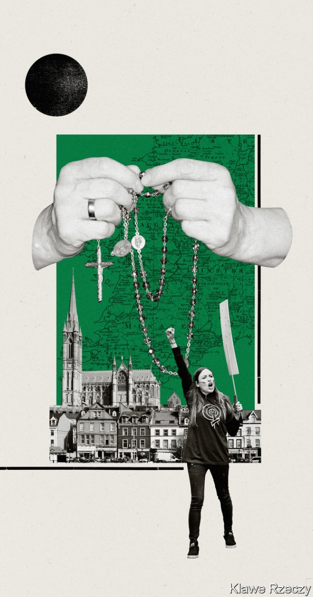

###### Personal and political

# The liberalisation of Ireland 

 

> print-edition iconPrint edition | Christmas Specials | Dec 18th 2019 

THE RADIO’S chatter of voices and music is briefly stilled; instead the sound of Angelus bells, peeling out an invocation to prayer, chimes out, slightly overlain by static. Agnes McKenna, an 83-year-old grandmother, pauses for a moment. When she was a child, she says, growing up with four siblings on a farm in western Ireland, at the sound of those bells everyone would stop what they were doing. Ploughs would halt in the middle of a field; farmhands would stand still and pray. 

With the bells dying out in the background, Agnes resumes bustling about her kitchen, filling up the teapot and buttering slices of brown bread. As her 27-year-old granddaughter, Síona Cahill, lays the table she looks bemused at Agnes’s description of an Ireland where the Roman Catholic church did not just delineate the seasons of a year, or the stages of a person’s life, but was present hour by hour. 

Much of Agnes’s life in Longford, a small town in central Ireland, still revolves around the church. She goes to Mass each day. Sister Pauline, a nun, is one of her closest friends. If Síona goes to Mass at all—which she might at Christmas or on other special occasions—she will not take the sacrament; she says her religion is in “people”. She lives with her girlfriend in Dublin, and spends much of her time campaigning for LGBT and women’s rights. “I’m not sure if I totally understand the present,” Agnes says. “It is going too fast for me.” For Síona, who takes up one social cause after another, it isn’t going nearly fast enough. 

But when Síona came out as a lesbian six years ago, she told her grandmother before her parents, and found her to be utterly supportive. During the referendum campaign to liberalise Ireland’s abortion laws in 2018 Síona travelled down to Longford every weekend to canvass voters. Agnes once came out canvassing with her. She remains worried that young girls might use abortion “willy nilly”, but she still voted for liberalisation. She voted for same-sex marriage in 2015, too. 

Síona’s values are perhaps not surprising. Agnes’s highlight a profound shift that has taken place in Ireland over the past four decades. The country was once one of the most conservative places in Europe. Now it is one of the more socially liberal. When Síona was born in 1992, homosexuality and abortion were illegal, divorce was prohibited and oral contraception was available only on prescription for married couples or for women with painful periods. 

In 2015 62% voted to make same-sex marriage legal, despite most of those preaching from the pulpit expressing disapproval at the idea. Three years later, a whopping 66% voted with Agnes and Síona to repeal the eighth amendment to the constitution, which had valued the life of mother and fetus equally, and make abortion available to women in the first 12 weeks of a pregnancy. Both referendums had high turnouts: 60% for same-sex marriage and 64% for abortion. Divorce, which became legal only in 1995, was liberalised further in 2019. When Fine Gael, currently the governing party, chose a gay politician, Leo Varadkar, as its leader the country had no trouble accepting him as taoiseach. 

“I do not think it is dramatic to call it a social revolution,” says Una Mullally, a journalist at the Irish Times who campaigned for both same-sex marriage and Repeal the 8th, the pro-choice campaign. Yet this revolution, as such, happened while 78% of the population still consider themselves to be Catholic, and while 91% of children attend a church-run school. How? 

One reason is exposure to the outside world. Ireland is a small island with a large diaspora. When she was 15 Agnes left Leitrim, where she had grown up, to go to London to work as a hospital attendant. She encountered another world: one of dance halls, mostly, but also central heating and a secular health service. When she returned with her husband, Paddy, in the 1970s, her sister, who had stayed in Britain, would send them condoms in the post with the inscription “Happy nights!” (Condoms were banned until 1979, and available only on prescription until 1985.) This meant that, unlike a neighbour who was “forever pregnant all her life” with 15 children alive and several dead, Agnes had just two children. “I said this to the priest,” she recalls, with Síona looking on proudly, “What’s the point in having them if you can’t afford them?” 

Diarmaid Ferriter, a historian at University College Dublin, points out that when Pope John Paul II visited Ireland in 1979—seemingly at the point where Ireland was still very devout—he warned in his Mass, given to over a million people in Dublin’s Phoenix Park, of “alien” influences turning people away from the church. He did not have in mind the cheap flights that Ryanair began to offer in the 1980s. But they did some of the trick. 

The campaign tried to appeal to people because of their faith, not despite it 

Increasingly, Irish people have taken a more “pragmatic” approach to their faith, says Mr Ferriter, by separating it from other aspects of their life. Susan McKay, a journalist in Dublin, sees it as “a new kind of Catholicism—a kind of Protestant relationship, just with God.” By the time Pope Francis made his own visit, in 2018, only around 150,000 people went to his Mass in Phoenix Park. 

The process was undoubtedly speeded up by the scale of clerical abuse revealed in the 1990s and thereafter. That some clergy could be cruel was not news. Agnes remembers one priest, in her primary school, caning a girl over her knuckles to watch her cry (“Aw, it’s thawing,” he would say). Women, who supported the church in greater numbers and who gave more of their time to it, were also often degraded. After giving birth Agnes’s mother had to be “churched”: blessed by the priest before she could take the sacrament again, as if she were unclean. She remembers another woman, when she asked a priest for advice about how to stop having so many children, being told to “do her womanly duty”. “They said jump and you said how high,” she says. 

In the early 1990s Irish newspapers and television stations started to run stories of widespread abuse by clerics, some powerful and hitherto popular. For Bernie Coen, a mother of four in Mayo, western Ireland, the church’s diminishment started with Bishop Eamonn Casey. In 1992 it emerged that the supposedly celibate bishop, who had stood at John Paul II’s side in 1979 and who was, according to Mrs Coen, “as big as Bruce Springsteen”, had fathered a boy with an American woman and subsequently refused to have any contact with him. “I’m glad my mother wasn’t around for that,” Mrs Coen says. “It was a real kick in the teeth.” 

In the mid-1990s individuals started to speak publicly about their rape as children by paedophile priests. The government scrambled to set up a series of inquiries. Just short of 100 priests were found to have sexually assaulted children between 1975 and the mid-2010s (campaign groups say the actual figure is much higher). The cases were horrifying, sometimes involving extreme acts of abuse, frequently involving multiple victims. The church sometimes moved the guilty around from parish to parish, with earlier complaints ignored or hushed up. “I had never thought of priests doing anything like that,” says Agnes. 

In 1996 the last Magdalene laundry closed. The laundries had been places where “fallen” women were sent to work in servitude. They were run, as were mother-and-baby homes for the pregnant and unmarried, by religious orders. The institutions fostered their own horrors. In 2015 a commission looked into 14 mother-and-baby homes after human remains were found at one at Tuam in western Ireland. It uncovered more death and cruelty. The bodies of more than 950 children had been sent to various medical schools for anatomical research between 1920 and 1977. Others had been buried in unconsecrated ground. 

The scandals had an immediate effect. According to David Farrell at University College Dublin and colleagues, trust in the church fell from 50% in 1981 to 20% in 2008. Mass-attendance figures dropped sharply. 

Not all the scandals were in the past. In 2012 Savita Halappanavar, an Indian dentist, died in hospital after she was denied an abortion while undergoing a miscarriage. Because the fetus still had a heartbeat, the doctors would not end its life, and so she lost hers. “We are a Catholic country,” the midwife was reported to have said to her. “That frightened me,” says Mrs Coen. “It felt unsafe to be a woman in Ireland.” For Síona, at university at the time, the death of Mrs Halappanavar marked the point at which she started to feel that she needed to act. 

For decades, disparate women’s groups had agitated for reform to laws on sexual conduct and reproductive rights dictated by the church. In the 2000s they began to coalesce into a larger movement. The appetite for change was not all down to a turning from the church; other things contributed to a sense that Ireland was not the country it had told itself it was. Ms Mullally points to the recession of 2009-13 and the centenary of the Easter Rising of 1916 as moments of reflection. In 1966 the 50th anniversary of the Rising focused on martyred men and their Catholicism, says Mr Ferriter. The years leading up to 2016 saw the “reclaiming [of] hidden histories”—of women who were Republicans, of children who died in the fighting. 

In 2012, sensing the public’s mood, Enda Kenny, Mr Varadkar’s predecessor, set up a constitutional convention. It was to discuss ten issues, including various voting reforms, the representation of women in politics and public life, and same-sex marriage. It was made up of 66 citizens, randomly selected, and 33 parliamentarians. Finbarr O’Brien, a 64-year-old postman in rural Cork, initially declined the invitation to join. “I had no interest in politics,” he says. But after his eldest son encouraged him to take part, he became one of the more enthusiastic members of the group. “It is one of the best things I’ve done in my life. It opened my eyes to a lot of things.” 

Mr O’Brien was sexually abused as a child and had tried to commit suicide as an adult. For years, when he was growing up, homosexuality was “a very touchy subject with me, regards two guys or two girls being together...I hated every guy who stood on two feet because of it.” Although his abuser was a layperson, not a priest, the crime was still covered up in his local community. He equated homosexuality with paedophilia for many years until he got help from a therapist. 

As part of the convention’s discussion on same-sex marriage he heard a church representative defend the institution as a sacrament between a man and a woman. “I just couldn’t take what he was saying…I was sweating. My knuckles had gone white, I was closing my fists so hard.” After a lifetime of repressing his abuse, and after decades of wrestling with his sense of shame, it took all his courage to speak up. He got up, briefly told his story, and said he felt the biggest problem was ignorance, and that “the gay people—whether they are man, or women, or whatever… They can provide a home as good as any.” 

This was not a private summoning up of courage in a closed room—the meetings were streamed online and much discussed. When Mr O’Brien went to the bar for a nerve-steadying drink after saying his piece, two teenagers who had been brought up by a gay couple came and shook his hand. “That made me feel a thousand times better,” he says. “It meant something to them.” 

When, in 2013, the convention was asked whether constitutional reform to allow same-sex marriage should be recommended to the government, 79% agreed. Less than two years later, the same-sex marriage referendum took place. 

In 2016 Mr Kenny set up a citizen’s assembly modelled on the previous convention to discuss further topics, including abortion. Its recommendation was radical: women should have the right to have an abortion up to the 12th week of pregnancy. “We were genuinely surprised at how far we’d gone,” says Louise Caldwell, a 42-year-old from County Meath, who participated in the assembly. The process did not change her mind on abortion but it “filled in the gaps” and challenged her preconceptions. “We learned that the largest proportion going to Britain to have an abortion were 35- to 45-years old, and had already had children.” 

Informed at first by legal and medical experts, the assembly soon asked to hear from women who had undergone abortions. “What we felt was unrepresented was voices,” says Ms Caldwell. During the referendum campaign which followed those voices were amplified. High-profile women such as Tara Flynn, a comedian, talked in public for the first time about going to the Netherlands for an abortion. Ordinary people spoke up, too: to their neighbours, their colleagues, even to strangers. “You can talk about theological arguments until the cows come home, but you cannot deny people their experiences,” says Ms Mullally. 

This emphasis on personal stories partly stemmed from the success of the same-sex marriage referendum. That campaign tried not to be divisive. “It wasn’t Gays versus God,” says Tiernan Brady, a LGBT-rights campaigner. Instead it was about “Margaret, Peter”, he says; the campaign tried to appeal to people because of their faith, and its emphasis on charity and kindness, not despite it. The effect of this was even more powerful in a referendum in which the topic—abortion—was far more contentious. 

Síona remembers marshalling her gang of Repeal volunteers in Longford. She told them to dress as if they were going to Mass (clean blouses or shirts, blazers). Some of the people whose doors they knocked on were receptive. Others were hostile. Occasionally, a pugnacious reaction gave way to a covert, sympathetic nod—in one instance, a seemingly anti-abortion woman whispered “I’m with you,” after checking her husband could not hear her. 

 

Many of the pro-life campaigners, by contrast, fell back on old tactics. Enlarged pictures of fetuses were put up on billboards and on lampposts. Such campaign imagery mostly scared off all but the most hard-core voters, and remains distasteful to many moderate Catholics. “Even pro-life people were saying Jesus, will they just sod off,” says one mother of three. Of the third of voters who voted against both same-sex marriage and abortion, many are still unhappy. “The first referendum you can understand, it’s an emotive thing,” says Father Richard Gibbons, the parish priest of Knock, a shrine visited by around 1.5m pilgrims each year. “But the abortion referendum knocked us for six.” 

Breda O’Brien, a conservative pro-life columnist with the Irish Times, has an explanation for how people who had thought themselves in the majority found themselves not to be. “There is a conformist streak in Irish personality...When it was the thing to be Catholic we were incredibly Catholic, and now it is [the thing] to be liberal.” David Quinn, of the Iona Institute, the main pro-life lobby group, notes that “Ireland has this huge ambition to be modern.” 

That suits Katherine Linnane, a 14-year-old whose mother was active in the abortion campaign. She lives in a country where she can feel at ease. “For all of my bisexual life I had the right to marry a girl. All of my life as an adolescent I had the right to have an abortion.” Mrs Coen says: “I think Ireland is safe in the hands of this generation growing up.” 

“In an angrier world Ireland has a lot to teach people,” thinks Mr Brady. It is an education which starts at home: the place of private reckonings, and personal revelations. In Longford, Agnes listens intently as Síona describes how tough she found it when seminarians at her university told her, week in and week out, that gay people should not get married and should not have children. “You’ve been through more than I realised,” Agnes replies, softly. Midway through the conversation, she also says to her granddaughter, as if to remind her: “It never bothered me that you were gay…You were you, you were Síona Cahill to me.” ■ 

