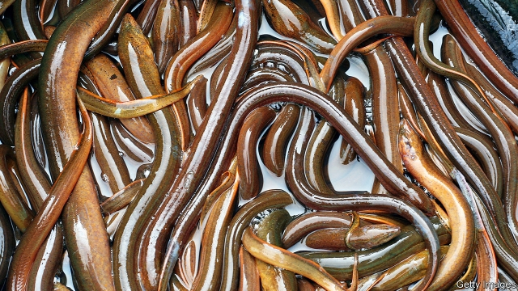

###### Eels

# The mysterious life and times of eels 

 

> print-edition iconPrint edition | Christmas Specials | Dec 18th 2019 

“ALL THE important questions...have been settled,” Max Schultze, a German biologist, opined on his deathbed in 1874. “Except the eel question.” 

Few outside biology would have understood what vexed him. Fishermen had no trouble finding eels: records of eel fisheries went back centuries, and the fish made up a third of Europe’s freshwater catch by value. Chefs had no shortage of answers on how to cook them. In the early 20th century, “Larousse Gastronomique”, the definitive guide to French cooking, listed 45 different ways to prepare them, from marinated to poached in onions. 

Biologists, though, were not interested in the eel’s availability or utility. They were interested in its reproduction. No one had ever seen one mate. No specimen had ever been spotted after giving birth or laying eggs. Nor had any spawn been seen. 

In antiquity, Aristotle opined that eels must spring spontaneously from river-bottom mud, and for most of the subsequent centuries that sounded sensible enough. By the 19th century such beliefs were no longer tenable. Life came only from life; animals were produced by sex. But eels were not just never observed having sex. They did not even seem equipped for it. In 1876, not long after Schultze’s death, a budding scholar dissected some 400 of them looking for testicles: nary a one. Young Sigmund Freud, discouraged, turned his attention to the dissection of brains. When he returned to matters of sex, it was on a less anatomical level. 

A century and a half on, progress has been made. How and where European and other eels reproduce has been discovered. They are freshwater fish which go out to sea—a long way out—to breed, a piscine antithesis to salmon. But it is still the case that no-one has seen them at it, or been able to reproduce the process in the lab—let alone in farm. And this matters. Although they are not the near staple they once were, people still like to eat eels, especially in Asia. But there are fewer and fewer to catch in the wild, and the wild is the only place they come from. The European eel is now listed as critically endangered. Depleting its numbers yet further by smuggling its young to Asia by the suitcase-full has become a lucrative criminal trade. 

As a result, their very survival as a species is far from certain. Today’s “eel question” is whether the species has a future. 

At their smallest, eels are translucent, worm-like creatures that give only the faintest hint of what they will later become (eels grow about 5cm a year in the wild, mature ones are about a metre long). 

In Europe, most of these tiny “glass eels” are found in the Bay of Biscay. From there, they find their way to rivers, creeks and ponds anywhere from the Baltic to the Mediterranean. Some have been known to slither over damp earth to reach inland waters. Many get eaten along the way. For those who make it, not much happens: once settled, eels are a sedentary lot for up to 20 years. Then, in the run-up to autumn, they dash for the sea. They are never seen again. One can only assume it is their offspring that later land in the Bay of Biscay. 

A seminal paper in 1923 by Johannes Schmidt, a Danish researcher, resolved to find what happened between the time when mature eels disappear and baby ones arrive. Chasing mature eels as they dash westward is not practical. Schmidt opted instead to track the larvae that hatch into glass eels, which can be found drifting eastward in the Atlantic each spring. 

Schmidt’s mission was only a partial success. He never found mating eels. But what he was able to establish was nonetheless startling. The smallest larvae, and so the most likely spawning ground for all European eels, were to be found nowhere near their habitat. Instead, the eels and their offspring could all be traced back to the Sargasso Sea, a remote bit of the northern Atlantic Ocean nestled between Bermuda and the West Indies—6,000km from Europe’s western coast. Eels found in North America also spawn in the Sargasso (a dozen other anguillid species spawn in other locations, some of which remain unknown). 

Why eels travel such great distances is not clear; how they do it barely any more so. Scientists suspect a geomagnetic sense guides their migration, which can take over a year. In their last months flitting about in Europe’s rivers and streams, the eels’ gut dissolves into fat to store energy for the voyage. Their eyes enlarge to adapt to the gloom of the ocean floor. Their colour changes from yellow to dark silver, better to bypass predators as they embark on their journey to sex and death. 

Not, though, if Hans Inge Olofsson has his way. On a late summer day in 2019, 114 eels that had hoped to start their exodus to Sargasso ended up in the bottom of Mr Olofsson’s boat instead. 

Tousle-haired with a raspy voice and a pouch of snus tobacco permanently lodged under his upper lip, Hånsa, as his friends call him, makes no effort to deviate from the affable Swedish fisherman of central casting. This year marked his 33rd season on the waters of the Ålakusten (eel coast), a 30km stretch at the southern tip of Sweden’s Baltic shoreline. By his reckoning, 114 eels in three traps is a good catch these days. 

There are many ways to catch an eel. The fleet-of-hand and sure-of-grip can snatch them out of the water. Others dangle hooks in rivers. Commercial fisheries like Hånsa’s use time-tested traps. One visit every couple of days is enough. A three-man crew is needed: Hånsa, a sprightly 68-year-old, the undoubted captain; his grandson Carl, in his 20s, who helps out as deckhand; and Stefan, a friend whose heft suggests a sideline as an oligarch’s bodyguard, steering the boat. 

 

Waist-high waders protect the trio not from water but from fish. Eels can survive out of water for long periods, and once the nets are emptied, the eels are like a moving rug absorbing whatever they come across. A few try to hide in the boat’s hidden crannies. One manages to jump back into the sea—113 eels will have to do. 

Historians trace organised eel fishing in southern Sweden back to the early 16th century. Hånsa’s grandfather first started plying the waters in 1923, the year Johannes Schmidt tracked the larvae to the Sargasso. His father took over in 1959, then Hånsa in 1987. 

About 100 crews once fished for eel off the Ålakusten. No longer. “There are only six or seven of us left nowadays,” says Hånsa. Eel fishing has become an old man’s game (even in egalitarian Sweden, women are rare in fishing). Some 70% of the fishermen are over 55; Hånsa is well beyond the legal retirement age of 61. 

The ageing of the Swedish eel gang ties back to the mysterious nature of their prey. Starting in 1980, the numbers of glass eels arriving on Europe’s shores started falling precipitously. For 30 years, their number fell by 15% a year; by 2010 annual arrivals from Sargasso to all Europe’s rivers and creeks had collapsed to just 1% of historical levels. 

Overfishing is an unlikely culprit: catches of grown eels were fairly stable before and after the drop started. In Europe, eel is now rarely eaten. But humans harm eels in other ways. The turbines of hydroelectric power plants slice up migrating eels into something for which only Larousse Gastronomique might have a use. Pollution has caused a loss of habitats. Climate change has probably swayed currents to transport eel larvae away from where they can thrive. 

Whatever the cause, the European eel was deemed “critically endangered” by the IUCN, a conservation group, in 2008. It now sits with the Beluga sturgeon and black rhinoceros on its “red list”, just one step above “extinct in the wild”. In 2007 the countries of the European Union committed to ensuring the migration to Sargasso of at least 40% of the number of eels that would escape in the absence of all humans, roughly double the current figure. Ireland and Scotland banned eel fishing entirely. 

In 2007 Sweden also banned the capture of eels. But the authorities made derogations for the likes of Hånsa, who could prove they had derived a living from eel fishing before the new rules came into force—literally a case of being grandfathered in. Across Sweden, a caste of about 140 old-timers is what remains of what used to be a proud industry. 

The march of time means Ålakusten crews are being whittled away naturally: a heart attack here, a stroke there. Hånsa had a health scare last year. The rules are clear that he who holds the fishing licence must be in the boat when the traps are emptied. Grandfather and grandson jokingly wonder if a corpse in a coffin might pass muster with the authorities. 

The fishing season is now limited to three months, starting in late July in Hånsa’s case. But emptying traps and mending nets is a small part of what being an eel fisherman is about these days. In and out of season, afternoons at Hånsa’s are spent smoking eels. For six hours 30 eels at a time are left hanging, like so many neckties, over smouldering logs of elder wood from a local ridge. Drawn in by the earthy smell, punters from a local campsite happily pay 395kr ($40) a pop, double the price for fresh eel. 

A more boisterous sideline is the eel party. Three nights a week, paying guests visit Hånsa’s cottage and its hotch-potch of nets, hulls and rusting anchors. His wife, Maria, serves up eel in every which way: boiled, fried, smoked, smoked then fried. The captain, donning a stripy jumper and a cap he did not need on the boat, brings out a guitar and belts out tunes such as “Eelvis Presley”. 

 

Between songs, as revellers drink their schnapps, Hånsa regales them with tales of the eel’s libido-enhancing powers—how Freud missed this is not clear—and pins any blame on the falling catches on hydropower dams. Having the eel listed as “critically endangered” has kept some punters away from the parties, Hånsa says, but others wonder if this might be their last chance. 

Not all scientists agree the European eel is endangered in any conventional way. Best estimates are that well over 1bn glass eels still land on European shores every year. “It’s a seriously unusual situation for a population of fish that numbers in the billions to be declared an endangered species,” says Michael J. Miller, a researcher at Nihon University in Japan. But the remarkable drop in adult numbers needs to be addressed. 

Europe’s conservation measures have also worked. Glass eel arrivals are no longer falling and have seen a small increase in recent years. Eels captured young and grown up in aquaculture tanks, mainly in the Netherlands and Italy, represent two-thirds of all European consumption. 

But fish farms have to start with glass eels as their raw material. This hardly matters in Europe, where enough larvae still drift in from Sargasso to satiate the appetite of devotees. In Japan, on the other hand, unagi kabayaki, eel that is grilled after being dipped in a teriyaki-style sauce, is an enduring staple. Demand is greater than can be supplied by catches of Anguilla japonica, a relative of the European eel which is also listed as endangered. 

China has stepped into the breach. Since 1990 eel farms have proliferated there, mainly near Hong Kong. There are now at least 900 of them, and they increasingly sell to China as well as to Japan. As China receives few glass eels of its own, it has scrambled to find some for its farms. Rare Japanese glass eels can fetch up to $30,000 a kilo. But European eels can be procured for around €300 a kilo in France or Spain. Given a kilo of glass eels contains 3,000 fish that, once grown, will yield fillets worth a total of over €25,000, the result has been a predictable boom in eel smuggling. 

According to Europol, the EU police agency, around 100 tonnes of live glass eels are exported illegally from Europe to China every year. That is 300m baby fish—roughly a quarter of the entire stock of eels that makes it from the Sargasso to the coast of Europe. By numbers trafficked, there is no bigger wildlife crime. 

Chinese gangs, aided by locals, establish pop-up aquariums in garages and warehouses. One den raided by the Spanish authorities in 2018 had a wall lined with 364 suitcases. Each could be loaded with 10 bags of 10,000 wet baby eels each, weighing about 30kg in all. The eels smuggled from Europe to China yield fish sold for over €2bn says Andrew Kerr of the Sustainable Eel Group, a lobbying outfit in Brussels. Eel busts are now happening across Europe. In the year to June, Europol said it had seized over 17m eels and that 154 people had been arrested in Europe on eel-smuggling charges. 

Assuming demand from Japan and China will not abate, the long-term prospects of the eel look murky unless Schultze’s “eel question” can be answered once and for all, and eels can be convinced to go through their whole life cycle in captivity. 

Given its continued appetite for the fish, Japan is now where the eel-research action is taking place. The spawning ground of the Japanese eel was finally discovered in 1991 (it lies off the coast of Guam, a mere 2,000-3,000 km away from where grown eels end up). Researchers there have come tantalisingly close to making eels spawn. Specimens in captivity have been made to produce larvae. But no one has yet cracked what food those larvae will eat. 

Such a world of international smuggling and cutting-edge research feels like a world away at M. Manze in the south-east of London. A blue plaque on the wall designates it as the oldest surviving eel-and-pie joint in the city, dating back to 1892. 

Until a few years ago, eels lived in an aquarium inside the restaurant, from which the chef would grab them. The Cockney dish of “jellied eels” involves boiling thick slices of fish, then allowing them to set in its own translucent stock. They go for £3.90 ($5) a bowl, to be eaten with lots of pepper and vinegar. 

Jellied eels lack the crunchiness and bacon-like texture of Hånsa’s smoked eels and the flavour of unagi. To a modern palate, they are the culinary equivalent of a gramophone: a relic from another era. Most customers on a recent visit were tucking into meat pies. “The older clientele still go for them,” a waitress claims. 

Only a handful of eel-and-pie shops still remain. At one in Walthamstow the restaurant is turned into “The Jellied Eel”, a pop-up cocktail bar, at the weekend. A website reassures potential patrons “there thankfully won’t be a single jellied eel in sight”. Even from its own menu, the eel has learned to slink away. ■ 

