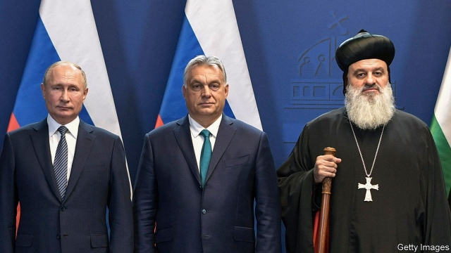

###### A useful stick

# Christians are persecuted in many places. Autocrats exploit this 

 

> print-edition iconPrint edition | Europe | Dec 18th 2019 

“OUR CRIES have not been heard by many,” said Ignatius Aphrem II, patriarch of the Syriac Orthodox Church, in November. He was at a conference in Budapest on the persecution of Christians, and he spoke for those in the Middle East who had been pushed from their homes, forcibly converted or killed. Despite such suffering, he lamented, “very few tangible steps have been taken.” There was an exception to the general apathy, however: Hungary, the conference’s host, which he praised for its “unwavering commitment” to Christians in need. 

The Hungarian government declared this year that it is “taking responsibility for all of the world’s Christian communities”. Since 2016 it has created a high-level position dedicated to Christian-persecution issues; set up Hungary Helps, a foreign-aid agency that has reportedly given 90% of its assistance to Christians; and founded the International Conference on Christian Persecution, which representatives from 40 countries attended in late November. Driving the push is Viktor Orban, the prime minister, who bills himself as a defender of Christianity both at home (by rejecting Muslim people and Western liberalism) and worldwide (by sending aid to Christians abroad). His closest ally in this crusade is Russia’s president, Vladimir Putin, who has said that Russians watch the plight of Christians in the Middle East “with tears in our eyes”. 

Christians are undoubtedly at risk. The Pew Research Centre found that, in 2017, they were harassed in every Middle Eastern country, either by the state or by other groups. Increasingly, strongmen are using persecuted Christians as “instruments in a larger political conflict”, says Marie Juul Petersen, a researcher at the Danish Institute for Human Rights. 

For nationalist leaders, the cause has much appeal. To stir up Hungarian voters, Mr Orban likens European Christians facing the “muzzle of political correctness” to Middle Eastern ones facing death. Internationally, meanwhile, he and others blame Western liberal democracies for failing to stand up for oppressed Christians. Some suggest that liberal leaders are too cowardly to do so. Others hint at something darker. Mr Orban speaks of “a mysterious force” that “shuts the mouths of European politicians and cripples their arms” to act on the issue. Sergei Lavrov, the Russian foreign minister, says Europe “shamefully renounces its Christian roots”. And in September, at a UN panel on Christian persecution, co-hosted by Brazil and Hungary, the Philippines’ foreign secretary asked ominously: “Hear anything from Wall Street? Nothing. Lombard Street? Even less.” 

According to these men, couching Christian rights in broader religious-freedom language, as is common in Western countries, does not count. Central to their argument is a widespread refrain, repeated not just by Mr Orban but also by Germany’s chancellor, Angela Merkel: that Christians are the most persecuted religious group in the world. This statement is hard to verify, according to Katherine Marshall of Georgetown University. Varied definitions of persecution, hard-to-reach populations and overlapping religious and ethnic identities all complicate data-gathering. 

Anyway, there is little evidence that Hungary’s style of Christian-centric aid is especially helpful even to Christians. Much of it has gone towards individual building projects—about $1.7m to restore churches in Lebanon, and another $450,000 to a school for displaced children in Erbil, the Kurdish capital. The overall amount of aid Hungary gives to persecuted Christians is “meagre”, says Balazs Szent-Ivanyi ofAston University. The government has claimed it totalled a modest $40m over three years. 

The most serious harm that Mr Orban and his ilk do to the Christians they claim to champion is to corrode the idea of religious freedom itself. Helping illegal immigrants in Hungary can get you imprisoned for a year, and being a Jehovah’s Witness in Russia can get you tortured. Christianity’s loudest defenders are not very Christian. ■ 

