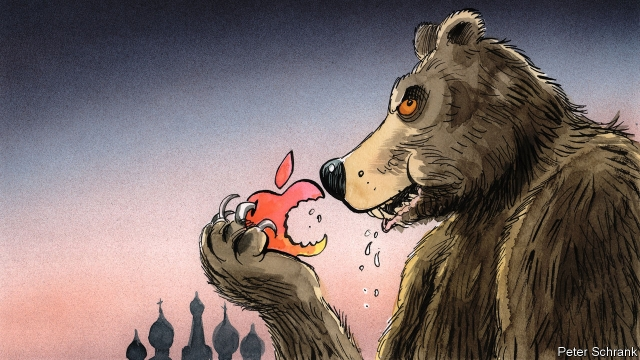

###### iSpyware?

# Russia presses Apple to install Kremlin-approved apps 

 

> print-edition iconPrint edition | Europe | Dec 18th 2019 

WHO WILL win the tussle between Apple, the world’s biggest company, and Vladimir Putin, an autocrat with nuclear weapons? On December 2nd Russia’s president signed a controversial law that will prohibit the sale within Russia of devices that do not come pre-loaded with locally produced applications. The legislation, which will come into force next July, has been dubbed the “law against Apple”, as it disproportionately affects the tech giant, known for its insistence on keeping tight control of the apps it allows on its devices. 

The law’s sponsors have described it as a way to protect Russian internet companies, as well as to help elderly citizens who may find smartphones difficult to use, though it is not yet known which Russia-made apps will have to be installed. Local digital-rights activists like Artem Kozlyuk are worried, saying that these apps could “secretly collect information: location, tools and services being used and so on”. The apps can be deleted, but only if users know to do that—and there are suspicions that they might leave behind backdoors into users’ phones after they are gone. 

The legislation follows another recent law promoting a “sovereign internet”; from November 1st the government has awarded itself the power to sever the Russian internet (known as the “RuNet”) from the rest of the globe. This is worrying for many local internet activists and experts, even though there are doubts that current network infrastructure could support it. Even before that, in the name of data protection, websites that refuse to build data servers on Russian territory, including LinkedIn, have been blocked. And this week the Russian authorities alarmed techies by raiding the Moscow offices of Nginx, an American-owned web-server company in dispute with a Russian one. The Apple showdown may be intended as a lesson to other giants, particularly Google (which owns YouTube) and Facebook; these companies present grave challenges to the Kremlin’s monopoly on information. 

Apple officials may think the Russian market too small to be worth the policy change, but the company has recently proved willing to make another controversial concession. Starting in late November, Apple’s maps and weather apps, when used inside Russia, have denoted the Crimean peninsula, Ukrainian territory illegally annexed by Russia in 2014, as Russian. Even when used outside Russia, the weather app shows Crimean cities without (unusually) stating which country they are in, while Apple maps introduces a mysterious dotted line dividing the peninsula from the rest of Ukraine. 

Apple may have offered this olive branch in the hope of smoothing relations with Moscow, but its actions have contributed to a growing sense of insecurity in Ukraine, where the foreign minister, Vadym Prystaiko, has accused Apple of “not giving a damn” about his country. A spokeswoman for Apple says that it is “taking a deeper look at how we handle disputed borders”. But a group of European parliamentarians has lodged a formal complaint and damage has already been done to the company’s reputation. 

Unlike Facebook and Google, Apple had mostly avoided political scandal until now. It has six months to decide whether or not to quit the Russian market. The world, and Ukraine, will be watching to see if it caves in to the Kremlin’s demands. ■ 

