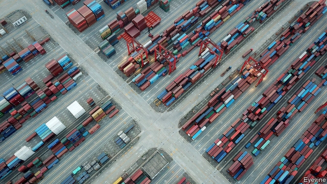

###### Trade truce

# The ceasefire in the trade war between America and China is fragile 

 

> print-edition iconPrint edition | Finance and economics | Dec 18th 2019 

AMERICAN TRADE deals typically stretch to thousands of pages. The new “phase one” trade deal between America and China takes up only 86. Wang Shouwen, the Chinese deputy representative of international trade negotiations, described a text with nine chapters, including ones on intellectual property, technology transfer, financial services and dispute settlement. Robert Lighthizer, the United States Trade Representative (USTR) gave journalists a glimpse of it on December 13th, hours after it had been agreed. It is due to be signed by both sides in the new year. 

Mr Lighthizer said that American tariffs on around $120bn of Chinese imports would be reduced from 15% to 7.5%. Fresh tariffs due on December 15th were cancelled. In return, he said, China would ramp up imports of American agricultural products, manufactured goods, energy products and services by $200bn over two years. Negotiators had set targets for various categories of commodities, so that agricultural purchases would rise from a baseline of $24bn in 2017 to at least $40bn in 2020 and 2021. The exact figures would be secret to avoid influencing markets. 

These arrangements are sure to attract criticism. It is hard to see how China will meet its targets while sticking to the World Trade Organisation’s principle of non-discrimination. Joe Glauber of the International Food Policy Research Institute, formerly chief economist of America’s Department of Agriculture, warns that other countries, in particular Australia, Brazil and Canada, may have objections. He also questions the secrecy regarding the targets, asking “how else would producers get signals on what to plant?” 

China, for its part, does not like the idea of becoming so reliant on America for imports of commodities such as soyabeans. It had long insisted that it was unrealistic for President Donald Trump to demand that it double its purchases of agricultural products from America. Intriguingly, after the new deal was announced it refrained from mentioning any numerical targets. Whether that is because it is embarrassed about having been forced into such a concession, or because the purchase agreements are not as solid as American officials suggest, will become clear only when the text is eventually published. 

The Chinese do, however, seem to have made some welcome promises. Mr Lighthizer boasted of commitments on intellectual property similar to, albeit narrower than, those in the USMCA, a recently agreed trade deal between America, Mexico and Canada. He also said the Chinese authorities had agreed not to ask multinationals to hand over technology as part of the process of securing a licence to do business—an issue central to America’s first tariff action in the trade war. Jake Parker of the US-China Business Council, a lobby group for American companies operating in China, notes that such tech transfer was the biggest concern for many of his group’s members. 

The Chinese, for their part, insisted that their promises were in line with their broader economic strategy of opening up, and would improve the business environment. Indeed, cynics will note that many of the reforms being chalked up to the deal had already started, raising questions about whether the nearly two-year-long trade battle has made much difference. 

Until the deal is signed, the threat of renewed trade hostilities remains. And even then, the enforcement rules will cause anxiety. Mr Lighthizer, hardly an independent arbiter, will have the final say over whether China has broken its commitments. He will be able to consider anonymous complaints by American companies. This fixes a real problem—fear of retaliation that leads executives to hold their tongues. But it also risks the Chinese feeling that they are being accused of misdeeds they can neither verify nor easily fix. 

Both sides said that the success of the first phase of talks would determine success in the second, which would presumably unlock further tariff cuts. Mr Lighthizer spoke of climbing a mountain a bit at a time. But the summit is still distant. ■ 

