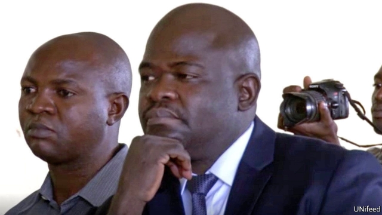

###### Trial and errors

# A warlord’s trial aims to end impunity in Congo 

 

> print-edition iconPrint edition | Middle East and Africa | Dec 18th 2019 

THE SMALL figures hidden under green cloaks shuffle forward and give their testimony through a voice-distorting funnel. “We were taught how to take a woman by force,” says one boy who was abducted while walking home with his mother. Another says he was recruited at the age of nine and given medicine to enable him to rape women. All are giving evidence in the trial of Ntabo Ntaberi Cheka, a warlord from eastern Congo who faces charges of recruiting child soldiers, mass rape and other atrocities. 

The trial has been hailed as a step towards reducing violence and ending impunity for warlords in a part of the Democratic Republic of Congo that is still largely overrun by militias. Yet it also highlights the difficulties of bringing justice to a weak state in which conflict rages. 

Witnesses are too frightened to testify openly in the trial, which is taking place in Goma, a city just 130km from Mr Cheka’s former stronghold. Many of his troops are still at large. The UN is trying to help by putting witnesses up in safe houses or by regularly checking in on them. But not all have been well protected. One woman, who was raped by three of Mr Cheka’s soldiers in front of her young children, says that shortly after she appeared in court a stranger turned up at her door and asked why she would want to “talk badly” about her “brother Cheka”. Too frightened to go out, she has stopped selling vegetables and now has no income. 

One former child soldier says that days before he was supposed to appear in court he received a menacing phone call, allegedly from Mr Cheka himself. That is less implausible than it sounds: the warlord has easy access to a mobile phone in jail. He has other surprising privileges, such as being allowed to have his wife visit to cook for him over a portable stove in his cell. 

The former child soldier decided to testify anyway. But he is one of a brave few: only 14 witnesses have dared to show up in court. The boy who was taught to rape at the age of nine told the judge that he had come to testify because: “I want justice to deal with the person who mistreated us during our childhoods and to encourage other children like me to leave armed groups.” 

Slouched on a bench in his cell, Mr Cheka denies doing any wrong and says that the witnesses are lying. Yet prosecutors and human-rights groups have assembled a long list of charges. Among them is the allegation that in a days-long raid in 2010 his men, along with those of two other militias, raped 387 women, men and children. UN investigators said the violence was to punish locals for supporting government forces. 

Despite the trial’s flaws, the mere fact that Mr Cheka is in the dock is a victory. Warlords in Congo are rarely punished. Most are given senior positions in the army if they agree to switch sides. Five rebel leaders have been sent to the International Criminal Court in The Hague. Last month one of them, Bosco Ntaganda, who is known as “The Terminator”, was sentenced to 30 years in prison for war crimes and crimes against humanity. He is appealing against the conviction and sentence. 

Crucially, Mr Cheka’s trial is being held before a Congolese judge in a city close to the villages where his troops once paraded severed heads on poles and hung women’s insides from trees. News that he has been locked up and is facing justice has already trickled back to those he terrorised. It may also deter other militia leaders from committing crimes. “Cheka was one of the most feared warlords in the country,” says Elsa Taquet from Trial International, an NGO that is supporting the victims’ lawyers. “We have seen him crumble.” ■ 

