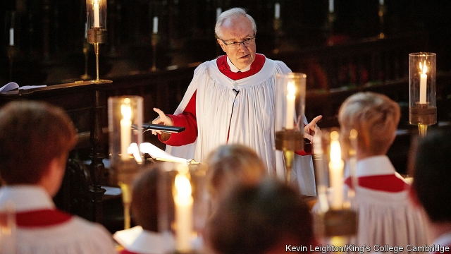

###### In the bleak midwinter

# Obituary: Stephen Cleobury died on November 22nd 

 

> print-edition iconPrint edition | Obituary | Dec 18th 2019 

SNOW SELDOM falls in England at Christmas time. Yet cards habitually show woods, cottages and robins sunk deep in it, with more star-flakes descending. For Christmas Eve—once the wrapping is done, the turkey timetable worked out, the door locked for the late-night journey to church—brings with it an enveloping quiet that seems closest to the stillness of snow. 

Traditionally this quiet is broken by carolling. It may be the local waits, clustered under a streetlamp with gloves and torches, but more often over the past few decades it has meant the broadcast service of Nine Lessons and Carols by the choir of King’s College, Cambridge. Seamlessly, in their red and white robes in the candlelit choir-stalls, the choristers fill listeners’ heads not only with their favourite Victorian hymns—“Once in royal David’s city”, “The first nowell”, “Hark! The herald”, all stirring tears with memories of Christmases past—but also with the rhythmic, driving freshness of true carols, the dancing medieval folk tunes rescued from the hills and lanes of Derbyshire or Sussex by Cecil Sharp and Ralph Vaughan Williams in the early 20th century, just at the point of disappearing. 

When Stephen Cleobury took up this precious task in 1982, as the new director of music at King’s, he was terrified. (Being given to understatement, that was not a word he used lightly.) His training was more than adequate: chorister at Worcester Cathedral, organ scholar at St John’s, Cambridge, later a fearless conductor, with the Philharmonic and the Britten Sinfonia, of new works for orchestra. But the choir’s reputation awed him. The carol service in particular, always beginning with “Once in royal” from an unaccompanied treble, always sung by men and boys in keeping with the founding charter of 1441—was in a sense a piece of public property. He could not radically reform it, any more than he could alter the glorious fan vault of King’s chapel to achieve what he had to work hardest for, greater clarity of texture. 

He had various ideas, though, to nourish new growth in it. He applied them equally to the week-by-week chapel services and to other jobs he held, such as chief conductor of the BBC Singers. Those changes began with teaching. His own music lessons as a chorister had been hit and miss: theory at desks set up in the cathedral nave, huddling round an ancient stove, and harmony and counterpoint in the deputy organist’s house over ten-shillings’ worth of cake. But four years spent teaching O- and A-level music at Northampton Grammar gave him insights into dealing with boys—how to keep them up to the mark, affirm that they were good, without giving them any idea that they had arrived—that proved invaluable. Though teaching was not in his contract at King’s, he instructed the first-year students in harmony and counterpoint to lay down the basics. He saw to it, too, that each chorister had singing lessons. Meanwhile, to be equally strict or even stricter with himself, he went on learning to play the organ better. 

Under him the carol service became more ecumenical and open. It had more Latin, like the weekly services, which now featured Latin masses and canticles. His Anglican suspicion of the Roman church had been soothed, when he was really quite young, by singing an especially wonderful melody in Verdi’s “Te Deum”, and later by the beauty, which he thought inexpressible, of Gregorian chant. In 1979 he became master of music at Westminster Cathedral, falling deeply in love with the rhythms of the Catholic liturgy. The singing of Latin brought purer vowels into the King’s sound, which was pleasing. So too did singing carols in other languages, including Latvian and Church Slavonic. This tested the singers, and made them more expert musicians. It also reminded them—if they needed reminding, with worldwide tours, frequent recording sessions and televised broadcasts of the carol service all over America—that their singing now spanned the globe. 

Like his immediate predecessors, he wrote new descants to freshen up the well-known hymns. His most daring innovation, though, was to commission a new carol every year. A lot of new church music was not of very high quality, and he wished to show that fine composers were still willing to write for liturgical settings. Lennox Berkeley, Arvo Pärt and John Tavener all wrote one, and he regretted not asking John Adams, since no one said no. These new pieces were often taxing: a high B for solo treble in Thomas Adès’s “The Fayrfax Carol”, hectic stops and starts in Judith Weir’s “Illuminare, Jerusalem”, stamping in Harrison Birtwistle’s “The Gleam”. Quite hostile letters came into the director of music’s office. One suggested that he should be locked up. 

Countering those who objected was not too hard, though. The new carols were actually modern versions of the old: the voices of people of the time dancing, celebrating or reflecting, sometimes stridently or clumsily, but with raw devotion. His choristers could sing them with a freedom, edge and individuality they could not show in the weightier hymns or in the anthems. In 1918 Eric Milner-White, who had founded the service, wrote of his wish to bring in “colour, warmth and delight”. These qualities were definitely now back at King’s. They fitted the director’s conviction that choral singing was the best possible use of body, brain and heart, the whole self. Everyone should get out there and sing. 

At the same time, he made sure the choir did not lose its otherworldly sound. He treasured the thought that anyone who heard it might find peace and consolation there. For behind music, especially the music of Bach, lay something wondrous and beautiful that could be touched. Over the years he felt increasingly uncertain what to call it. But he found himself getting keener on the idea of the Holy Spirit, something around in the air and in the silences between the notes, as the choir sang. 

