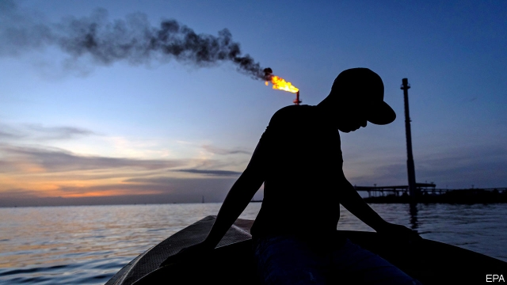

###### Durable Maduro

# More dollars and fewer protests in Venezuela 

 

> print-edition iconPrint edition | The Americas | Dec 18th 2019 

THE HUMBOLDT, a pencil-shaped luxury hotel overlooking Caracas, has long symbolised broken promises by Venezuelan governments. Built in 1956, during the military dictatorship of Marcos Pérez Jiménez, it has been empty most of the time. The cable car to its mountaintop location keeps breaking down. The current regime, a socialist dictatorship led by Nicolás Maduro, promises that the Humboldt will soon be relaunched as Venezuela’s first “seven-star” hotel. 

On December 14th it threw a party. Christmas lights twinkled. A DJ pumped out reggaeton hits. Models cavorted around the empty swimming pool. Enchufados (plugged-ins), made rich by their connections to the regime, sipped imported vodka at tables with panoramic views while two green laser lights beamed down upon the capital of a country that is suffering from the world’s deepest recession. “Caracas has become like something out of ‘The Great Gatsby’,” said Karina González, a young secretary, as she looked up at the light show. “Decadence alongside penury.” 

The Humboldt bash is a sign of change. It is not a return of prosperity, which does not spread beyond the party-goers and their sort. Nor is it the democratisation demanded by the opposition and by the 60-odd countries that back it. Rather, it points to the regime’s growing confidence that it will survive international pressure aimed at toppling it, which has been led by the United States. 

Its policy of “maximum pressure” on the regime began last January, after Juan Guaidó, the head of the opposition-controlled legislature, proclaimed himself Venezuela’s interim president on the grounds that Mr Maduro had rigged his re-election in 2018. Most Western and Latin American countries recognise Mr Guaidó’s claim. The Trump administration banned purchases of Venezuelan oil by the United States—once Venezuela’s biggest customer. It widened sanctions on individuals to include almost everyone in Mr Maduro’s inner circle. 

The oil sanctions have been porous. Venezuela has found non-American customers, such as Russia’s Rosneft. Production by PDVSA, Venezuela’s state-owned oil company, is showing signs of recovery after plunging by three-quarters since 2015. It has signed an agreement with an Indian company to help boost it further and repair refineries. Venezuela gets extra money from selling gold (both from illegal mines and from its reserves) and narcotics. 

The sanctions have had unintended consequences. Officials whose travel is restricted and whose foreign bank accounts are frozen spend more of their time and money at home, one explanation for the Humboldt blowout. More important, the oil sanctions were enough of a shock to force the government to retreat from socialism. Mr Maduro has lifted nearly all the economic controls first imposed by Hugo Chávez, the charismatic leader of the “Bolivarian revolution”, who died in 2013. Sanctions have “made the government more flexible”, says Luis Oliveros, an economist. 

It has stopped trying to dictate the exchange rate and control prices. Private firms can now import whatever they choose and set their own prices. Supermarkets in Caracas, nearly empty for much of 2017 and 2018, are again stocked with food. It is not just the rich who can afford it. Perhaps a third of Venezuelans have direct access to remittances from relatives living abroad. Since Mr Maduro took office in 2013 at least 4m people, 12% of the population, have left the country. Venezuelans abroad send back $4bn a year, roughly 3% of GDP, according to Econoanalitica, a consultancy. This supplements the government’s distribution of food, disproportionately to its supporters, and a discreet aid programme managed by foreign NGOs. 

Dollars are elbowing aside Venezuela’s bolívar, the world’s most inflation-prone currency. Taxi drivers and cleaning ladies quote prices in dollars, even if they accept payment in bolívares. McDonald’s pays burger-flippers in Caracas a bonus of $20 a month, which is more than treble the minimum wage of 300,000 bolívares ($6). Prices at the Traki department store in central Caracas are in dollars, though the dollar sign itself does not appear on tags. Spaghetti (from Egypt) costs 50 cents for a 400-gram (14-ounce) pack. Queues at the tills suggest that ordinary shoppers can afford it. The value of dollar notes in circulation now exceeds that of bolívares.  

The Venezuelan currency itself, in which most people are still paid, is not depreciating quite as fast as it was. The government has tightened banks’ reserve requirements. According to the national assembly, the annual inflation rate has dropped from nearly 3m% at the beginning of 2019 to 13,475% in November, which is still the highest in the world by far. 

“Things are a little better than they were last year,” says Héctor Márquez, a mechanic. Outside Caracas few Venezuelans would agree. People continue to die needlessly in hospitals that lack equipment and drugs. The UN estimates that 7m Venezuelans urgently need humanitarian aid. 

That has led to internal migration. Many people are fleeing provincial cities for Caracas, where traffic jams are back after disappearing last year. El Chigüire Bipolar (the Bipolar Capybara), a satirical website, has Mr Maduro declaring: “The Republic of Caracas cannot continue receiving Venezuelan refugees.”  

Quiescence in Caracas is what Mr Maduro most wants. A Venezuelan with access to dollars is less likely to protest against the government, points out Mr Oliveros. That complicates the task of Mr Guaidó, who has promised repeatedly that the Maduro regime will fall “soon”. His main hope had been that the armed forces would switch sides, but there is little sign of that. Mr Guaidó’s new focus is a push for reform of the electoral authority, which the regime counts on to help rig elections in its favour. 

Its next opportunity will be in the national-assembly election, which is due in December 2020. The regime may hold it earlier. If the opposition loses that vote, Mr Maduro will control all branches of government. “The conditions for any political change in 2020 are getting ever more remote,” says John Magdaleno, a Caracas-based consultant. 

Publicly the Trump administration still backs Mr Guaidó against the “former” regime. “We’re not out of sanctions,” said Elliott Abrams, Washington’s point man for Venezuela, in October. 

But recent reports by news agencies suggest that President Donald Trump may be looking for new ideas. One is to work with Russia to put pressure on Mr Maduro. Another is to talk directly to the regime. In November Erik Prince, an ardent Trump supporter who founded Blackwater Security Consulting (now called Academi), dined in Caracas with Delcy Rodríguez, Venezuela’s vice-president. That prompted speculation that the two governments are setting up a back channel, which would bypass Mr Guaidó. That would not be happening if the regime were on its way out. ■ 

