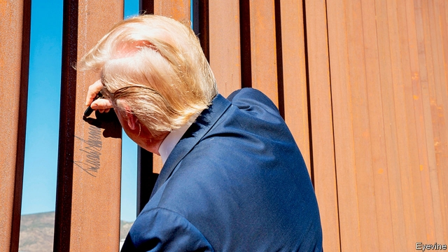
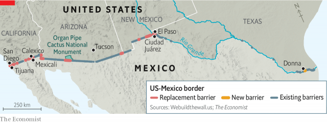

###### Borderline disorder

# Donald Trump’s wall will irrevocably change America’s south-western border 

 

> print-edition iconPrint edition | United States | Dec 18th 2019 

ON A CRISP clear morning in November Fidel Baca, a Customs and Border Patrol (CBP) agent in El Paso, was driving west on Cesar Chavez Highway, which runs alongside the Rio Grande. Mexico was just yards away, behind a few mesh fences and the reddish-brown trickle of river. An alert came on the radio telling him that a surveillance had camera had caught four people emerging from the river’s concrete channel on the American side. Stopping by the side of the road, he pointed first to a couple of fresh footprints, and then, just behind them, to fresh wet sand atop the highway barrier: someone had just jumped it. The chain-link border fence behind the barrier showed a fresh cut. 

Less than a mile away from where Mr Baca patrolled, a new wall is rising, and it will not be so easily sliced through. America’s new border wall is made of 30-foot-tall (18 in some places) steel bollards filled with concrete, sunk six feet deep into a concrete foundation and topped with five-foot slabs of solid steel designed to impede climbing. Though American taxpayers rather than Mexico are paying the bill, and it is far from “beautiful”, Donald Trump is honouring his promise to build a wall along America’s border with Mexico. 

Some Democrats argue that Mr Trump is merely replacing walls that already exist. That is not true. When a 30-foot wall, impenetrable to wildlife and surrounded by a network of roads and lights, replaces a low fence, it really is a new structure, in much the same way that replacing a garden shed with a ten-storey office block would be. A journey from El Paso to San Diego makes clear just how deeply the wall will change the character of America’s south-western border. Emma Lazarus’s poem on the Statue of Liberty welcomes to America the world’s “huddled masses yearning to breathe free”. Mr Trump’s wall sends the opposite message. 

On a map, El Paso appears to sit directly across from Ciudad Juárez. But in many ways the two cities are really one, separated by the border. Parents in Juárez send their children to America each day to private schools in El Paso, while professionals who work in Juárez often prefer to live in El Paso. Each day an average of around 80,000 people cross into America from Juárez by bus, car and on foot. 

As of early December 2019, 27.5 miles of new wall have been built in El Paso, with contracts for another 24 miles expected to be signed soon. The CBP argues that the wall is particularly important in urban areas such as El Paso because it buys them time. When someone crosses a border in a remote area, Mr Baca explains, CBP has hours, perhaps even days, to catch him before he reaches a place where he can blend in. He recalls that when he was seconded to a mountainous region in rural West Texas, “by the time you apprehend someone, they’ve been walking for three days, maybe five. If we were tracking someone, you could smell them before you saw them.” 

 

In cities, says Mr Baca, “we have seconds to minutes...People can just blend in once they reach the city.” Of course, no barrier is completely impenetrable. Smugglers have reportedly sawn through Mr Trump’s wall. But slicing through a chain-link fence is quick and easy; cutting through concrete-filled steel bollards takes energy, probably multiple motorised saw blades and most importantly for the border patrol, a long time. Gloria Chavez, the acting chief of CBP’s El Paso Sector, which includes all of New Mexico’s largely rural frontier, argues that “There’s a misconception that the wall was built to stop the flow. It was built to manage the flow. It’s a tool.” 

What comes next for the wall builders? The next completely new sections will be in south-eastern Texas, and progress there might be difficult. Much of America’s border lands are public, but in Texas, land is mostly privately owned. The government will have to buy it from landowners, which can be a tricky process. 

A CBP official points out that records in south Texas are spotty, and ownership of many parcels unclear. During the last big wall-building fit in 2008, the official said they found one parcel in South Texas with 86 possible claimants (“we’ve introduced cousins to each other,” says the official). In some cases, the government has to seize land. That is unpopular everywhere, but especially in rural Texas, where distrust of the federal government runs deep. The government’s use of eminent domain in 2008 led to hundreds of lawsuits, some of which are still ongoing. 

Farther west along the border, in Arizona, many are concerned about the wall’s environmental impact. Along the new sections of wall in Organ Pipe Cactus National Monument lie massive, fallen saguaro cactuses in sections—bulldozed for the barrier. Saguaro, with their chubby upturned arms, have a vaguely human look; the Tohono O’odham, the local native population, consider them embodiments of their ancestors. They can live for centuries. Some of those cut down were probably standing before Arizona was a state. 

But the wall’s potential environmental harms extend well beyond fallen flora. Activists worry that water used in mixing concrete for the wall’s foundation will deplete precious desert aquifers, imperilling not just an endangered species of fish whose sole American habitat is Quitobaquito Springs, in Organ Pipe, but all desert life (a CBP official contends that his agency is not using any groundwater within five miles of Quitobaquito). The lights planned for the wall could disrupt the bats that pollinate the saguaro. The new wall, with its deep foundation and closely built bollards, could act as a dam and worsen floods. 

Such concerns seem remote in downtown San Diego. Yet Jerry Sanders, the city’s former mayor and police chief, fondly recalls bird hunting along the border decades ago, when the only barrier was “a cable, just so you couldn’t drive straight across.” That was more or less the state of fencing along much of America’s southern border until surprisingly recently. The first border fence designed to stop illegal immigration started going up just south of San Diego in 1990. Security fears spurred a fit of construction under George W. Bush. 

No president has made a barrier—or hostility to immigration—as central to his political platform as Mr Trump. CBP says it has funding for 509 miles of construction. From Mr Trump’s inauguration until October, Congress provided nearly $3.1bn to replace or upgrade border fencing. Mr Trump redirected billions of dollars from defence funding to wall construction, endangering dozens of military-construction projects—though on December 10th a federal court blocked Mr Trump from using that money on his wall. Many have raised concerns over how much the wall costs, and who is building it. The Defence Department’s inspector-general will audit a $400m construction contract given to a North Dakota firm whose boss has repeatedly sung Mr Trump’s praises. 

 

In total the wall could cost as much as $25m a mile just to build, not including maintenance. And it is far from clear what it will achieve. A wall will certainly make life harder for fence jumpers. But the number of people trying to evade immigration controls to come to America to work has fallen for years. Most of the increase in arrests at the border has come from families and unaccompanied children who want to be caught by CBP officers because they intend to claim asylum, which they have a legal right to do. For such people a wall is much less of a deterrent. 

That is why Nancy Pelosi, the House Speaker and Mr Trump’s most effective political opponent, called the wall “an immorality”. Fortifying a border is not inherently immoral. Doing it this way, however, may be unwise. America’s global success derives not from its military might or power projection, but from its shaping of the world’s multilateral institutions, its openness, and its ability to constantly redefine itself as it assimilates and is changed by successive waves of immigrants. A wall tells the world that America is turning away from those values. 

A more effective way to stop illegal immigration coming from Central America might involve increased foreign aid for political stabilisation there. Fixing America’s overwhelmed asylum system may require more funding for the officials who assess claims. On remote stretches of the border surveillance technology would probably be cheaper and just as effective at stopping migrants as a physical barrier. But a wall is easier to explain, and for a president who prides himself on his reputation as “a builder”, politically irresistible. 

A plaque honouring Mr Trump gleams from a bollard in Calexico, about two hours east of San Diego. Not far from that plaque, directly on the Californian side of the border, is an outlet mall that seemed designed to attract Mexican shoppers. Mexicali, Calexico’s twin city in Mexico, attracts American medical tourists who zip across the border for procedures that cost a fraction of what they would in America. Such enterprises are a reminder that—wall or no wall, and though Mr Trump may wish otherwise—the fates of Mexico and America are and always will be entwined.■ 

