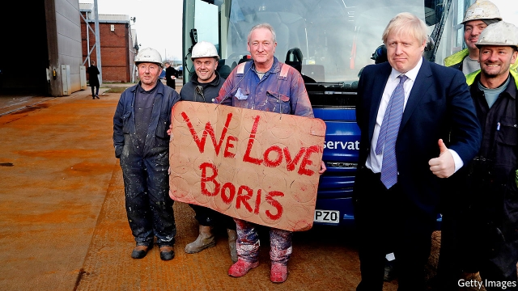
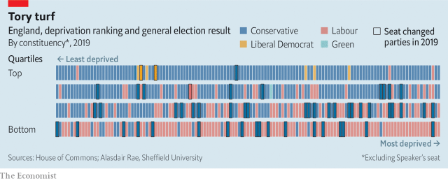

###### What’s the story, northern Tories?

# Who are the Conservatives’ new voters in the north? 

 

> print-edition iconPrint edition | Britain | Dec 18th 2019 

AFTER SECURING the biggest Conservative majority in a generation, there was only one place for Boris Johnson to take a victory lap: Sedgefield. The seat, a former mining community with a mixture of market towns and well-off suburbs on the edge of Teesside, had been Labour since 1935. It came with the added bonus of once being held by Tony Blair. “I know that people may have been breaking the voting habits of generations to vote for us,” said Mr Johnson, managing to speak soberly while dancing on Mr Blair’s political grave. “I will repay your trust.” 

About 1m habitual Labour voters backed the Conservatives in the election on December 12th, according to Datapraxis, a data-analysis company. The upshot was that a wall of seats across the north and the Midlands that had not voted Conservative in decades—or ever—fell to Mr Johnson’s party. Redcar, a Teesside town whose steel mill shut down four years ago under the Conservative government, swung by 15 points from Labour to the Tories. The Black Country turned blue, with Mr Johnson gaining seats in Wolverhampton and West Bromwich. In all, the Conservatives won 54 seats from Labour. Now comes the trickier task: keeping them. 

The first step is to work out who these new Tory voters are. An area of 25,000 square miles (65,000 square km) with more than 25m people is not homogenous, but a few common threads emerge. Most gains came from Leave-voting towns on the edges of more successful cities. The Conservatives cleaned up among blue-collar workers. There was a direct relationship between the size of the swing to the Tories and the number of people in blue-collar jobs. Many of the gains came in places that are poorer than typically Tory areas. Going into the election, the average hourly wage in a Tory-held seat was £15.40 ($20.30); in the seats it won it is around £13.70, according to the Resolution Foundation, a think-tank. Before the election 17 Tory seats were among the most deprived 25% of English constituencies, according to Alasdair Rae from Sheffield University. Now they have 35 (see chart). 

 

Many of the seats where the Conservatives broke through are ageing. The number of over-65s in Bishop Auckland, which the Conservatives won for the first time, has increased by a third since 1981, while the number of 18- to 24-year-olds has fallen by a quarter, according to the Centre for Towns, another think-tank. This is good news for a Conservative Party that won 57% of the vote among over-60s and 67% among over-70s, according to YouGov. 

At the same time Mr Johnson made inroads among younger voters. The age at which someone becomes more likely to vote Conservative than Labour dropped from 47 in 2017 to just 39 this time round, according to YouGov. Mr Johnson also cleaned up among men. After a campaign spent glad-handing chaps in hi-vis jackets and, at one point, driving a digger through a fake wall, the prime minister notched up a 19-point lead over Labour among men, compared with a six-point lead among women. “Blue-collar men think [Labour] are dreadful, sponging, effete wasters,” says Simon Clarke, the Conservative MP for Middlesbrough South and East Cleveland. “It is just contempt.” The Tories may have a woman problem, but they seem to have a bloke solution. 

The government thus rests on an unfamiliar electoral coalition living in parts of the country that the Conservatives do not know well. Mr Johnson’s strategy to keep hold of these new voters has three parts: more money, more power and more attention. The prime minister’s fiscal plans allow him to spend up to £80bn (3.8% of annual GDP) on capital projects over the coming parliament. Much of it will be on high-profile projects outside the south-east, such as “Northern Powerhouse Rail”, which will better connect the north’s cities and surrounding towns. The hitch is that these take time. So projects that can be done quickly will be favoured and shouted about. Whereas a new railway can take decades, bus services can be improved within a few years, under existing laws. Likewise, legislation to turn Teesport into a “free port” with its own customs arrangements could be tabled in 2020. Expect a visit from a hard-hatted Mr Johnson if it is. 

Handing power to local politicians is also on the agenda. Mr Johnson’s allies like reminding people that he is the first prime minister to have also been an elected mayor (of London, in 2008-16). But plans to devolve power are often resisted most fiercely by those whom they are supposed to empower. Gateshead refused to join a devolution project centred around Newcastle, on the other side of the Tyne. A plan for Sheffield and its environs was watered down. David Cameron, whose government tried to get more English regions to adopt elected mayors, was half-right when he grumbled: “We just thought people in Yorkshire hated everyone else. We didn’t realise they hated each other so much.” 

There are reasons for the Conservatives to believe that the new electoral map may last. Sedgefield nowadays has plenty of swanky suburbs, where a Tory life of home- and car-ownership can be lived cheaply. Given their demography, many of the seats that went blue in the recent election should have had a higher Tory vote in the first place. For many years people in the Labour-held north and Midlands were less likely to vote Conservative than people with identical characteristics who lived in the south, points out James Kanagasooriam, a Tory pollster. A mixture of history and habit helped to keep the Labour vote artificially high in these regions. In 2019, thanks to Brexit and a deeply unpopular Labour leader, the spell broke. 

Yet the twin tailwinds of Brexit and Jeremy Corbyn will not always be there to help the Tories. Once they are removed, the new Conservative alliance may prove unstable. The days of lifelong party loyalty are over, says Will Jennings of the University of Southampton, who has researched the growing political gap between Britain’s cities and its towns. “Are these voters going to stick around?” he asks. “That is the big question.” Unless the Conservatives can come up with a positive answer, another party leader might end up giving a victory speech in Mr Johnson’s old seat. ■ 

