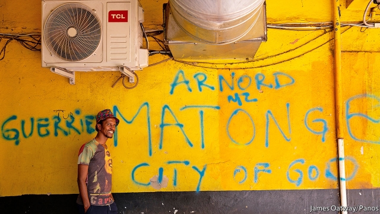
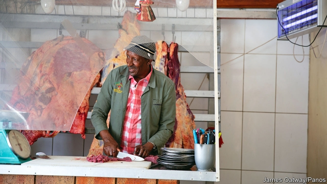
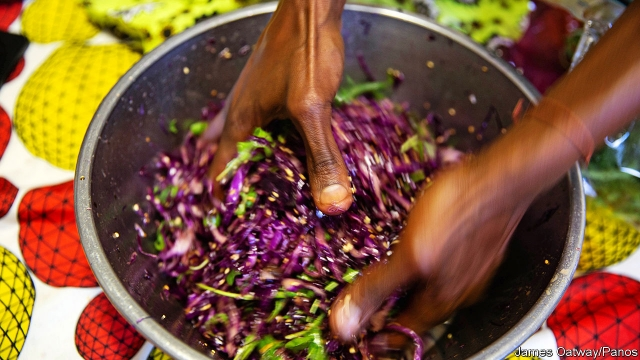

###### Yeoville

# Hard times and hotplates in the most diverse district in Africa 

 

> print-edition iconPrint edition | Christmas Specials | Dec 18th 2019 

ONE MORNING in October Sanza Sandile zigs and zags his way through Yeoville market. He hollers at Ghanaian seamstresses, waves at Nigerian apothecaries and sniffs at the stews bubbling in front of Zimbabwean cooks. Finally he finds what, or rather who, he is looking for: Lydia Luiki, the Congolese queen of cassava. 

Ms Luiki sits on a small wooden stool. Between her feet is a sack of green leaves from the shrubby cassava tree, which came in from Mozambique this morning. She processes it with three other Congolese women, who nimbly wash, pluck, blend and pack the leaves. The resulting mulch is sold for 10 rand (60 cents) per bag. 

Mr Sandile (pictured above) has tried other cassava-sellers but their produce is far inferior to that of the Congolese queen. Hers is a staple of the dinner club he hosts five days a week in Yeoville, a district in central Johannesburg which is home to 20,000 people from at least 30 African countries. His “cassava three ways”—Angolan, Congolese and Mozambican—is one of a dozen dishes that mix the cuisines of the area’s diasporas. 

The 44-year-old chef grew up in Soweto, a township on the outskirts of Johannesburg. During the 1970s and 1980s it was the wellspring of resistance to apartheid, South Africa’s brutal system of white rule. It was also a place of “dry sandwiches”, recalls Mr Sandile. By contrast, Yeoville, to which he moved in 1994, the year of Nelson Mandela’s election, was a cornucopia of flavour. It still is. 

Few tourists come to Yeoville. Nor do many residents of the rest of Johannesburg. And though its high crime rate might make that choice seem sensible, they are missing out. The diverse tastes that inspire Mr Sandile reflect a fascinating present and past. 

Once a place where Europeans washed up, today most of its residents are from other African countries. No other place on the continent has so many different communities in such proximity, and for all its violence and poverty it remains a place of sanctuary. “Yeoville”, says Mr Sandile, “is still the headquarters for people who know what it means to be the Other.” 

Johannesburg is a city built on mining and migrants. A few years after the first big discovery of gold in 1886, Thomas Yeo Sherwell, a developer from Yeovil, England, bought a plot of land to the north of the main seam and named it after his hometown and himself. He touted it to the rich as an oasis away from the dirt, dust and noise. 

In the end Yeoville proved still too close to the mines for the newly monied. But it became popular with migrants, many of them Jews from eastern Europe. In the decades after the second world war, when the South African economy boomed, new migrants from authoritarian and communist Europe flocked to Yeoville. The streets were dotted with vendors selling falafal and German-style sausages, Italian cafés and Greek tavernas. 

Kristina Gubric was born in Yeoville in 1973. Her parents were ethnic Hungarians from Yugoslavia who had paid for the move by smuggling cigarettes and tights. Ms Gubric recalls a childhood buying shawarma and Wurst, and watching her father play chess in cafés. She observes that by moving from Josip Broz Tito’s Yugoslavia to apartheid South Africa, her parents “swapped one form of oppression for another”. 

Mr Botaka insists he is casually dressed while sporting a diamanté earring and a tuxedo 

But in Yeoville oppression was frequently discussed, and often resisted. The area has always had a radical streak. Mandela and Mahatma Gandhi both lived there briefly. It was home to many members of the South African Communist Party. Diasporas today keep up the area’s tradition of politicking. “When you see Congolese in Yeoville they’re probably discussing politics,” smiles Gilla Botaka, a security guard. 

In the late 1970s and 1980s Yeoville stood out amid the starched wickedness of apartheid. Gay-friendly clubs such as Casablanca sprang up. Under the Group Areas Act, first passed in 1950, South Africans of different skin colour were segregated, with non-whites forcibly removed to peripheral townships. But in Yeoville authorities sometimes turned a blind eye to “greying”. There was probably more mixing in the area than anywhere else in the country. 

The mixing increased as apartheid neared its end. The Group Areas Act was repealed in 1991. Exiled members of the African National Congress (ANC), the party of Mandela, returned home. Progressive South Africans of all colours imagined what a democratic version of their country would be like. A lot of that dreaming—and a lot of drinking—went on in Yeoville. 

“You left white South Africa at the door when you arrived in Yeoville,” remembers Laurice Taitz, who grew up in Benoni, an affluent white town outside Johannesburg. “You left all the conformity, the evil dullness of it all.” She recalls a heady time of parties and politics. “It was a coming of age for a lot of people…the first hint of what a new South Africa might be.” 

Some of Mr Sandile’s recollections of that time seem still to be glimpsed through a hedonistic fug. Did he really see Paul Simon on stage with Thabo Mbeki at a jazz club? Was he actually sent to help Mick Jagger find some “really nice stuff”? Either way, Yeoville was where he first saw blacks and whites mixing together, and, just as unusual, black people drinking chardonnay. Here were the “smart blacks” who had been suppressed and squandered under apartheid. Here, he continues, “We were free.” 

Looking back, though, Mr Sandile also sees the eve of democracy as a missed opportunity. “We could have created an alternative suburb in Yeoville. We could have all co-existed.” It is hardly a feeling unique to the area. A quarter of a century after the end of apartheid, many all over South Africa feel that the country has squandered its democratic dividend. But the Yeoville residents who lived through the heady days of the early 1990s feel an especially acute sense of regret. 

In 1991 Yeoville was 79% white. By 1998 it was more than 84% black. “It’s like I’ve lived in two different countries,” says Gabrielle Ozynski, one of the few white South African residents to have stayed. But Yeoville’s story was not just one of “white flight”. It saw “black flight”, too. The ANC cadres who had partied and plotted in Yeoville got government jobs. Many moved to Pretoria, the administrative capital. 

 

In the late 1990s and 2000s the South African middle classes were replaced in Yeoville by migrants from the rest of Africa. Under Mandela, South Africa welcomed refugees. Under his successors that was coupled with a spotty approach to illegal immigration; the army was removed from border patrols in 2004, replaced by a small, ineffective police contingent. 

One of the largest communities in Yeoville is from the Democratic Republic of Congo. A former synagogue has become the “Congolese mall”, complete with hair salons, Pentecostal churches and a courier service (“Much cheaper than FedEx”, says the owner). The Congolese are hard to miss. Their elegant clothes are a sign of “sapology”: an elegant protest against stifling poverty that began in the dictatorship of Joseph Mobutu, who banned Western clothes. Mr Botaka, the politically active security guard, insists he is dressed casually while sporting a diamanté earring and a tuxedo. 

But if the Congolese stand out, they know they are but one group among many. “I didn’t travel before coming to South Africa,” says Joris Bondo, who moved to Johannesburg in 1996 from Congo. “But in Yeoville I travel across Africa every day.” 

 

The smell of frankincense burning in coffee shops is testament to the number of Ethiopians who have left behind ethnic conflict, too. Zimbabweans are targeted by multiple adverts offering low-cost remittance transfers back home. Smaller communities from west African countries such as Liberia and Sierra Leone have also found a haven in Yeoville. 

Many are fleeing civil strife. Some are escaping a more pervasive persecution. “I’m gay,” says Richard, from Ghana, who came to Yeoville in 2003 and never left. “I’m not very welcome back home. I would have had to have led my whole life for other people, as a lie.” 

Most migrants to Yeoville, like newcomers anywhere, start by seeking out compatriots. But over time there is cross-pollination. Laye Kamara, from Liberia, is dating a Zimbabwean woman, whose level of education impressed him. At a local primary school a Zimbabwean and Cameroonian couple explain that their son speaks Lingala in the playground so he can fit in with Congolese pupils. 

Food, like education, is a catalyst for mixing. Blessings Café, one of the many diners in Yeoville, is manned by Lucky Olabode, a former fork-lift truck driver from Delta State in Nigeria. He has learned to cook pap (maize), meat and stew for his southern African clientele, as well as traditional fare such as pepper soup and jollof rice for Nigerians. Sharing meals is one reason why “we have a strong community here,” he says. 

It is a sentiment that Mr Sandile is trying to foster with his own dinner club. On a recent visit your correspondent sampled the famous cassava three ways; jollof rice, Senegalese-style; “Nigerian cow leg”; Ethiopian ladyfingers; Mozambican pickle smeared on steamed fish; pumpkin dishes galore; poached guavas; and fried magwinya (doughnuts). All of it was washed down with a savage blend of Egyptian arak and Ghanaian herbal bitters. 

When Mr Sandile first moved to Yeoville he worked as a radio journalist. He would also act as a fixer, doing odd jobs. The cooking came later, as a way of showing that Yeoville still had much to offer. “I embraced multi-African food,” he explains. “I don’t want to go to Melville [a mostly white, hipster suburb] for a pizza. Fuck it.” 

Yet Mr Sandile is the first to recognise that Yeoville is far from a cosmopolitan paradise. “Yeoville is the pan-Africanism of the streets,” he argues. If there is a shared identity it is one born of mutual hustle, rather than any kind of ideology. More than 70% of workers in Yeoville earn less than 6,400 rand ($432) per month. “Here in Yeoville I think we are all friends. The reason for any problem is hardship,” says Mr Olabode, the Nigerian chef. His 3,000 rand rent is three-quarters of his monthly salary. 

Many migrants use Yeoville as a starter suburb before moving out of the city, in the same way as white Europeans once did. But saving is hard when rent takes up most of your pay. Not that one gets a lot for the money. The demand for accommodation is so high that two-bedroom flats can rake in more than 20,000 rand per month, about the same as more salubrious parts of Johannesburg. In this case, though, the flats may have ten or more residents. Opposite the Yeoville market a brick wall is festooned with signs looking for “a woman to share a bed” or “a man to share a sitting room”. 

Nor does the South African state make it easy for Yeoville residents. A common complaint is sluggishness in processing asylum claims. Mr Bondo has still not been formally classified as a refugee, which would make it easier to work, despite having arrived from Congo 23 years ago. He has had to renew his status as an asylum seeker more than 40 times. 

The city government has long neglected the area, perhaps because most foreigners cannot vote. It is more likely to sweep informal traders off the pavements than sweep litter off the streets. That makes enterprise hard for people who often have no other way to make money. A Zimbabwean woman flogging chunks of cabbage by the roadside explains that she would like to sell higher-value goods but cannot risk the confiscation of more expensive stock. 

And it is not just the state that is hostile. In September cities including Johannesburg saw spasms of xenophobic attacks on foreign-owned shops and property. Such was the violence that a Nigerian airline sent a plane for dozens of citizens to leave the country. 

In Yeoville, because of the safety of numbers, there were relatively few attacks. When vigilantes got close, warnings were passed in person and on WhatsApp. (“The Zulus are coming” was a common message.) But the violence has still caused a sense of unease among residents. Richard, from Ghana, says South Africans’ “Afrophobia” stems from their own plight, though that is no excuse. “Don’t blame me for you not getting a job.” 

For Mr Sandile the “giant elephant in the room is the way we Africans treat each other.” Even though xenophobic attacks are rare in Yeoville, crime is not. There were 27 murders in 2018 and the tally was higher in 2019. Every night before his supper club opens he ensures the toilets are washed then locked. Otherwise they are spoiled and items are stolen. “We are left here as Africans robbing each other and hating each other.” 

Like many residents, he has a passionate ambivalence for Yeoville. He loves what it ought to represent, but laments the day-to-day reality. It is not unlike his feelings towards contemporary South Africa as a whole: great in theory, less so in practice. 

For now the remembrance of the heady idealism of the early 1990s, the joy of a shared meal and the need to make a living keep the plates coming. “I’m staying here and doing my table,” says Mr Sandile. “Because my memory is my weapon. And I remember that we used to live nicely here.” ■ 

