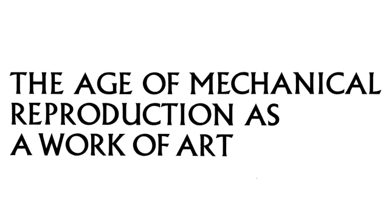
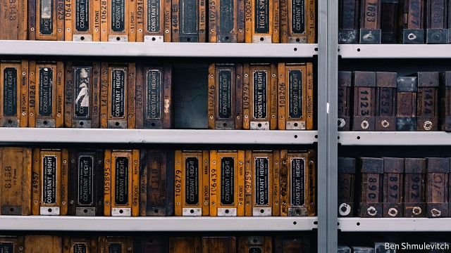
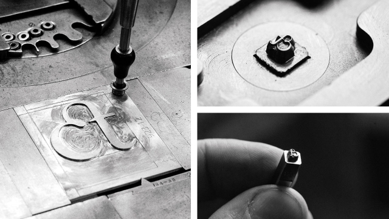

###### Setting type

# How the world’s old printing presses are being brought back to life 

 

> print-edition iconPrint edition | Christmas Specials | Dec 18th 2019 

A FEW YEARS ago Russell Maret, a New York artist, found himself puzzling over a question. In the 1920s and 1930s some preindustrial fonts were revived by Stanley Morison, a great British typographer. They transformed the quality of book-printing. But in the process of reviving them, Morison changed them. When he created the Poliphilus font from the great printer Aldus Manutius’s edition of “The Dream of Poliphilus” (1499), for instance, he corrected the alignment.  

Mr Maret is critical of these corrections. “Aldus’s types weren’t misaligned because he was some old-timey printer. He was getting exactly what he wanted.” Was it, Mr Maret wondered, the inherent technological limitations of the early 20th century that led the revivalists to want to standardise old typefaces? Or some broader mechanical mindset?  

The only way for him to work that out was to create his own font. The problem was that the Monotype Corporation, which employed Morison and dominated book-printing in the English-speaking world for much of the 20th century, went bust in 1992, so Mr Maret had to cast about for the equipment he needed. 

His search led him to a small street in south London where, at the end of a mews, lies a two-storey building that a century ago was home to two baby elephants. The elephants had been imported from India by the Daily Mirror newspaper, which wanted one as a mascot but was told it would need company so bought a pair; the building in Stockwell was a veterinary surgery for circus animals and was, therefore, regarded as a suitable place to house them.  

The fate of the elephants is not known, but the building, whose floors had been reinforced to carry the animals’ heft, has found a new purpose as the home of another weighty cargo. It now accommodates most of the remains of the British letterpress printing industry, thanks to the efforts of the 84-year-old Sue Shaw. 

Mrs Shaw, who left school at 16 and has worked in the book business all her life, has a passion for beautiful printing. “You can’t read Trollope in Times Roman,” she says in the course of a conversation about typographical faux pas. “It’s an outrage! It has to be Baskerville or Fournier.” Her objection is not merely that it is anachronistic—Times Roman was created in 1932, half a century after Trollope’s death—but also that the font was produced not for beauty but to maximise the number of readable letters that could be crammed on to the front page of a newspaper. The ascenders and descenders are consequently short; in her view that gives the font a clinical, businesslike air unsuited to fiction. 

These days commercial printing is dominated by offset—in which an inked image is transferred onto a smooth surface and thence onto paper—and digital—in which ink is sprayed directly onto the page. Letterpress printing, in which metal type presses ink on to paper, is treated as obsolete. But it is letterpress that stirs the aficionado, particularly in its hot-metal form, in which molten metal is poured into letter-shaped apertures called matrices to create fresh slugs of type as they are needed, rather than relying on shuffling around pieces of movable type cast in advance. 

Mrs Shaw set up her own hot-metal press in the 1970s, just as the business was dying. She got a little work, but increasingly found that her efforts went into preserving the artefacts that she loved. “All London’s typesetters were collapsing, and there I was buying up all these gorgeous typefaces.” She bought, with help from the National Heritage Memorial Fund and the Science Museum, the remains of Stephenson Blake, into which many of the old English typefounders had been folded; of Robert DeLittle, a wood-letter printer; and of the Monotype Corporation’s British operations.  

Monotype is Mrs Shaw’s great enthusiasm. Patented in 1897, it mechanised the composition of printers’ type, thereby greatly accelerating the whole process. A keyboard operator would input a text by punching holes into a paper ribbon which was then fed into a casting machine, allowing entire passages to be composed at once, in order and ready to print from. Mrs Shaw loves Monotype for its complexity, and for the vast machines required to produce each letter. “That’s why it’s such fun. Only fanatics are interested in it.” 

 

There are perhaps eight million items in the Type Archive she has created, the earliest probably dating back to the 16th century. Nobody really knows, however, because it has not been catalogued. Doing so would be a huge and difficult task. The Monotype collection alone contains 5,700 drawers of patterns (large metal plates engraved with the shape of a letter) and 22,000 containing matrices. The former are made of a thin layer of copper backed with lead. Many of the drawers in which they are stored, though only a few inches deep, are too heavy for one person to lift. 

Every stage of the process is there. Alongside the patterns and the matrices are thousands of boxes of punches—small metal letters which are derived from the patterns and used to stamp their shape into a matrix. And there are thousands of varieties of type, in different fonts, sizes and alphabet: Roman, Cyrillic, Sinhala and the 20 Indian languages the Monotype Corporation once serviced.On the upper floor are 79 of the machines used in the different stages of the hot-metal process. Some are collecting dust, but most—like those used to set the title for this article in Albertus, created for Monotype in the 1930s by Berthold Wolpe—are clanking away. This year, as a result of Mr Maret’s curiosity, they have been making the first new Monotype hot-metal font for 40 years. 

Letterpress printing hung on longer in poorer countries than in Britain, but now its near extinction is global. “Letterpress has been wiped out completely in India,” says Aurobind Patel, who designed the font, called Ecotype, that this newspaper used from 1991 to 2018 (we now use Milo). It is “like the backdrops of the Alps that photo studios used to have, that are photoshopped in these days.” 

Thousands of tonnes of metal type must have been melted down. But some has been bought up by collectors like Ahmad Matar, a Saudi Arabian artist. His biggest haul was from an Armenian library in Cairo, but he reckons that Beirut may have the greatest potential, for it was the centre of the Arabic printing industry. “There is an Arabic saying,” he says from his studio in Jeddah, where the walls are lined with wooden cases full of type. “Cairo writes. Beirut prints. Baghdad reads.”  

The most enthusiastic conservators are former printers. The employees of dying industries often feel a powerful nostalgia for the machines with which they have spent their lives. The feeling is perhaps magnified among those whose business was disseminating human culture. When Izumi Munemura was looking for material for the Printing Museum he opened in Tokyo in 2000 he was approached by former employees of Toppan, a printing company, which had largely stopped using letterpress by 1985. They had been storing some of the company’s hot-metal type. “They opened the door to the warehouse and said, ‘Here you go: we have been waiting for this moment.’ It was like a scene from Indiana Jones.” 

Not all the old fonts and machines were consigned to museums or melted down. In a few corners of the world, such as Kazui Press in Tokyo, they continue to operate. Kazui was run by Juzo Takaoka from 1956 until his son, Masao, took over in 1995. The younger Mr Takaoka still runs the firm. 

Letterpress is a far more arduous business in Japanese than in English; it takes 3,000-4,000 characters to print a book or newspaper. It is also expensive—Kazui business cards are ¥20,000 ($185) per hundred. But Mr Takaoka still has plenty of customers. In explanation, he points to a grey ceramic cup into which he has poured tea. “You can serve or drink tea in a plastic or paper cup. The process would be the same: you bring the cup to your mouth and you drink tea. But it’s more tasteful to drink from a ceramic cup, no?”  

 

Nobody knows the size of the letterpress industry, but there is an agreement that, in at least some places, it is rebounding. “When I got started, old presses were practically scrap metal,” says Harold Kyle, who founded Boxcar Press in Syracuse, New York two decades ago. “Now they go for anything from $3,000 to $25,000.” Even in China, where letterpress poses the same challenges as in Japan, there are signs of a revival among graphic designers. 

In America Martha Stewart, a homemaking guru, must take some credit for the boom: she popularised letterpress wedding invitations. At the other end of the scale, in terms of cost and complexity, sit Mr Maret and his fellow book artists. They create beautiful volumes in tiny runs, often writing the text, drawing the illustrations, designing the fonts and printing the books. These works belong to a different discipline from books which showcase art made in some other medium. For Mr Maret and other great book-artists, such as Veronika Schäpers and Didier Mutel, the book is its own medium, a uniquely satisfying combination of the intellectual, visual and tactile.  

“There is something special about things that are inconvenient” 

Beyond its creators, dealers and collectors, book art is known to few, because it cannot satisfactorily be exhibited. Leaving a book open at a single page in a gallery would not allow visitors to appreciate it; letting visitors leaf through it would ruin it. But although the world of book art is small, it is flourishing.  

In 2005 Peter Koch, a book artist, and Susan Filter, a paper conservator, decided that there was an appetite for a fine-printing show on America’s west coast. In 2019 Codex, their biennial fair, had 240 exhibitors. In 2015, $1.4m-worth of work was sold at the fair; in 2017, that rose to $2.3m. Books on show, says Ms Filter, sell for anything from $10 to $50,000. 

This is not the first time that old printing techniques have been reborn. In the late 19th century William Morris, a reactionary socialist aghast at the effects of the Industrial Revolution, founded the Kelmscott Press to revive the skill of hand-printing, spawning a movement that thrived in the early 20th century. Today’s revival is not dissimilar. “Digital printing is too easy,” says Mrs Shaw. “The computer does it all for you.” In Tokyo Mr Takaoka echoes her feelings: “There’s something special about things that are inconvenient.” Perhaps the skill and effort that goes into letterpress printing answer a human need. The view of work in neoclassical economics as something that people will do only in exchange for money was always crude: skilled labour demands effort but also brings joy. 

The connection with history is also important. “I realised that ever since we were children, we’ve been told printing is one of our four great inventions,” says Wei Diming, who has opened a letterpress shop in the Chinese city of Xian. “But no one has really seen what letterpress printing is like and how to use it. So I spent over two years to revive it so that people would be able to experience this cultural tradition.” Mr Matar, in Jeddah, is similarly moved: “Type represents a revolution in the human mind: as an artist, when I touch the letters, it’s a very big thing.” 

Touch is something workers in a digital age often need more of; staring at a screen all day leaves many with a sense that something is not quite right. “Humans are haptic animals,” says Ms Filter. “People want to pick up a stone and make a tool of it.” 

Consumers like the feel of things, too. In the age of the digital download growth in the sales of vinyl records, which can be held and treasured, is accelerating. Their devotees find that vinyl gives a different quality to the sound; similarly, with printing, people like the fact that letterpressed paper has a distinctive feel. 

This causes wry amusement to some printers. In the past the embossing of a letter was regarded as a sign of bad workmanship. “What printers were after”, says Bob Richardson, a former BBC graphic designer who works at the Type Archive, “was a ‘kiss impression’, where the type touches the paper lightly enough just to ink it. If you embossed one side of the paper, it made it difficult to print on the other side.” Mr Takaoka is outraged by the fad for clumsy letterpress products. “The over-pressing and over-inking...it’s an insult to us craftsmen. For 500 years, people have worked hard to maintain the art of letterpress printing. To be honest, I just want this ‘resurgence’ or ‘boom’ to go away.” 

If it fails to, that will be in part because of people like Mark Storey. He expresses his love for beautifully printed books not by making them but by buying them—an activity for which his job as chairman of a private-equity company equips him comfortably. In a cavernous room, Mr Storey has an astonishing library of the ancient and the modern that includes several Doves Press volumes, numbers of which were limited by the decision of one of the founders to throw the entire stock of type into the Thames to ensure that it was never used in a mechanical press; a 1935 Lectern Bible in the Centaur font designed by Bruce Rogers for use in churches; and a number of Mr Maret’s books. 

Mr Storey handles his books with great delicacy; part of their appeal is tactile. But his enthusiasm for hand-printed books is also elegiac. “There’s a sense of things not quite lost, hanging on only because people are willing to commit their lives to them.”  

People like Duncan Avery. When he first joined Monotype in 1945 at the age of 17, Mr Avery was set to work machining parts for Bren guns, for that was the way things were at the end of the war. He stayed with Monotype all his working life. At 91 he is the oldest of the crew of former Monotype workers who have been volunteering at the Type Archive for a quarter of a century. He drives up from Sussex two days a week, collecting 81-year-old Douglas Ellis, who looks after the matrix machines, on the way.  

On a recent November morning, Mr Avery was dealing with an American order for a set of 24-point Centaur matrices: “Lovely font.” The archive’s commercial side is not extensive. But revenues are no longer declining, and indeed, thanks to Mr Maret’s inquiry into the technology and the mindset of early-20th-century printing, there has been an uptick. 

It was not just intellectual curiosity, Mr Maret admits, that led him to try to create a new Monotype font. “I’ve always wanted to make a typeface that could be set in paragraphs.” Why? “Because it would be fun. There’s no practical economics in this. I wanted a complete typeface that I could write a book in and send to a typecaster, for no other reason than it would cause me joy.” Now that it is an art not an industry, hot-metal printing is no longer bound by economic logic. Those who practise it do not have to seek the most efficient solution to every problem. 

In the spirit of inquiry and enjoyment, Mr Maret adapted one of the fonts cut in the 17th century by Peter de Walpergen for Bishop Fell. He called his version Hungry Dutch: de Walpergen was Dutch, and the font was originally intended for a book called “Hungry Bibliophiles”. Then it was over to London, for the old gang plus some younger apprentices to turn it into a Monotype font. 

Parminder Kumar Rajput, at 71 the youngest of the old gang, is the only man left in the world who can operate all the various Monotype machines needed to produce a typeface from scratch. Because the business was highly specialised, most workers mastered only one short slice of the long and complex process. Mr Rajput’s first foreman, eager to promote him, encouraged him to learn how to master the whole process. Mr Rajput happily learned how to use all the machines; but he declined promotion, staying on the shop floor for all his working life. 

 

Richard Ardagh’s route into type production has been different to Mr Rajput’s. A 38-year-old graphic designer, he got interested in letterpress at art school. Mrs Shaw showed him round the archive, and he was hooked. “The employees being so long in the tooth heightened my sense that I should get involved as soon as I could.” Having studied under Mr Rajput, he cut around two-thirds of the punches for Hungry Dutch. 

This work does not contribute directly to his earnings, but may do so indirectly: “Your cup has to be full of inspiration, wherever you get it from.” On the same day that Mr Avery was processing the Centaur order, Mr Ardagh ran up the rickety stairs from the vault to Mrs Shaw’s office in a state of high excitement. In one of the cast-iron Stephenson Blake safes he had found the punches for an Irish font cut by Joseph Moxon in the 1680s. Mrs Shaw was jubilant. “We’ve been looking for our mislaid Moxon’s Irish for 15 years!”  

Making a new Monotype font was quite a challenge. The equipment needed for the beginning of the process—transferring a drawing onto a metal pattern by means of a glass plate, wax and electrolysis—had been lost. The Type Archive workers tried making the pattern through etching instead. After trial and error, a computerised milling machine did the job. 

But the main difficulties with the process concerned the question at the centre of Mr Maret’s investigation. The Monotype workers redrew his Hungry Dutch letters according to the Monotype protocols, which require the characters to conform to 15 common widths, with standardised weights, height, slope and axis. That was the way it was done in Monotype; but that was not what Mr Maret wanted. So when the long tail of the upper-case Q was shortened, he insisted that it should be lengthened. Since Mr Maret was the customer, he won the day. Some regard the font which the process produced as a little uneven, but to the untrained eye it is lovely.  

Thus Mr Maret got both his font and his answer: although some of the changes to the Poliphilus font were imposed by the technology, not all of them were necessary. The historical font could have been given more freedom. “The machinery embodies a system with certain rules...but it was neither the system nor the rules that resulted in the look of late-industrial typefaces. They might have suggested it, but it was the people who used the machines who took that suggestion as fiat.” 

Mr Ardagh has also gained from the project. He has been experimenting with making fonts through 3D printing, and has learned far more about the old way of making type by doing it himself than he could have by reading about it.  

At the Type Archive, aside from a flurry as a bunch of young people arrive from the Science Museum to digitise some of the material, things go on much the same. Mrs Shaw continues to try to rustle up money to display her treasures. Mr Avery continues to drive up from the countryside to keep the business side afloat. And Mr Rajput continues to cajole vast old machines into producing tiny gems of shining type. ■ 

