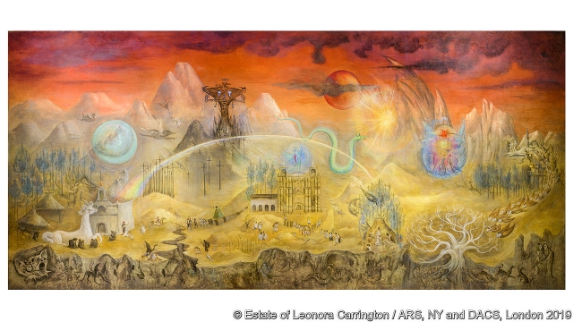

###### Leonora Carrington

# Searching for Britain’s most important surrealist 

 

> print-edition iconPrint edition | Christmas Specials | Dec 18th 2019 

THE WHITE-WASHED concrete walls of number 194 Calle Chihuahua, in Roma, a fashionable district of Mexico City, do not give much away. The façade is as plain as it comes. The windows are shuttered. Bang loudly on the wooden door and a security guard within answers: “There’s nobody here.” Ask why the house is described online as a museum and his answer is: “Fake news. There’s nothing here at all.” 

For more than six decades until her death, aged 94, in 2011, 194 Calle Chihuahua was the home of Leonora Carrington, a British Surrealist painter and writer. When Edward James, a British ex-pat in Mexico who was both her patron and friend, first visited her there in the 1940s, he found her studio bursting with life: “Small in the extreme, it was an ill-furnished and not very well-lighted room...The place was a combined kitchen, nursery, bedroom, kennel and junk-store. The disorder was apocalyptic. My hopes and expectations began to swell.” 

James was right to be hopeful. Carrington became one of the most accomplished Surrealist artists of the 20th century. But not in the way many people of that time understood the genre. 

Instead she took Surrealism to a place that was centred on women, not as muses or femmes enfants, but as domestic goddesses, cooks, sorceresses, witches. Her paintings depict women instinctively in touch with the natural and supernatural worlds, and the half-real, half-mythical animals and birds that roamed within them. A critic visiting her first solo exhibition in New York in 1948 found the 27 pictures on display “hopping with demons...feathery, hairy, horny, half-luminous creatures merged imperceptibly into birds, animals and plants…[and] painted with cobweb delicacy.” 

Few give Mexico, her adopted home, credit for influencing this fantastical, half-feral dreamscape. Though her art flourished there, it was the place inside her mind, shaped by childhood fan-tasies and fears, mental illness, womanhood and motherhood, where she found inspiration. Nor did Mexico initially cherish her in the way it celebrated its best-known home-grown artists, such as Diego Rivera and Frida Kahlo, who created a brand of mexicanidad (Mexicanness) that was integral to the creation of national identity after the revolution in 1910-17. 

But Carrington tapped into a deeper layer of Mexico’s psyche. And, increasingly, she is appreciated not just by the country’s connoisseurs—“The Giantess (The Guardian of the Egg)”, (pictured overleaf) sold for $1.5m a decade ago, and is now in a private collection—but by ordinary Mexicans. More than 300,000 people flocked to a retrospective of Carrington’s work in Mexico City’s Modern Art Museum in 2018, more than the numbers who queued to see “Frida Kahlo: Making Her Self Up” at the V&A in London that same year. 

The publicity-shy Carrington would have found the adulation bemusing. “She didn’t care the fuck about museums,” her eldest son, Gabriel Weisz, says. Yet she did care about deeper, more spiritual matters, and in many ways Carrington and these aspects of the country naturally blend into each other. To find the congruence requires a long, and at times frustrating, journey, to what some call Mexico profundo—the country’s ancient roots. 

Carrington’s own route to Mexico, and to intellectual and artistic freedom, was fraught with difficulties. She met Max Ernst, a German Surrealist painter, in London when he was 46 and she was 20, a dazzling but reluctant debutante from Lancashire in northern England. After living in Paris together, they moved to southern France where, under his love and tutelage, her painting and writing flourished. Her cousin, Joanna Moorhead, describes the awakening in “The Surreal Life of Leonora Carrington” (2017). 

They were still living in bliss when the French arrested Ernst as an enemy alien in 1939. Fearing for him, and facing potential internment herself, Carrington fled to Franco’s Spain. There she had a nervous breakdown and was hospitalised in an asylum for four months. Salvation, of sorts, came in the form of a marriage of convenience to a Mexican diplomat who led her to safety first in New York then in Mexico City. 

President Lázaro Cárdenas had opened up Mexico to those fleeing the Spanish civil war and fascism in Europe. Carrington shared a house with some of them in Calle Gabino Barreda, in a scruffier neighbourhood closer to the city centre than her later home in Roma. The group included Remedios Varo and Kati Horna, two fellow female Surrealists with whom she struck up lifelong friendships. On the walls they hung artworks by Pablo Picasso and Salvador Dalí. But decades ago the house was replaced by a clinic. There is no memory of its inhabitants or the pictures they hung on its walls, just queues of people struggling with aches and pains. “Famous artists?” says a man hawking sweets and cigarettes from a blue trolley outside. “Not here. Only famous physiotherapists, I’m afraid.” 

Carrington divorced the diplomat, married another immigrant, Emerico “Chiki” Weisz, and was soon marooned in her first house in Roma with no money, a new husband and two small boys, juggling motherhood with painting. “Dalí is very lucky to be able to knock them off as he does,” she wrote sardonically to James, who had been one of Dalí’s biggest backers. 

Carrington and James were made for each other. Their friendship was deep, funny, occasionally fraught and, it seems, platonic. They had much in common. Carrington, the daughter of a textile tycoon and his Irish wife, spent much of her childhood in Crookhey Hall near Morecambe Bay with ten servants, a chauffeur and a nanny. In her paintings she portrays the hall as a prison of the mind. James, heir to several large fortunes, grew up in West Dean, a baronial pile in Sussex, where he was starved of both playmates and his mother’s affection. 

James also had a chequered love life. In the 1930s he married an Austrian ballerina, but the relationship dissolved into a divorce case that was covered in lurid detail in the press. 

Both James and Carrington venerated animals. Her short stories such as “The Debutante” brought forth from her psyche the hyenas, horses and other creatures that would populate her art for the rest of her life. As Mr Weisz puts it, James had “a special communication with Leonora’s inner animal”. 

In their letters, preserved at James’s family home, they both moan about Mexico. Carrington was suspicious of aspects of the country, says Mr Weisz, such as the sacrificial violence that she saw simmering beneath the surface. But she also adored much else: the markets, the variety of food, the curanderos (healers) and their ancient witchcraft rituals. Like the Celtic myths that she was told during her childhood, Mexico is full of stories of ancient sorcery, plumed serpents, jaguar gods and the like. The country that André Breton once called “the Surrealist place par excellence” served her well. 

She did not often return the favour directly by choosing Mexico as a subject; it was its spirit, not its fauna, flora, landscapes or people that seeped into her work. But there are exceptions. It is easy to while away a morning in front of her mural “El Mundo Mágico de los Mayas” (on previous page) which depicts Mexico’s Mayan south-east, the syncretism of indigenous and Catholic faiths, flying serpents, rainbow-coloured quetzales, Blakean visions of heaven and hell, and the Virgin of Guadalupe, carried aloft by worshippers, with the face of a monkey. 

 

If, that is, you can find it. It sits not in an art gallery but in the city’s anthropology museum. When your correspondent asks staff there where it is to be found, he is told, “The mural is not here. It’s on loan.” As if it were easy to pick up part of a wall and carry it off. 

It is only through the intervention of an astute security guard that he is set right and sent up a flight of stairs to a rarely visited corner of the museum. There it is, luminous on a panel several metres long. No doubt Carrington would have chuckled at the haphazard journey to find it. 

There is one place in Mexico, though, where enthusiasts are trying to give Carrington’s memory a home, even if, bizarrely, it is a place that she hardly visited. 

Xilitla, in the mountains of central Mexico, is the essence of Mexico profundo. On a sunny afternoon, young men and women practise heel-stomping dances in the main square. Coffee farmers in pickup trucks hold up traffic as they chat. Indigenous women hawk lemons in the local cafés. During the regular fiestas, men dress up in bull costumes, terrorising the young girls as they grasp at their skirts. 

Carrington first came to a house there called El Castillo (The Castle) to visit James, who stayed there whenever he came to Xilitla. He had first done so in 1945, looking for somewhere to plant his collection of orchids. He went on to become the town’s biggest benefactor, building a sculpture garden into which he sunk millions of dollars from the mid-1960s until his death in 1985. Called Las Pozas (The Pools), it is now considered one of the strangest architectural follies in the world. During its construction, James tried to lure Carrington to visit, describing the bliss of bathing in the pools. He promised her a dose of LSD in her orange juice. His Mexican right-hand man (some say lover), Plutarco Gastélum, settled and married in Xilitla. 

In 2018 the Leonora Carrington Museum opened there. Alongside the museum, a jolt of modern architecture near the cobbled town square, Carrington fans can also visit a mural standing two and a half metres high in a corner of El Castillo. The painting, completed in the 1960s, is of a long-necked satyr-like woman, with spiral breasts and an aristocratic arm draped elegantly on a ledge, her fingers long and slim, like those of Carrington herself. It could be a self-portrait, in human-cum-animal drag. 

That the town now has a museum for Carrington, who was only ever a visitor there, may seem odd, even a little out of line. Some people resent Xilitla’s adoption of Carrington. Gastélum’s family, who still live there, fear the work of their beloved “Tio Eduardo” (Uncle Edward) will be overshadowed by his more talented friend. Yet it seems fitting that these two should be reunited there. Far from England, both Britons had a lifelong yearning for a home. They found one among the animals and plants of the Mexican rainforest. 

Kako Gastélum, Plutarco’s son, imagines a conversation between “Saint Leonora and Saint Edward”, as he calls them, looking down from on high. He would be slumped in an armchair, as was his wont, while she would be smoking. “He says to her: ‘Look Leonora, they have built a museum for you in Xilitla.’ She would reply, ‘In Xilitla? What on earth for?’” ■ 

