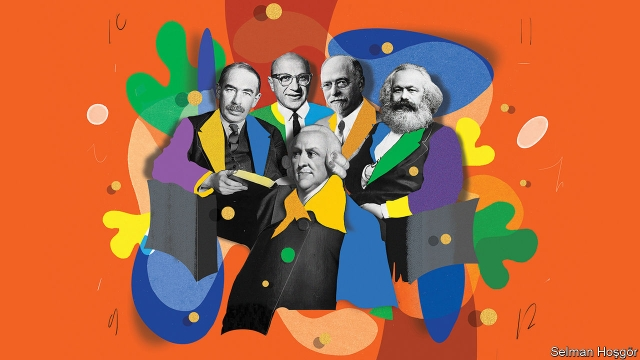
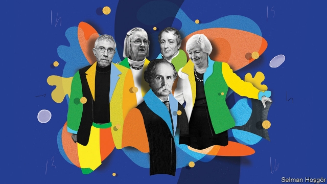

###### Quiz

# Try your hand at our Christmas quiz 

 

> print-edition iconPrint edition | Christmas Specials | Dec 18th 2019 

THIS YEAR’S quiz is based on ten famous economists. Four questions are loosely linked to each one, and a fifth requires the connection between the four. Send answers to xmasquiz@economist.com by January 6th 2020. Three winners, chosen at random, will receive copies of “Uncommon Knowledge”, The Economist’s new book. 

1.Keynes made his name after the first world war with a book called “The Economic Consequences of the Peace”. He wrote a book with a very similar title about which famous British politician? 

2. In later years, Keynes visited that politician at which well-known London address, whose last private owner was a Mr Chicken? 

3.Which well-known economist of the Keynesian school coined the term “monopsony” in her famous book “The Economics of Imperfect Competition”? 

4.Keynes published his General Theory in 1936. Due to a constitutional crisis in Britain, 1936 was also known as “the year of three whats”? 

5.What theme (apart from Keynes) links these answers? 

1.Friedman taught at which university for 30 years? A school of economic thought was named after it. 

2.Friedman was awarded the Nobel prize for economic thought in 1976. Which baseball team, the most successful in the sport’s history, lost the World Series that year? 

3.The year 1976 also saw the death of Bobby Hackett, a famous American cornetist. With which style of music was he associated? 

4.In 1950 Friedman was a consultant to the American government, helping administer the Marshall Plan in Paris, home of the Moulin Rouge. What sort of shows, from the word for “wooden structure” in old French, were held at the club? 

5.What theme (apart from Friedman) links all these answers? 

1.What type of establishment did Smith use to illustrate his belief about the benefits of the division of labour? 

2.Smith wrote his works in the aftermath of great 18th-century speculative events such as the South Sea Bubble. In which narrow London passage, from Cornhill to Lombard Street, did much financial trading occur? 

3.Smith died in 1790, the same year as Benjamin Franklin, who invented a device to protect against what meteorological phenomenon? 

4.In the Bible, Adam was the name of the first man. What was the title of a well-known feminist magazine, named after the way Eve was supposedly created? 

5.What theme links all these answers? 

1.In a manifesto published in 1848, what did Marx say was haunting Europe? 

2.Marx thought that communist revolution would occur only in a highly industrialised country. But which less-developed nation actually had the first successful communist takeover? 

3.H.L. Mencken, an American journalist said, “Communism, like any other revealed religion, is largely made up of prophecies.” He was more enthusiastic, however, about his favourite drink, describing it as “the only American invention as perfect as the sonnet.” What was it? 

4.Fritz Lang, the Vienna-born film director, was briefly blacklisted in the 1950s for his supposed association with communism. What was the title of his 1931 masterpiece about a child killer? 

5.What theme links all these answers? 

1.Fisher’s economic output included works on the quantity theory of money and debt deflation. But his reputation was spoiled by his remark in October 1929 that stocks had a reached a “permanently high” what? 

2.Fisher was a great enthusiast for Prohibition. Two states failed to ratify the 18th amendment that passed prohibition into law: Connecticut was one. Which was the other? (Hint: it is the smallest state in the union.) 

3.Another famous Irving, whose surname was Berlin, wrote “God Bless America”, which called on divine blessing “from the mountains” to where? 

4.Another namesake, Washington Irving, wrote which book, featuring a headless horseman? 

5.What theme links all these answers? 

 

1.What is the title of Mr Krugman’s column in the New York Times? 

2.In 1991 Mr Krugman was awarded the John Bates Clark medal for outstanding American economists under 40. In the same year, the sixth film in the ��Star Trek” series was released. What was the film’s subtitle? 

3.Mr Krugman won the Nobel prize for economics in 2008, the year that Barack Obama was elected. What was the title of the memoir Obama wrote in 1995? 

4.Mr Krugman was born in 1953, the same year that a famous film musical, starring Doris Day, was released. What was the film? 

5.What is the theme (apart from Mr Krugman) linking these answers? 

1.Ms Yellen was the first female chair of the Federal Reserve. Whom did she succeed? 

2.Ms Yellen graduated from Brown University in 1967. Which American tennis player won the Wimbledon women’s singles, women’s doubles and mixed doubles that year? 

3.Ms Yellen received her PhD from Yale in 1971, the year that Muhammad Ali was defeated for the first time, by Joe Frazier. Ali and Frazier fought for the third time in Asia in 1975, in a brutal bout which was given which rhyming nickname? 

4.Ms Yellen took charge of the Fed in 2014, the same year as the death of which comic actor, who won an Oscar for “Good Will Hunting”? 

5.What theme (apart from Ms Yellen) links these answers? 

1.Alfred Marshall was noted for bringing mathematical rigour into the subject of economics. He came second in his year studying mathematics at Cambridge. What title, also accorded to James Clerk Maxwell and Lord Kelvin, did this earn him? 

2.Marshall’s great textbook “Principles of Economics”, was published in 1890. Three years later, a new type of engine was built for the first time in Augsburg, and was named for its inventor. What was it called? 

3.Marshall died in 1924. That year saw the birth of an heiress who would become the mother of Anderson Cooper, a CNN anchor. What was her name? 

4.Also born in 1924 was a tough-guy actor who had an unlikely hit single, “Wandrin’ star”. Who was he? 

5.What is the theme (apart from Marshall) that links these answers? 

1.Elinor Ostrom was the first woman to win the Nobel prize for economics, awarded to her in 2009. Much of her work was on the problems of collective action, an issue often referred to as the tragedy of what? 

2.Ostrom was born in 1933, the same year as which team lost baseball’s World Series? 

3.In 1973, Ostrom founded a workshop in political theory at Indiana University, where she taught, and to which she later donated her Nobel prize money. Also in that year, the spotted owl was listed as an endangered species. What is the collective name for a group of owls? 

4.Ostrom died in 2012, the year of the London Olympics. The archery contest was held at which stadium, known as the home of cricket? 

5.What is the theme linking these answers? 

1.Ricardo is best known for a law which Paul Samuelson, another economist, cited when asked for a proposition in social sciences that was both “true and non-trivial”. What is the law called? 

2.Another of his laws, which has entered into common parlance, relates to the consequences when businesses keep adding factors of production (like workers or plant and equipment). What is this law called? 

3.Ricardo entered Parliament in 1819, and died in 1823. In the year of his death, which body ruled that Native Americans could not own land? 

4.Lucy and Ricky Ricardo were a fictional TV couple, played by Lucille Ball and Desi Arnaz. What was the name of the show, which ran from 1951 to 1957? 

5.What is the theme linking these answers? 

Send your reply to: xmasquiz@economist.com by January 6th. The answers will appear online on January 8th. 

