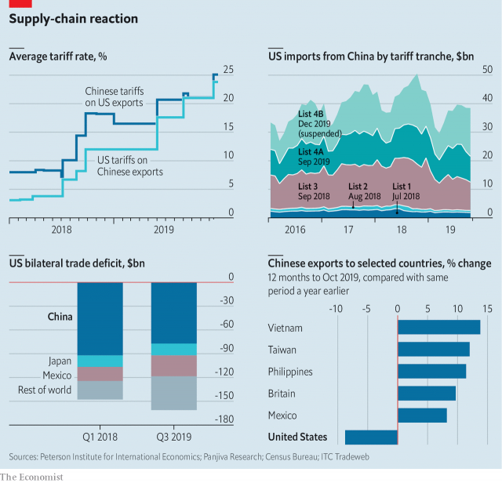

###### By the numbers

# How US-China trade has changed 

 

> print-edition iconPrint edition | Finance and economics | Dec 18th 2019 

 

AFTER AN apparent detente between America and China in late 2018, trade relations soured again at the start of 2019. Over the course of the year America ratcheted up tariffs, and its bilateral trade deficit with China fell. But market forces are powerful, and trade finds a way. America’s bilateral deficits with several other countries, including Mexico, rose. Meanwhile Chinese exporters found new homes for their goods, including Vietnam and the Philippines. Next year is likely to see trade patterns further disrupted, as Chinese policymakers aim for a Trump-pleasing increase in imports from America. 

