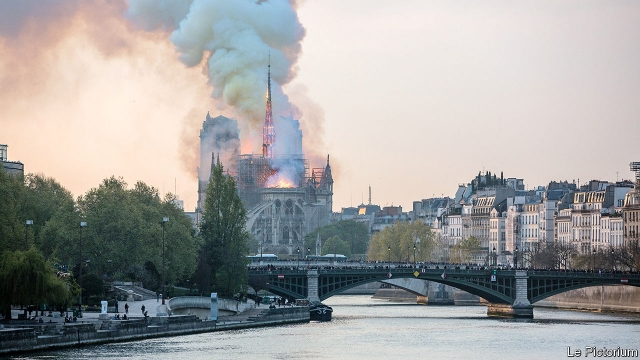
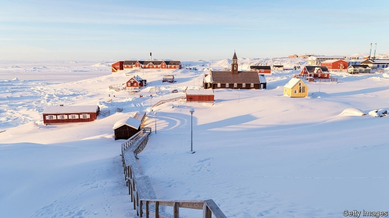

###### The World in 2020

# The world this year 

 

> Dec 18th 2019 

An attempt to amend Hong Kong’s extradition law triggered the worst crisis in the city since its handover to China in 1997. Amid concerns that the changes could result in dissident Hong Kongers facing trial in mainland China, millions took to the streets in what morphed into an ongoing pro-democracy movement, the biggest challenge to the authority of China’s leaders since the handover. The government in Beijing, which in October staged huge celebrations to mark 70 years of communist rule, has warned the protesters not to push it. 

Protests against autocratic rule also broke out in other countries, leading to the ouster of Omar al-Bashir in Sudan and the resignation of Evo Morales in Bolivia after a contentious election there. Mass demonstrations caused Ecuador’s government to reinstate fuel subsidies and Chile’s president to promise a new constitution. Algeria’s octogenarian leader, Abdelaziz Bouteflika, called it a day in the face of huge protests. Iraq’s prime minister, Adel Abdul-Mahdi, did the same. But there was no sign of Iran’s mullahs loosening their grip in response to people power. A crackdown on protests there left as many as 450 people dead. 

The trade war between America and China rumbled on, deploying arsenals of tariffs. In December both sides pulled back from the brink by reaching a “phase one” agreement that stopped America from imposing more penalties. The IMF reckoned the trade dispute could cost the global economy $700bn. America restricted its companies from selling technology to Huawei, a Chinese maker of telecoms equipment. See article. 

Warnings about a slowing world economy were a consideration for the Federal Reserve when it decided to cut interest rates for the first time since the financial crisis. Two more reductions followed. Mr Trump quarrelled openly with the Fed for not cutting sooner, calling it a “stubborn child”. 

The European Central Bank launched a new round of stimulus, much to the chagrin of the German finance minister. It was one of Mario Draghi’s last acts as ECB president before handing over to Christine Lagarde, who is launching only the second strategic review of monetary policy at the ECB. Jean-Claude Juncker, the bogeyman of British Brexiteers, retired as president of the European Commission and was replaced by Ursula von der Leyen, who was the longest-serving member of Angela Merkel’s cabinet in Germany. 

 

A horrified world watched on TV as a fire destroyed the roof and some of the interior of Notre Dame cathedral in Paris. A vigorous debate ensued about the extensive refurbishment works. The general overseeing the rebuilding told the chief architect to “shut his mouth” for resisting a modernist plan to replace the spire. 

Two years in the making, the report into Russian meddling in American politics was at last completed by Robert Mueller. Donald Trump’s critics were disappointed by a lack of evidence tying him to the Russian provocateurs. After all the fuss over the Mueller report, it was Mr Trump’s request to Volodymyr Zelensky, the Ukrainian president, to “do us a favour” and dig up dirt on the Bidens that led to impeachment proceedings. Mr Zelensky won office by trouncing Petro Poroshenko in an election. 

Some of the runners in the Democratic presidential race fell before reaching the first hurdle. Kamala Harris, one of the early favourites, pulled out after spending all her money. 

In Venezuela Juan Guaidó, the leader of the opposition-controlled national assembly, proclaimed himself interim president, declaring Nicolás Maduro’s regime to be illegitimate. Mr Guaidó was recognised by 60 Western and Latin American countries, but Mr Maduro clings on to power. See article. 

Iran moved further away from the deal limiting its nuclear activities, saying it would no longer abide by the agreement unless the EU provided it with economic aid. Attacks on commercial shipping and Saudi oil installations were blamed on Iran. America sent more troops and weapons to the region to deter Tehran. 

Long-awaited IPOs from a host of tech unicorns turned out to be damp squibs, mostly. Uber’s was the biggest. Its share price went into reverse and is now some 30% lower than on its first day of trading. A spectacular fiasco at WeWork saw it pulling its IPO and being rescued by SoftBank. Saudi Aramco’s IPO took place in Riyadh. It was the world’s largest ever, raising $25.6bn. 

Among the year’s big takeovers, Occidental, supported by Warren Buffett, acquired Anadarko for $55bn. AbbVie issued one of the biggest-ever bond offers to finance its $83bn purchase of Allergan. And the London Stock Exchange struck a $27bn deal to buy Refinitiv. Fiat Chrysler and Peugeot agreed to merge, after a proposed tie up between Fiat and Renault hit the skids. 

In January Theresa May’s hapless government lost a crucial vote on her Brexit withdrawal agreement in the House of Commons by 230 votes, the largest government defeat on record. It went downhill from there. Three requests were made to extend the Brexit deadline, and Britain still remained in the EU. 

 

Mrs May crawled on as prime minister until July. Her replacement, Boris Johnson, sparked a constitutional crisis when he prorogued Parliament in order to limit opposition manoeuvring on Brexit, but the Supreme Court said this was unlawful. Fed up Britons trekked to the polls for yet another election, and gave the Conservatives their biggest majority in 32 years. Mr Johnson took this as a mandate to “get Brexit done”. 

Argentina’s presidential election brought the Peronists back to power, when Alberto Fernández defeated Mauricio Macri. Cristina Fernández de Kirchner became vice-president, spooking investors who remember her reckless spending when she was president. 

In other elections Justin Trudeau’s Liberals were returned to power in Canada, but with a minority government following a political scandal. The first election in Thailand since the coup in 2014 saw pro-military parties scrape together a majority, with help from the courts. Spain held two elections; the Socialists remain the biggest party. Narendra Modi won a second term as prime minister in India. Joko Widodo secured five more years as Indonesia’s president. The African National Congress claimed victory in South Africa, though its 58% share of the vote was its smallest ever. The Liberal Party defied the pollsters to win in Australia. In Denmark the centre-left came to power, as did the centre-right in Greece. 

Israel held two inconclusive elections and is heading for a third poll in March 2020. Binyamin Netanyahu was boosted by America recognising Israeli sovereignty over the Golan Heights and describing the settlements in the West Bank as lawful. In November the prime minister was indicted for bribery and fraud. 

Italy got a new government formed by the Democratic Party and Five Star Movement. Matteo Salvini, the hardline leader of the Northern League, was shut out of the coalition. 

The collapse of a dam in the Brazilian state of Minas Gerais unleashed a wave of mud that killed 270 people. The dam’s metal waste could affect local ecosystems for decades. 

Media streaming took a leap forward with the release of new services from Disney, Apple and others to try to eat into Netflix’s market. Netflix got its first Oscar nomination for best picture with “Roma”, though “Green Book” won the award. 

The Business Roundtable, representing America’s top bosses, redefined the purpose of a company away from shareholder primacy and towards the interests of customers, workers and communities. Mark Zuckerberg proclaimed “a privacy-focused vision for social networking”. But Facebook’s boss found himself at odds with global regulators about his ambitions for Libra, a cryptocurrency that he wants to launch in 2020. 

In the worst crisis in its history, Boeing eventually suspended production of its 737 MAX jetliner, after it was grounded worldwide following a second crash within six months. Airlines are still rejigging their flight timetables. See article. 

After a terrorist attack killed 46 paramilitary police in the Indian-controlled portion of Kashmir, Indian fighter jets struck targets inside Pakistan for the first time since 1971, claiming to hit a jihadist camp. India’s central government later revoked the special status of its part of Kashmir and split it into two territories. 

A massacre in March of 51 people at two mosques in Christchurch, New Zealand, was linked to a rise in global white nationalism. Five months later a gunman who murdered 22 people at a Walmart in El Paso, Texas, was influenced in part by the Christchurch shootings. 

In Sri Lanka a series of bombings on Easter Sunday targeted Christians and tourists, killing 253 people. A claim that the jihadists were seeking revenge for the murder of Muslims in Christchurch was doubted by intelligence services. The attacks in Colombo bolstered the strongman campaign of Gotabaya Rajapaksa in the presidential election. After his victory he appointed as prime minister his brother Mahinda, a former president who had overseen the brutal crushing of a Tamil-separatist insurgency. 

Turkey invaded northern Syria to fight Kurdish forces allied with America, after Mr Trump withdrew his troops from the area. Although widely condemned, Mr Trump defended his decision on the basis that the Kurds “didn’t help us with Normandy”. The American president also unilaterally ended peace talks with the Taliban. Afghan negotiators are struggling to get them back to the table. 

Mr Trump was able to brag about one success: Abu Bakr al-Baghdadi, the murderous rapist who led Islamic State, blew himself up when he was cornered by American forces. 

Although vegetarian food seemed to be offered everywhere in 2019, Greggs, a purveyor of cheap bakery treats in Britain, was derided for selling a vegan sausage roll. But it was its critics who were left with egg on their face: its share price is up by 75% since January. 

 

Could Greenland become a flashpoint in 2020? Donald Trump’s offer to buy the Danish territory was mocked in Copenhagen, causing him to cancel a state visit. Now America wants to open a consulate in Greenland for the first time since the second world war. Its staff may get a chilly reception. 

